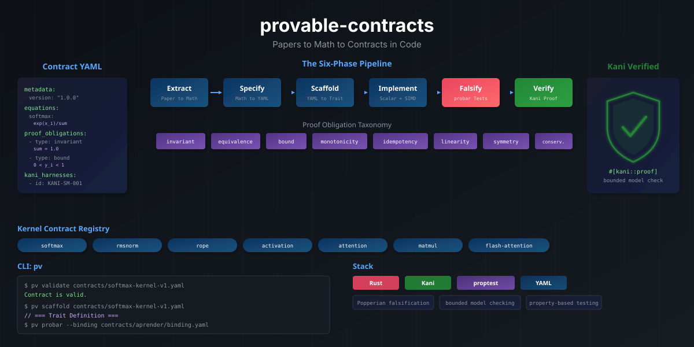

<p align="center">
  
</p>

<h1 align="center">provable-contracts</h1>

<p align="center">
  <strong>Papers to Math to Contracts in Code</strong>
</p>

<p align="center">
  <a href="https://crates.io/crates/provable-contracts">
    
  </a>
  <a href="https://docs.rs/provable-contracts">
    
  </a>
  <a href="https://github.com/paiml/provable-contracts/actions">
    
  </a>
  <a href="LICENSE">
    
  </a>
</p>

A Rust library and CLI for converting peer-reviewed research papers into
mathematically provable kernel implementations via YAML contract
intermediaries with Kani bounded model checking and Lean 4 theorem
proving.

---

## Table of Contents

- [Features](#features)
- [Installation](#installation)
- [Usage](#usage)
- [CLI Reference](#cli-reference)
- [Contract Registry](#contract-registry)
- [Fleet Enforcement (Kaizen)](#fleet-enforcement-kaizen)
- [The Seven-Phase Pipeline](#the-seven-phase-pipeline)
- [Escape-Proof Enforcement](#escape-proof-enforcement)
- [Proof Obligation Types](#proof-obligation-types)
- [Documentation](#documentation)
- [Contributing](#contributing)
- [License](#license)

## Features

- **YAML Contracts** -- Declare kernel semantics (equations, invariants,
  proof obligations) in a structured, version-controlled YAML schema.
- **26 Proof Obligation Types** -- From algebraic properties (invariant,
  bound, monotonicity) to Eiffel DbC types (precondition, postcondition,
  frame, loop_invariant, loop_variant, old_state, subcontract).
- **Escape-Proof Enforcement** -- Six-stage compile-time pipeline where
  skipping any stage produces a compiler error. Inspired by SPARK/Ada
  proof discharge, Eiffel contract inheritance, and Dafny verification
  conditions. Zero runtime cost (`debug_assert!` in release = nothing).
- **Lean 4 Theorem Proving** -- 64 proved theorems (0 sorry) across
  softmax, RMSNorm, LayerNorm, MatMul, FFT, SVD, quantization, and more.
  Lean proves algorithms over reals; Kani verifies Rust code over f32.
- **Kani Bounded Model Checking** -- Generate `#[kani::proof]` harnesses
  with `stub_float` strategy bridging Lean proofs to Rust verification.
- **Scaffold Generation** -- Automatically produce Rust trait stubs and
  failing test skeletons from any contract.
- **Property Test Generation** -- Emit `proptest` / probar property-based
  tests from both obligations and falsification predicates.
- **Contract Explanation** -- `pv explain` renders a chain-of-thought
  narrative for any contract: what it means, why each obligation exists,
  how the verification chain works.
- **Binding Registry** -- Map contract equations to real crate functions
  (`aprender`, `entrenar`, `realizar`, `trueno`, `forjar`, `simular`)
  for wired integration tests with compile-time enforcement via
  `#[contract]`, `#[requires]`, `#[ensures]`, `#[invariant]` macros.
- **Traceability Audit** -- Verify the full chain from paper reference
  through equation, obligation, falsification test, and Kani harness.
- **Contract Scoring** -- Five-dimension quality scoring (spec depth,
  falsification, Kani, Lean, binding) with A-F letter grades.
- **Quality Gate (lint)** -- Unified validate + audit + score gate with
  pass/fail exit codes, SARIF output, and CI integration. Seven gates:
  validate, audit, score, verify (test refs), enforce (pre/post/Lean),
  enforcement-level, reverse-coverage.
- **Semantic Query Engine** -- BM25 search across all contracts with
  tier/class filters, cross-project discovery, and graph-aware ranking.
- **PyTorch Extraction** -- `pv extract-pytorch` infers pre/postconditions
  from PyTorch docstrings and generates YAML contract skeletons.
- **Codegen** -- `pv codegen` generates `debug_assert!()` macros from
  YAML preconditions, postconditions, and invariants for compile-time enforcement.
- **Kaizen Fleet Enforcement** -- `pv kaizen` measures, regenerates,
  injects, and validates contract enforcement across 25 sovereign stack
  repos. Tiered scoring (kernel/tool), A-F letter grades per-repo,
  workspace subcrate scanning, feature-gated test discovery.

## Installation

### Library

Add to your `Cargo.toml`:

```toml
[dependencies]
provable-contracts = "0.2"
```

### CLI

```bash
cargo install provable-contracts-cli
```

This installs the `pv` binary.

## Usage

### Library API

```rust
use provable_contracts::schema::{parse_contract, validate_contract};
use provable_contracts::scaffold::generate_trait;
use provable_contracts::kani_gen::generate_kani_harnesses;

let contract = parse_contract("contracts/softmax-kernel-v1.yaml")?;
let violations = validate_contract(&contract);
let trait_code = generate_trait(&contract);
let harnesses = generate_kani_harnesses(&contract);
```

### CLI Examples

```bash
# Explain a contract (chain-of-thought narrative)
pv explain contracts/softmax-kernel-v1.yaml
pv explain contracts/softmax-kernel-v1.yaml --format markdown
pv explain contracts/softmax-kernel-v1.yaml --binding contracts/aprender/binding.yaml

# Validate a contract
pv validate contracts/softmax-kernel-v1.yaml

# Generate Rust trait + test scaffolding
pv scaffold contracts/softmax-kernel-v1.yaml

# Generate Kani proof harnesses
pv kani contracts/softmax-kernel-v1.yaml

# Generate probar property tests
pv probar contracts/softmax-kernel-v1.yaml
pv probar contracts/softmax-kernel-v1.yaml --binding contracts/aprender/binding.yaml

# Show contract status
pv status contracts/softmax-kernel-v1.yaml

# Run traceability audit
pv audit contracts/softmax-kernel-v1.yaml
pv audit contracts/softmax-kernel-v1.yaml --binding contracts/aprender/binding.yaml

# Compare two contract versions
pv diff contracts/softmax-kernel-v1.yaml contracts/softmax-kernel-v2.yaml

# Cross-contract obligation coverage
pv coverage contracts/ --binding contracts/aprender/binding.yaml

# End-to-end codegen (scaffold + kani + probar + book)
pv generate contracts/softmax-kernel-v1.yaml -o generated/

# Generate debug_assert!() macros from YAML preconditions/postconditions
pv codegen contracts/ --output src/contract_checks.rs

# Extract contracts from PyTorch source
pv extract-pytorch "torch/nn/functional.py::softmax"

# Dependency graph (text, dot, json, mermaid)
pv graph contracts/
pv graph contracts/ --format mermaid

# Display equations (text, latex, ptx, asm)
pv equations contracts/softmax-kernel-v1.yaml
pv equations contracts/softmax-kernel-v1.yaml --format latex

# Lean 4 codegen and proof status
pv lean contracts/softmax-kernel-v1.yaml
pv lean-status contracts/

# Proof level report (L1-L5)
pv proof-status contracts/

# Score a contract (five-dimension quality metric, A-F grades)
pv score contracts/softmax-kernel-v1.yaml
pv score contracts/ --min-score 0.75

# Semantic search across contracts
pv query "softmax numerical stability"
pv query "kernel" --tier 1 --score
pv query "attention" --class A --call-sites --violations

# Contract quality gate (validate + audit + score + verify + enforce)
pv lint contracts/
pv lint contracts/ --min-score 0.60 --format sarif
pv lint contracts/ --binding contracts/aprender/binding.yaml

# Generate type invariant trait + Kani preservation harnesses
pv invariants contracts/validated-tensor-v1.yaml

# Generate Coq theorem stubs
pv coq contracts/softmax-kernel-v1.yaml

# Generate mdBook pages
pv book contracts/ -o book/src/contracts/
```

## CLI Reference

| Command            | Description                                              |
|--------------------|----------------------------------------------------------|
| `explain`          | Chain-of-thought narrative for any contract               |
| `validate`         | Parse and validate a YAML kernel contract                |
| `scaffold`         | Generate Rust trait definition + failing tests            |
| `kani`             | Generate `#[kani::proof]` bounded model harnesses        |
| `probar`           | Generate property-based tests from obligations           |
| `codegen`          | Generate `debug_assert!()` from YAML pre/postconditions/invariants |
| `extract-pytorch`  | Extract contracts from PyTorch source docstrings         |
| `status`           | Display contract summary (equations, obligations)        |
| `audit`            | Run traceability audit with optional binding check       |
| `diff`             | Compare two contract versions, suggest semver bump       |
| `coverage`         | Cross-contract obligation coverage (`--reverse`, `--fuzz`) |
| `generate`         | End-to-end codegen (scaffold + kani + probar + book)     |
| `graph`            | Dependency DAG (`text`, `dot`, `json`, `mermaid`)        |
| `equations`        | Display equations (`text`, `latex`, `ptx`, `asm`)        |
| `lean`             | Generate Lean 4 definitions and theorem stubs            |
| `lean-status`      | Report Lean 4 proof status across contracts              |
| `proof-status`     | Hierarchical proof level (L1-L5) report (`--table`)      |
| `score`            | Contract/codebase scoring (`--pvscore` for 10-dim)       |
| `query`            | Semantic search with tier/class/graph filters            |
| `lint`             | 7-gate quality pipeline (`--explain`, `--coverage`, `--watch`) |
| `invariants`       | Generate type invariant trait + Kani preservation harness |
| `coq`              | Generate Coq theorem stubs from contract obligations     |
| `fuzz`             | Generate libfuzzer targets from contracts                |
| `mirai`            | Generate MIRAI abstract interpretation annotations       |
| `flux`             | Generate Flux refinement type annotations                |
| `tla`              | Generate TLA+ system-level specifications                |
| `infer`            | Auto-suggest contracts for unbound functions             |
| `unlock`           | Remove enforcement level lock (`--reason` required)      |
| `book`             | Generate mdBook pages for contracts                      |
| `kaizen`           | Fleet-wide enforcement measurement with tiered grades    |
| `roofline`         | Compute roofline ceilings from contract equations        |
| `pipeline`         | Validate cross-repo pipeline contracts                   |
| `verify-bindings`  | Generate compile-time binding verification tests         |

## Contract Registry

171+ contract YAML files ship in `contracts/`, organized by seven tiers,
five equivalence classes (A-E), and twenty-five per-crate directories.

**Tier 1 -- Foundation Kernels**: softmax, rmsnorm, rope, gelu, silu,
layernorm, batchnorm, cross-entropy, transpose, matmul, embedding,
absolute-position, alibi.

**Tier 2 -- Composite Kernels**: attention, gqa, flash-attention,
swiglu, bidirectional-attention, conv1d, adamw, sliding-window-attention.

**Tier 3 -- System Contracts**: model-config-algebra, tensor-shape-flow,
roofline-model, kv-cache-sizing, kernel-launch-budget, backend-dispatch,
sampling-algorithms, paged-attention, speculative-decoding, and more.

**Tier 4 -- Training Contracts**: lora-algebra, classification-finetune,
cuda-classify-training, qlora-hyperparameters, dpo-loss.

**Tier 5 -- Classical ML**: kmeans, pagerank, decision-tree, lbfgs,
cma-es, arima, active-learning, bpe-tokenization.

**Tier 6 -- Model-Specific**: qwen2/qwen3/qwen35 e2e verification,
hybrid-layer-dispatch, gated-delta-net, qwen35-hybrid-forward.

**Tier 7 -- Domain-Specific**: bashrs parser-soundness, safety-classifier,
encoder-roundtrip; depyler type-preservation, semantic-equivalence,
memory-safety; fp8-interchange.

**Equivalence Classes**: A (Llama/Mistral), B (GPT-2/BERT),
C (BLOOM/MPT), D (Gemma), E (Qwen).

### Binding Registries

Thirteen downstream crates have binding registries mapping contract
equations to Rust implementations, each with compile-time enforcement
via `build.rs` + `#[contract]` proc macro (Level 3 integration):

| Crate | Bindings | Policy |
|-------|----------|--------|
| **pmat** | 2,665 | AllImplemented |
| **aprender** | 2,363 | AllImplemented |
| **entrenar** | 1,868 | AllImplemented |
| **presentar** | 1,824 | AllImplemented |
| **realizar** | 1,725 | AllImplemented |
| **ruchy** | 1,681 | AllImplemented |
| **depyler** | 1,451 | AllImplemented |
| **bashrs** | 1,056 | AllImplemented |
| **forjar** | 819 | AllImplemented |
| **simular** | 566 | AllImplemented |
| **decy** | 456 | AllImplemented |
| **rmedia** | 405 | AllImplemented |
| **trueno** | 100 | AllImplemented |
| **ttop** | 8 | AllImplemented |

**Total: 16,997 bindings across 14 repos. 100% AllImplemented.**

### Qwen 3.5 Verification DAG

The Qwen 3.5 end-to-end verification contract composes 8 sub-contracts
into a complete model proof. The dependency graph:

```
softmax ← attention ← sliding-window-attention
       ← cross-entropy        ↑
       ← sampling       qk-norm ← attention-scaling
       ← gqa                   ↑
                        rmsnorm ← qwen35-hybrid-forward ← e2e
silu ← swiglu ─────────────────↑
matmul ← gqa             conv1d ← gated-delta-net ──────↑
rope ← rope-extrapolation       hybrid-dispatch ────────↑
                          embedding-algebra ← inference-pipeline
model-config-algebra ← qwen35-shapes ──────────────────↑
                     ← kv-cache-sizing ─────────────────↑
```

## Fleet Enforcement (Kaizen)

`pv kaizen` measures contract enforcement across the entire PAIML
sovereign stack -- 25 Rust repos with 534 bindings.

```
$ pv kaizen --src-root /home/noah/src

Fleet Enforcement Report
========================
  Repos:              25
  Call sites:         636
  Penetration:        119%
  Enforcement:        0.92 (Grade A)

  Tiered:
    Kernel (4 repos):  Grade A — 259 sites, E2 53%
    Tool (21 repos):   Grade A — 287 sites, pen 97%
```

**Grading** (score = penetration x quality, E0=0.1 E1=0.5 E2=1.0):

| Grade | Score  | Meaning                          |
|-------|--------|----------------------------------|
| A     | >= 0.60 | Strong DbC, domain pre+post     |
| B     | >= 0.40 | Good coverage, majority E1+     |
| C     | >= 0.25 | Moderate, wired but many E0     |
| D     | >= 0.10 | Weak, low quality               |
| F     | < 0.10  | Minimal enforcement             |

24 of 25 Rust repos at Grade A. The `/kaizen` Claude Code skill
automates the measure-inject-validate loop using five-whys root cause
analysis.

## The Seven-Phase Pipeline

The provable-contracts methodology follows seven phases:

1. **Extract** -- Parse peer-reviewed papers into canonical math
   (equations, domains, invariants).
2. **Specify** -- Encode the math as a YAML kernel contract with proof
   obligations, falsification tests, and Kani harness definitions.
3. **Scaffold** -- Auto-generate Rust trait stubs and failing test
   skeletons from the contract.
4. **Implement** -- Write the scalar reference implementation, then the
   SIMD-accelerated version.
5. **Falsify** -- Run Popperian falsification via property-based testing
   (probar + certeza).
6. **Verify** -- Prove correctness bounds via Kani bounded model
   checking.
7. **Prove** -- Generate Lean 4 theorem stubs and prove correctness
   in a type-theoretic proof assistant.

## Escape-Proof Enforcement

It must be **impossible** to ship code that violates a contract. Not
"difficult" — impossible. The compiler refuses to produce a binary.

Six stages, each gating the next:

```
A. Equation (YAML)        → must exist
B. Lean 4 Proof           → must have no sorry
C. YAML Validation        → pv lint gates 1-5 must pass
D. build.rs Codegen       → generates debug_assert!() from pre/postconditions
E. #[contract] Macro      → checks CONTRACT_* env var, injects assertions
F. Test Execution         → cargo test blocks merge on failure
```

Zero runtime cost — `debug_assert!()` expands to nothing in release
builds. The proof exists in the build artifacts, not the shipped code.

See [`docs/specifications/sub/escape-proof-enforcement.md`](docs/specifications/sub/escape-proof-enforcement.md).

## Proof Obligation Types

26 obligation types across two categories:

**Property types (19):** `invariant`, `equivalence`, `bound`,
`monotonicity`, `idempotency`, `linearity`, `symmetry`,
`associativity`, `conservation`, `ordering`, `completeness`,
`soundness`, `involution`, `determinism`, `roundtrip`, `state_machine`,
`classification`, `independence`, `termination`.

**Eiffel DbC types (7):** `precondition`, `postcondition`, `frame`,
`loop_invariant`, `loop_variant`, `old_state`, `subcontract`. Derived
from Bertrand Meyer's Design by Contract (OOSC, 1997).

See [`docs/specifications/sub/eiffel-dbc.md`](docs/specifications/sub/eiffel-dbc.md).

## Documentation

- **Specification**: [`docs/specifications/pv-spec.md`](docs/specifications/pv-spec.md) (canonical, ONE spec)
- **Sub-specs**:
  - [`sub/schema.md`](docs/specifications/sub/schema.md) -- Contract YAML schema
  - [`sub/eiffel-dbc.md`](docs/specifications/sub/eiffel-dbc.md) -- Eiffel DbC extensions
  - [`sub/escape-proof-enforcement.md`](docs/specifications/sub/escape-proof-enforcement.md) -- Six-stage enforcement
  - [`sub/lean-kani-composition.md`](docs/specifications/sub/lean-kani-composition.md) -- Lean + Kani composition
  - [`sub/cli.md`](docs/specifications/sub/cli.md) -- CLI reference
  - [`sub/pipeline.md`](docs/specifications/sub/pipeline.md) -- Seven-phase pipeline
  - [`sub/scoring.md`](docs/specifications/sub/scoring.md) -- Scoring system
  - [`sub/query.md`](docs/specifications/sub/query.md) -- Query engine
  - [`sub/registry.md`](docs/specifications/sub/registry.md) -- Contract registry
  - [`sub/integration.md`](docs/specifications/sub/integration.md) -- Stack integration
  - [`sub/lint.md`](docs/specifications/sub/lint.md) -- Lint gates
- **mdBook**: Run `mdbook serve` from the repository root, or build
  with `mdbook build`.

## Contributing

1. Fork the repository
2. Create your changes on the `master` branch
3. Run quality gates: `make lint && make test`
4. Run coverage: `make coverage`
5. Submit a pull request

## Cookbook

See [provable-contracts-cookbook](https://github.com/paiml/provable-contracts-cookbook) for examples and recipes.

## License

MIT
