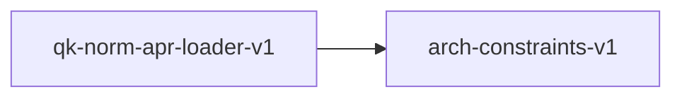

# arch-constraints-v1

**Version:** 1.0.0

Per-architecture inference constraints — source of truth

## References

- GH-323: ArchConstraints codegen
- realizar/src/gguf/config.rs: Consumer
- aprender/contracts/model-families/*.yaml: Source data

## Dependency Graph



## Equations

### arch_constraint_lookup

```
constraints(arch) = { norm_type, activation, pos_enc, mlp_type, weight_layout, has_bias, tied_emb, has_qk_norm, eps }
```

**Domain:** $arch \in { llama, mistral, phi3, qwen2, qwen3, deepseek2, gemma, gemma2, gpt2, bloom, stablelm, falcon, falcon_7b, falcon_40b, yi, internlm2, command-r, mamba, smollm, olmo, granite, starcoder }$

**Codomain:** $ArchConstraints struct$

**Invariants:**

- $Every GGUF general.architecture value maps to exactly one constraint set$
- $Enum fields are exhaustive over the defined enum variants$
- $DeepSeek eps = 1e-6 (not default 1e-5)$

## Falsification Tests

| ID | Rule | Prediction | If Fails |
|----|------|------------|----------|
| FALSIFY-ARCH-CONSTRAINTS-001 | Model-family consistency | Every model-family YAML's constraints section matches this contract | Contract drifted from model-family source YAMLs |
| FALSIFY-ARCH-CONSTRAINTS-002 | Enum exhaustiveness | No architecture has unknown enum values | New architecture added without updating contract enums |
| FALSIFY-ARCH-CONSTRAINTS-003 | DeepSeek epsilon regression | DeepSeek eps is 1e-6, not 1e-5 (bug fix from hand-maintained code) | DeepSeek eps reverted to incorrect default 1e-5 |

