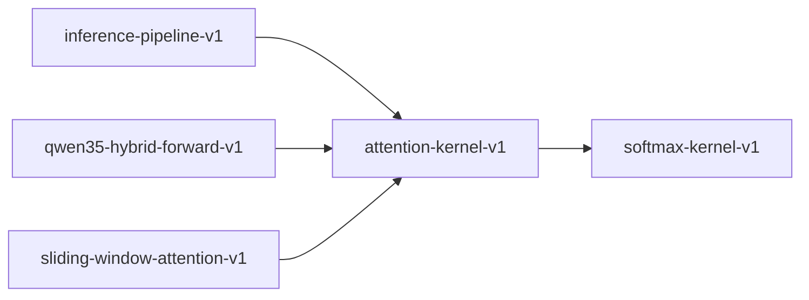

# attention-kernel-v1

**Version:** 1.0.0

Scaled dot-product attention kernel

## References

- Vaswani et al. (2017) Attention Is All You Need

## Dependencies

- [softmax-kernel-v1](softmax-kernel-v1.md)

## Dependency Graph

## Equations

### attention

$$
Attention(Q, K, V) = softmax(QK^T / √d_k) · V
$$

**Domain:** $Q \in \mathbb{R}^{n×d_k}, K \in \mathbb{R}^{m×d_k}, V \in \mathbb{R}^{m×d_v}$

**Codomain:** $\mathbb{R}^{n×d_v}$

**Invariants:**

- $Each row of attention weights sums to 1.0$
- $Attention weights \in (0,1)$
- $Output rows are convex combinations of V rows$

## Proof Obligations

| # | Type | Property | Formal |
|---|------|----------|--------|
| 1 | invariant | Attention weights normalize | $\sum_j softmax(QK^T/√d_k)_{ij} = 1 for all i$ |
| 2 | bound | Attention weights in (0,1) | $0 < attn_{ij} < 1 for all i,j$ |
| 3 | bound | Output bounded by V | $min(V) \leq output_{ij} \leq max(V)$ |
| 4 | equivalence | SIMD matches scalar |  |
| 5 | invariant | Scaling factor | $Uses 1/√d_k scaling (not 1/d_k)$ |

## Kernel Phases

1. **compute_scores**: QK^T matrix multiplication — *scores shape is (n, m)*
2. **scale**: Divide by √d_k — *scaled = scores / √d_k*
3. **softmax_rows**: Apply softmax to each row — *each row sums to 1.0*
4. **weighted_sum**: Multiply attention weights by V — *output shape is (n, d_v)*

## SIMD Dispatch

| Kernel | ISA | Target |
|--------|-----|--------|
| attention | avx2 | `attention_avx2` |
| attention | ptx | `attention_ptx` |
| attention | scalar | `attention_scalar` |

## Falsification Tests

| ID | Rule | Prediction | If Fails |
|----|------|------------|----------|
| FALSIFY-ATT-001 | Weight normalization | Each attention weight row sums to 1.0 | Softmax not applied row-wise or scaling error |
| FALSIFY-ATT-002 | Output convexity | Output values within min/max of V | Matmul error or softmax weight leak |
| FALSIFY-ATT-003 | Scaling factor | attention(Q,K,V) uses 1/√d_k not 1/d_k | Wrong scaling factor constant |
| FALSIFY-ATT-004 | SIMD equivalence | \|attn_simd(Q,K,V) - attn_scalar(Q,K,V)\| < 8 ULP | Matmul accumulation order in SIMD differs |
| FALSIFY-ATT-005 | Attention weights bounded | All attention weights in (0, 1) | Softmax output outside (0,1) range |

## Kani Harnesses

| ID | Obligation | Bound | Strategy |
|----|------------|-------|----------|
| KANI-ATT-001 | ATT-INV-001 | 4 | stub_float |

## QA Gate

**Attention Contract** (F-ATT-001)

**Checks:** weight_normalization, output_convexity, scaling_factor

**Pass criteria:** All 5 falsification tests pass

