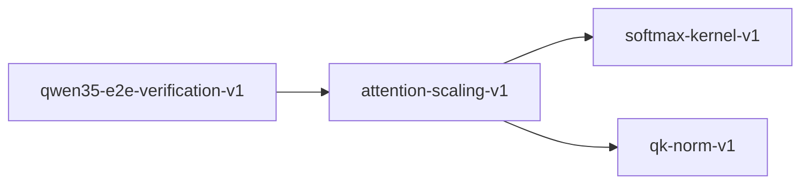

# attention-scaling-v1

**Version:** 1.0.0

Attention scaling — 1/√d_k normalization, numerical stability, and softmax saturation

## References

- Vaswani et al. (2017) Attention Is All You Need — scaled dot-product
- Henry et al. (2020) Query-Key Normalization for Transformers
- Qwen3.5 Technical Report — QK-norm + 1/sqrt(d_k) scaling

## Dependencies

- [softmax-kernel-v1](softmax-kernel-v1.md)
- [qk-norm-v1](qk-norm-v1.md)

## Dependency Graph

## Equations

### attention_entropy

$$
H(attn_i) = -\sum_j attn_ij * \log(attn_ij)
$$

**Domain:** $Entropy of attention distribution for query i$

**Invariants:**

- $H >= 0$
- $H = 0 iff attention is one-hot$
- $H <= \log(m) (uniform attention)$

### numerical_stability

$$
softmax(x - max(x)) = softmax(x)
$$

**Domain:** $Max-subtraction trick for numerical stability$

**Invariants:**

- $Subtracting max prevents exp overflow$
- $Result mathematically identical$
- $All intermediate values <= 0 after subtraction$

### scaled_dot_product

$$
score(Q, K) = Q @ K^T / √d_k
$$

**Domain:** $Q \in R^{n × d_k}, K \in R^{m × d_k}$

**Invariants:**

- $Output shape: [n, m]$
- $Scaling by 1/√d_k prevents variance growth$
- $Symmetric in Q[i] and K[j] up to scaling$

### score_bound_with_qknorm

$$
|score_ij| <= √d_k (after QK-norm)
$$

**Domain:** $QK-norm ensures ||q_i|| \approx 1, ||k_j|| \approx 1$

**Invariants:**

- $Cauchy-Schwarz: |q·k| <= ||q|| * ||k|| \approx 1$
- $After 1/√d_k scaling: |score_ij| <= 1/√d_k * d_k = √d_k$
- $Practical bound much tighter due to unit norms$

### softmax_saturation

$$
entropy(softmax(scores)) \to 0 as max(scores) \to ∞
$$

**Domain:** $Pre-softmax attention scores$

**Invariants:**

- $Large unscaled scores cause near-one-hot attention$
- $Scaling keeps scores moderate \to meaningful attention distribution$
- $QK-norm further stabilizes by bounding ||Q||, ||K||$

### variance_preservation

$$
Var(score_ij) \approx 1 when Q,K ~ N(0,1)
$$

**Domain:** $Entries of Q and K i.i.d. standard normal$

**Invariants:**

- $Without scaling: Var(Q@K^T)_ij = d_k$
- $With scaling: Var(score)_ij \approx 1$
- $Scaling prevents softmax saturation$

## Proof Obligations

| # | Type | Property | Formal |
|---|------|----------|--------|
| 1 | invariant | Score shape correctness | $shape(Q @ K^T / √d_k) = [n, m]$ |
| 2 | invariant | Variance preservation | $Var(score_ij) \approx 1 for unit-variance inputs$ |
| 3 | bound | Score bound with QK-norm | $\|score_ij\| <= √d_k after QK-norm and scaling$ |
| 4 | bound | Attention entropy non-negative | $\forall i: H(attn_i) >= 0$ |
| 5 | bound | Attention entropy upper bound | $\forall i: H(attn_i) <= \log(m)$ |
| 6 | invariant | Max-subtraction equivalence | $softmax(x - max(x)) = softmax(x)$ |
| 7 | equivalence | Scaling prevents saturation | $H(softmax(QK^T/√d_k)) > H(softmax(QK^T)) for large d_k$ |

## Falsification Tests

| ID | Rule | Prediction | If Fails |
|----|------|------------|----------|
| FALSIFY-ASCL-001 | Scaling factor | Division by √d_k applied | Missing or wrong scaling factor |
| FALSIFY-ASCL-002 | Score bound | \|score_ij\| <= √d_k with QK-norm | QK-norm not applied or bound formula wrong |
| FALSIFY-ASCL-003 | Entropy non-negative | H(attn) >= 0 always | Log of zero or numerical underflow |
| FALSIFY-ASCL-004 | Max-subtraction equivalence | softmax(x - max(x)) == softmax(x) | Implementation doesn't use max-subtraction |
| FALSIFY-ASCL-005 | Saturation prevention | Scaled attention has higher entropy than unscaled | Scaling not effective for chosen d_k |
| FALSIFY-ASCL-006 | Shape correctness | score shape is [n_queries, n_keys] | Transposition error in Q @ K^T |
| FALSIFY-ASCL-007 | Entropy upper bound | H(attn_i) <= log(m) for m keys | Softmax normalization error breaks entropy bound |

## Kani Harnesses

| ID | Obligation | Bound | Strategy |
|----|------------|-------|----------|
| KANI-ASCL-001 | ASCL-BND-001 | 8 | stub_float |
| KANI-ASCL-002 | ASCL-INV-001 | 16 | stub_float |

## QA Gate

**Attention Scaling Contract** (F-ASCL-001)

Numerical stability and scaling quality gate

**Checks:** scaled_dot_product, variance_preservation,
softmax_saturation, score_bound_with_qknorm,
attention_entropy, numerical_stability

**Pass criteria:** All 7 falsification tests pass

