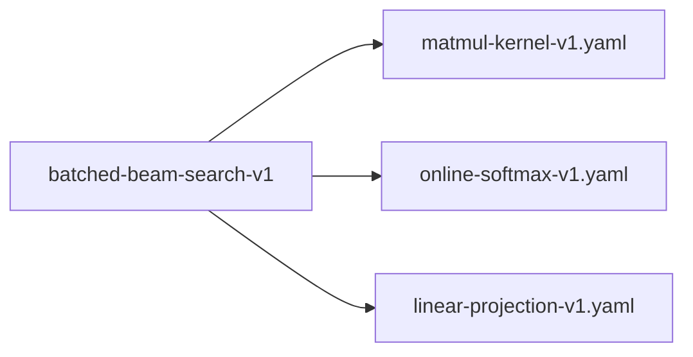

# batched-beam-search-v1

**Version:** 1.0.0

Batched beam search — convert N sequential matvecs into one batched matmul for Whisper decoder projections

## References

- Freitag & Al-Onaizan (2017) Beam Search Strategies for Neural Machine Translation
- Graves (2012) Sequence Transduction with Recurrent Neural Networks §3.1 Beam Search
- Radford et al. (2023) Robust Speech Recognition via Large-Scale Weak Supervision (Whisper)

## Dependencies

- [matmul-kernel-v1.yaml](matmul-kernel-v1.yaml.md)
- [online-softmax-v1.yaml](online-softmax-v1.yaml.md)
- [linear-projection-v1.yaml](linear-projection-v1.yaml.md)

## Dependency Graph

## Equations

### batched_beam_projection

$$
Batched beam projection (single matmul):
  X = stack(input[0], ..., input[N-1])    \in \mathbb{R}^{N × d_in}
  Y = X @ W^T                              \in \mathbb{R}^{N × d_out}
  output[b] = Y[b]                         \in \mathbb{R}^{d_out}
Total work: N · d_in · d_out FLOPs in 1 kernel launch

$$

**Domain:** $X \in \mathbb{R}^{N × d_in}, W \in \mathbb{R}^{d_out × d_in}$

**Codomain:** $Y \in \mathbb{R}^{N × d_out}$

**Invariants:**

- $Y[b] = W @ X[b] for all b$
- $Single kernel launch amortizes overhead$
- $GEMM utilization scales with N (better for N \geq 4)$

### beam_selection

$$
Beam selection via top-K from flattened logit matrix:
  logits = Y_vocab \in \mathbb{R}^{N × V}     (batched vocab projection)
  log_probs[b, v] = log_softmax(logits[b]) [v]
  scores[b, v] = beam_score[b] + log_probs[b, v]
  candidates = flatten(scores) \in \mathbb{R}^{N·V}
  top_K = argsort(candidates, descending=True)[:K]
  For each selected index i:
    parent_beam = i ÷ V
    token_id    = i mod V

$$

**Domain:** $logits \in \mathbb{R}^{N × V}, beam_score \in \mathbb{R}^{N}, K \leq N$

**Codomain:** $K (parent_beam, token_id, score) tuples$

**Invariants:**

- $Selected K scores are the K largest across all N·V candidates$
- $Parent beam index correctly maps back via integer division$
- $Token ID correctly maps back via modular arithmetic$

### sequential_beam_projection

$$
Sequential beam projection (N separate matvecs):
  for b in 0..N:
    output[b] = W @ input[b]
  where W \in \mathbb{R}^{d_out × d_in}, input[b] \in \mathbb{R}^{d_in}, output[b] \in \mathbb{R}^{d_out}
Total work: N · d_in · d_out FLOPs across N kernel launches

$$

**Domain:** $W \in \mathbb{R}^{d_out × d_in}, input[b] \in \mathbb{R}^{d_in} for b \in {0..N-1}$

**Codomain:** $output[b] \in \mathbb{R}^{d_out} for b \in {0..N-1}$

**Invariants:**

- $Each output[b] is an independent linear projection$
- $N kernel launches required$

### termination

$$
Beam search terminates at step t when:
  (a) all K active beams have emitted EOS token, OR
  (b) t = max_len
Final output: highest-scoring complete beam (ended with EOS)
Fallback: if no beam completed, return highest-scoring partial beam

$$

**Domain:** $active_beams ⊆ {0..K-1}, t \in ℕ$

**Codomain:** $token_sequence \in V*, |token_sequence| \leq max_len$

**Invariants:**

- $Complete beams never re-enter the active set$
- $Step counter t is monotonically increasing$
- $At least one beam is returned (fallback guarantees this)$

## Proof Obligations

| # | Type | Property | Formal |
|---|------|----------|--------|
| 1 | equivalence | Batched projection matches sequential projection | $\|batched_output[b] - sequential_output[b]\| < \varepsilon element-wise for all b$ |
| 2 | equivalence | Beam selection consistency | `top_K(batched_scores) = top_K(sequential_scores) as sets of (parent, token) pairs` |
| 3 | invariant | Dimension correctness | $shape(Y) = [N_beams, d_out] for each linear projection$ |
| 4 | monotonicity | Score ordering | $selected_scores[i] \geq selected_scores[i+1] for i \in {0..K-2}$ |
| 5 | termination | Beam search termination | $\forall inputs: beam_search halts within max_len steps$ |

## Kernel Phases

1. **batch_inputs**: Stack N beam hidden states into [N, d_model] matrix — *X[b] = hidden_state of beam b, shape [N, d_model]*
2. **batched_projection**: Single GEMM: Y = X @ W^T for each projection (Q, K, V, out, vocab) — *Y[b] = W @ X[b] for all b, verified by sequential fallback*
3. **score_and_select**: Log-softmax over vocab dim, add beam scores, top-K selection — *Top-K indices correctly decompose into (parent_beam, token_id)*
4. **beam_update**: Gather parent states, append selected tokens, update scores — *New beam[k] = old beam[parent[k]] ++ token[k], score updated*
5. **termination_check**: Check EOS tokens and step count, retire completed beams — *Active beam count monotonically non-increasing once beams complete*

## Falsification Tests

| ID | Rule | Prediction | If Fails |
|----|------|------------|----------|
| FALSIFY-BATCH-001 | Output equivalence with sequential beam search | \|batched_output[b] - sequential_output[b]\| < 1e-5 for all b, all projections | Matmul accumulation order differs between batched GEMM and sequential matvec — likely floating-point non-associativity |
| FALSIFY-BATCH-002 | Top-K beam selection matches sequential | Same set of (parent_beam, token_id) pairs selected by batched and sequential | Flattened index decomposition (÷V, mod V) has off-by-one or tie-breaking differs |
| FALSIFY-BATCH-003 | Beam width 1 equals greedy decode | beam_search(input, K=1) produces identical token sequence to greedy_decode(input) | Beam bookkeeping overhead corrupts the K=1 degenerate case |
| FALSIFY-BATCH-004 | All beams terminate correctly | beam_search returns within max_len steps for all inputs; all returned beams have length ≤ max_len | Termination condition fails to count completed beams or step counter not incremented |
| FALSIFY-BATCH-005 | Beam search termination | Property holds under boundary conditions | Edge case violation in Beam search termination |

## Kani Harnesses

| ID | Obligation | Bound | Strategy |
|----|------------|-------|----------|
| batched-beam-search-v1-kani-001 | Batched projection matches sequential projection | 8 | bounded_int |
| KANI-BATCHE-002 | Beam selection consistency | 8 | exhaustive |
| KANI-BATCHE-003 | Dimension correctness | 8 | exhaustive |
| KANI-BATCHE-004 | Score ordering | 8 | exhaustive |
| KANI-BATCHE-005 | Beam search termination | 8 | exhaustive |

## QA Gate

**batched-beam-search-v1 Contract** (F-BBSV-001)

Quality gate for Batched beam search — convert N sequential matvecs into one 

**Checks:** validation, falsification

