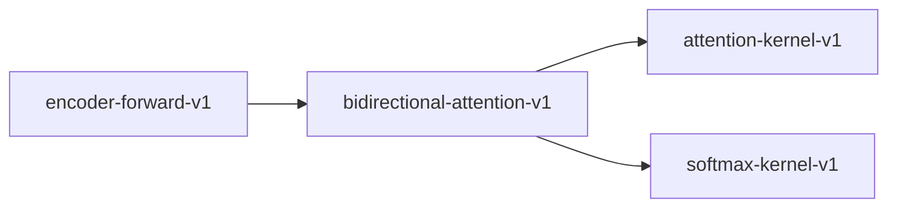

# bidirectional-attention-v1

**Version:** 1.0.0

Bidirectional (encoder) attention -- full attention without causal mask

## References

- Devlin et al. (2019) BERT: Pre-training of Deep Bidirectional Transformers

## Dependencies

- [attention-kernel-v1](attention-kernel-v1.md)
- [softmax-kernel-v1](softmax-kernel-v1.md)

## Dependency Graph

## Equations

### bidirectional_attention

$$
BiAttn(Q, K, V) = softmax(QK^T / \sqrt{d_k}) * V
$$

**Domain:** $Q in R^{n x d_k}, K in R^{n x d_k}, V in R^{n x d_v}$

**Codomain:** $R^{n x d_v}$

**Invariants:**

- $Every token attends to every other token (no mask)$
- $Attention weights are dense (no structural zeros)$
- $Equivalent to causal attention when n=1$

## Proof Obligations

| # | Type | Property | Formal |
|---|------|----------|--------|
| 1 | equivalence | Causal parity on single-token input | $\|BiAttn(q, k, v) - CausalAttn(q, k, v)\| < eps for n=1$ |
| 2 | invariant | Full attention density | $attn_weights[i][j] > 0 for all i, j in 0..n$ |
| 3 | invariant | Weight normalization | `sum_j(attn_weights[i][j]) = 1 for all i` |
| 4 | invariant | No causal mask applied | $attn_weights[i][j] > 0 for j > i (upper triangle non-zero)$ |

## Falsification Tests

| ID | Rule | Prediction | If Fails |
|----|------|------------|----------|
| FALSIFY-BIATT-001 | No causal mask applied | Upper triangle of attention matrix is non-zero | Causal mask leaked into bidirectional path |
| FALSIFY-BIATT-002 | Causal parity at n=1 | Output identical to causal attention for single-token input | Mask application differs even when mask is trivial |
| FALSIFY-BIATT-003 | Attention weight normalization | Each row sums to 1.0 within tolerance | Softmax normalization missing or incorrect |
| FALSIFY-BIATT-004 | Full attention density | All entries in attention weight matrix are strictly positive | Sparse attention or zero entries from masking bug |

## Kani Harnesses

| ID | Obligation | Bound | Strategy |
|----|------------|-------|----------|
| KANI-BIATT-001 | Causal parity on single-token input | 4 | stub_float |
| KANI-BIATT-002 | Full attention density | 4 | stub_float |
| KANI-BIATT-003 | Weight normalization | 4 | stub_float |
| KANI-BIATT-004 | No causal mask applied | 4 | stub_float |

## QA Gate

**bidirectional-attention-v1 Contract** (F-BAV-001)

Quality gate for Bidirectional (encoder) attention -- full attention without 

**Checks:** validation, falsification

