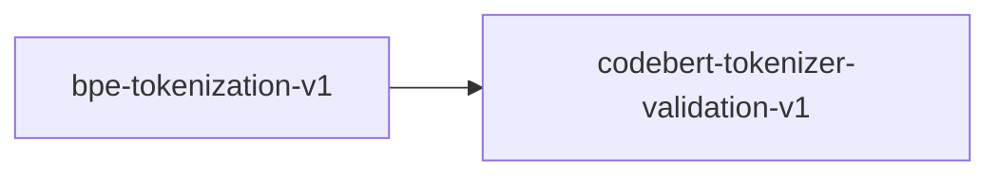

# bpe-tokenization-v1

**Version:** 1.0.0

Byte-pair encoding (BPE) tokenization correctness — merge-based subword tokenization with roundtrip, determinism, and vocabulary invariants

## References

- Sennrich, Haddow & Birch (2016) Neural Machine Translation of Rare Words with Subword Units. ACL. arXiv:1508.07909
- Radford et al. (2019) Language Models are Unsupervised Multitask Learners (GPT-2 BPE)
- Kudo & Richardson (2018) SentencePiece: A simple and language independent subword tokenizer. EMNLP.

## Dependencies

- [codebert-tokenizer-validation-v1](codebert-tokenizer-validation-v1.md)

## Dependency Graph

## Equations

### decode

$$
BPE decode: token_ids -> text
  1. Map each token ID to its string: tokens = [vocab_inverse[id] for id in token_ids]
  2. Concatenate: text = concat(tokens)
Decode is a simple lookup + concatenation with no merging required.

$$

**Domain:** $token_ids \in \mathbb{Z}^n where 0 <= token_ids[i] < |V|$

**Codomain:** $text \in UTF-8 string$

**Invariants:**

- $Decode is O(n) — linear in number of tokens$
- $Every valid token ID maps to a non-empty byte sequence$
- $Concatenation order matches token ID order$

### encode

$$
BPE encode: text -> token_ids
  1. Convert text to initial byte/character sequence: chars = list(text)
  2. While any mergeable pair exists in chars:
       Find highest-priority pair (a, b) in chars that appears in merge list
       Replace all occurrences of (a, b) with merged token ab
  3. Map final tokens to integer IDs via vocabulary: ids = [vocab[t] for t in chars]

$$

**Domain:** $text \in UTF-8 string (arbitrary)$

**Codomain:** $token_ids \in \mathbb{Z}^n where 0 <= token_ids[i] < |V| and n >= 1$

**Invariants:**

- $Output length >= 1 for non-empty input$
- $All token IDs are valid vocabulary indices$
- $Greedy left-to-right merge with priority ordering yields unique result$

### merge_rule

$$
BPE merge operation:
  Given vocabulary V and merge list M = [(a_1, b_1), (a_2, b_2), ...] ordered by priority:
  For each merge (a_i, b_i) in priority order:
    Replace all adjacent occurrences of (a_i, b_i) in token sequence with merged token c_i
    where c_i = concat(a_i, b_i) and c_i \in V
  Merge priority is determined by training corpus frequency (most frequent pairs first).

$$

**Domain:** $token_sequence \in V*, merge_list M = [(V, V)]* — ordered pairs$

**Codomain:** $token_sequence' \in V* with |token_sequence'| <= |token_sequence|$

**Invariants:**

- $Each merge reduces sequence length by at least 1 (when pair found)$
- $Merge order is deterministic given fixed merge list$
- `Concatenation of token strings is preserved: concat(tokens') == concat(tokens)`

## Proof Obligations

| # | Type | Property | Formal |
|---|------|----------|--------|
| 1 | roundtrip | Decode of encode recovers original text | `decode(encode(text)) == text for all valid UTF-8 strings` |
| 2 | invariant | Deterministic encoding | $encode(text) always produces the same token_ids for the same text and vocabulary$ |
| 3 | bound | Token IDs within vocabulary range | $0 <= encode(text)[i] < vocab_size for all i$ |
| 4 | bound | Non-empty input produces non-empty output | $len(text) > 0 implies len(encode(text)) >= 1$ |
| 5 | monotonicity | Encoding length bounded by input bytes | $len(encode(text)) <= len(bytes(text)) — at most one token per byte$ |

## Kernel Phases

1. **pre_tokenize**: Split input text into words/chunks at whitespace and punctuation boundaries — *Concatenation of chunks equals original text; no characters dropped*
2. **byte_encode**: Convert each chunk to initial byte-level token sequence — *Each byte maps to exactly one initial token; bijective mapping*
3. **iterative_merge**: Repeatedly apply highest-priority merge until no more merges possible — *Terminates in at most len(text)-1 merge rounds; sequence shrinks monotonically*
4. **vocabulary_lookup**: Map final token strings to integer IDs — *All tokens present in vocabulary; unknown tokens handled by byte fallback*

## Falsification Tests

| ID | Rule | Prediction | If Fails |
|----|------|------------|----------|
| FALSIFY-BPE-001 | Roundtrip: decode(encode(text)) == text | Roundtrip holds for all valid UTF-8 strings | Vocabulary missing byte-level fallback tokens; some bytes have no encoding path |
| FALSIFY-BPE-002 | Deterministic encoding | encode(text) produces identical output on repeated calls | Non-deterministic merge tie-breaking; hash-map iteration order leaking into merge selection |
| FALSIFY-BPE-003 | Token IDs within vocabulary range | All token IDs in [0, vocab_size) for any input | Vocabulary lookup returns sentinel value or out-of-bounds index for unseen tokens |
| FALSIFY-BPE-004 | Empty string handling | encode('') returns empty token list; decode([]) returns '' | Off-by-one in pre-tokenization or special BOS/EOS token injected unconditionally |
| FALSIFY-BPE-005 | Merge reduces sequence length | After each merge operation, token count strictly decreases by number of merges applied | Merge applied to overlapping pairs incorrectly; pair found but not actually adjacent |

## Kani Harnesses

| ID | Obligation | Bound | Strategy |
|----|------------|-------|----------|
| KANI-BPE-001 | Token ID range bound | 32 | bounded_int |
| KANI-BPE-002 | Merge termination | 16 | bounded_int |
| KANI-BPE-003 | Non-empty output for non-empty input | 16 | bounded_int |
| KANI-BPE_TO-004 | Decode of encode recovers original text | 8 | exhaustive |
| KANI-BPE_TO-005 | Deterministic encoding | 8 | exhaustive |
| KANI-BPE_TO-006 | Token IDs within vocabulary range | 8 | exhaustive |
| KANI-BPE_TO-007 | Non-empty input produces non-empty output | 8 | exhaustive |
| KANI-BPE_TO-008 | Encoding length bounded by input bytes | 8 | stub_float |

## QA Gate

**BPE Tokenization Contract** (F-BPE-001)

Byte-pair encoding roundtrip, determinism, and vocabulary correctness

**Checks:** roundtrip, determinism, token_id_range, empty_handling, merge_termination

**Pass criteria:** All 5 falsification tests pass + 3 Kani harnesses verify

