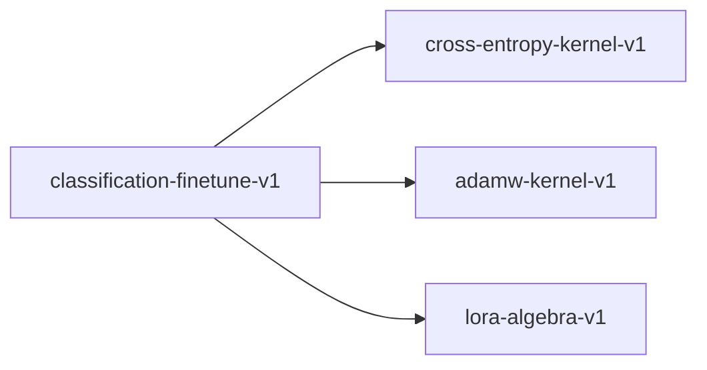

# classification-finetune-v1

**Version:** 1.0.0

Classification LoRA fine-tuning — Poka-Yoke types + config factories

## References

- Shingo, S. (1986) Zero Quality Control (Poka-Yoke)
- Popper, K. (1959) The Logic of Scientific Discovery
- Brady, E. (2017) Type-Driven Development with Idris
- Hu et al. (2021) LoRA: Low-Rank Adaptation

## Dependencies

- [cross-entropy-kernel-v1](cross-entropy-kernel-v1.md)
- [adamw-kernel-v1](adamw-kernel-v1.md)
- [lora-algebra-v1](lora-algebra-v1.md)

## Dependency Graph



## Equations

### classifier_weight_shape

```
weights.len() == hidden_size * num_classes
```

**Domain:** $hidden_size > 0, num_classes >= 2$

**Codomain:** $ValidatedClassifierWeight or ContractValidationError$

**Invariants:**

- `data.len() == hidden_size * num_classes`
- $hidden_size > 0$
- $num_classes >= 2$
- $No NaN or Inf values in data$

### label_bounds

$$
label_index < num_classes
$$

**Domain:** $label_index in Z_>=0, num_classes in Z_>=2$

**Codomain:** $ValidatedSafetyLabel or ContractValidationError$

**Invariants:**

- $index < num_classes (strict upper bound)$

### logit_shape

```
logits.len() == num_classes AND num_classes >= 2
```

**Domain:** $logits in R^n, num_classes in Z, num_classes >= 2$

**Codomain:** $ValidatedClassLogits or ContractValidationError$

**Invariants:**

- `data.len() == num_classes`
- $num_classes >= 2 (binary classification minimum)$
- $No NaN or Inf values in data$

### softmax_sum

$$
|sum(softmax(logits)) - 1.0| < epsilon
$$

**Domain:** $logits in R^n, n >= 2, all finite$

**Codomain:** $probs in [0,1]^n with sum = 1$

**Invariants:**

- $Each probability in [0, 1]$
- $Sum within 1e-5 of 1.0$

## Proof Obligations

| # | Type | Property | Formal |
|---|------|----------|--------|
| 1 | invariant | Logit shape matches num_classes | `ValidatedClassLogits::new(data, n) => data.len() == n` |
| 2 | invariant | Label index in bounds | `ValidatedSafetyLabel::new(idx, n) => idx < n` |
| 3 | invariant | Classifier weight shape | `ValidatedClassifierWeight::new(data, h, n) => data.len() == h*n` |
| 4 | bound | Softmax sum to one | $\|sum(softmax(logits)) - 1.0\| < 1e-5$ |
| 5 | invariant | NaN/Inf rejection | $new() rejects data containing NaN or Inf$ |

## Falsification Tests

| ID | Rule | Prediction | If Fails |
|----|------|------------|----------|
| FALSIFY-CLASS-001 | Logit shape | ValidatedClassLogits::new rejects data.len() != num_classes | Shape validation not enforced in constructor |
| FALSIFY-CLASS-002 | Label bounds | ValidatedSafetyLabel::new rejects index >= num_classes | Bounds checking not enforced in constructor |
| FALSIFY-CLASS-003 | Softmax sum | softmax(logits) sums to 1.0 within 1e-5 | Softmax normalization error |
| FALSIFY-CLASS-004 | Classifier weight shape | ValidatedClassifierWeight::new rejects data.len() != hidden*classes | Weight shape validation not enforced |
| FALSIFY-CLASS-005 | NaN rejection | ValidatedClassLogits::new rejects NaN values | NaN checking not enforced |
| FALSIFY-CLASS-006 | Degenerate class count | ValidatedClassLogits::new rejects num_classes < 2 | Minimum class count not enforced |

## Kani Harnesses

| ID | Obligation | Bound | Strategy |
|----|------------|-------|----------|
| KANI-FT-001 | FT-INV-001 | 4 | bounded_int |
| KANI-FT-002 | FT-INV-002 | 4 | bounded_int |
| KANI-FT-003 | FT-INV-003 | 4 | bounded_int |
| KANI-CLASSI-004 | Logit shape matches num_classes | 8 | exhaustive |
| KANI-CLASSI-005 | Label index in bounds | 8 | stub_float |
| KANI-CLASSI-006 | Classifier weight shape | 8 | exhaustive |
| KANI-CLASSI-007 | Softmax sum to one | 8 | stub_float |
| KANI-CLASSI-008 | NaN/Inf rejection | 8 | exhaustive |

## QA Gate

**Classification Fine-Tuning Contract** (F-FT-001)

Poka-Yoke types + config factory quality gate

**Checks:** logit_shape_validation, label_bounds_validation, weight_shape_validation, softmax_sum_invariant, nan_inf_rejection, config_factory_contract_sync

**Pass criteria:** All 6 falsification tests pass

