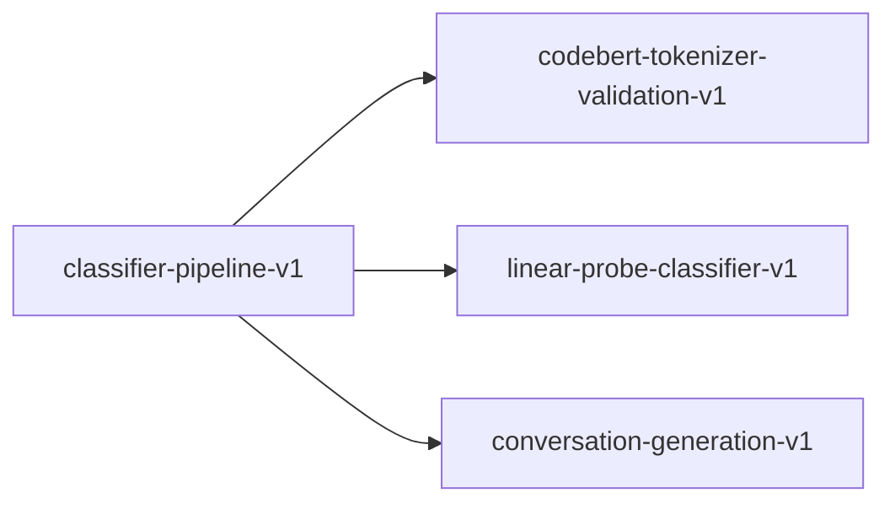

# classifier-pipeline-v1

**Version:** 1.0.0

CLF-RUN classifier pipeline — CodeBERT embedding extraction + linear probe training

## References

- SSC v11 Section 4.3: Classifier Infrastructure
- SSC v11 Phase 1: CLF-RUN task
- Alain & Bengio (2016) Understanding intermediate layers using linear classifier probes

## Dependencies

- [codebert-tokenizer-validation-v1](codebert-tokenizer-validation-v1.md)
- [linear-probe-classifier-v1](linear-probe-classifier-v1.md)
- [conversation-generation-v1](conversation-generation-v1.md)

## Dependency Graph

## Equations

### embedding_extraction

$$
cls_emb = EncoderModel.forward(tokenize(script))[0, :hidden_size]
$$

**Domain:** $script in String, model in EncoderModel$

**Codomain:** $cls_emb in R^768$

**Invariants:**

- $Output dimension equals hidden_size (768 for CodeBERT)$
- $Output is deterministic: same input \to same embedding$
- $Encoder weights are frozen (no gradient updates)$

### evaluation

$$
MCC = (TP*TN - FP*FN) / \sqrt{(TP+FP)(TP+FN)(TN+FP)(TN+FN)}
$$

**Domain:** `predictions in Vec<(u8, u8)>`

**Codomain:** $MCC in [-1, 1]$

**Invariants:**

- $MCC = 0 for random classifier$
- $MCC > 0.3 beats keyword baseline (C-CLF-001 Level 1)$
- $MCC > 0.4 beats linter baseline (C-CLF-001 Level 2)$

### linear_probe

$$
P(unsafe|x) = sigmoid(w @ cls_emb + b)
$$

**Domain:** $cls_emb in R^768, w in R^768, b in R$

**Codomain:** $probability in [0, 1]$

**Invariants:**

- $Only w and b are trainable (768 + 1 = 769 parameters)$
- $Prediction threshold at 0.5$
- $sigmoid(0) = 0.5 exactly$

## Proof Obligations

| # | Type | Property | Formal |
|---|------|----------|--------|
| 1 | invariant | Embedding determinism | `extract(model, script) == extract(model, script) for same inputs` |
| 2 | invariant | Split determinism | `split(data, seed) == split(data, seed) for same seed` |
| 3 | invariant | Probe convergence | $train_accuracy(epoch=N) >= train_accuracy(epoch=0) for N >= 10$ |
| 4 | invariant | Ship gate C-CLF-001 | $test_mcc > 0.3 (beats keyword) AND test_mcc > 0.0 (beats majority)$ |
| 5 | invariant | No empty embeddings | `for all e in embeddings: e.embedding.len() == hidden_size AND any(e != 0.0)` |

## Falsification Tests

| ID | Rule | Prediction | If Fails |
|----|------|------------|----------|
| FALSIFY-CLF-001 | Sigmoid correctness | sigmoid(0) = 0.5, sigmoid(large) ≈ 1, sigmoid(-large) ≈ 0 | Numerical implementation error in activation |
| FALSIFY-CLF-002 | Split determinism | Same seed produces identical train/test partition | Non-deterministic hash or random element in splitting |
| FALSIFY-CLF-003 | Linear probe learns | Training accuracy > 70% on linearly separable synthetic data | SGD implementation error or learning rate too large/small |
| FALSIFY-CLF-004 | Serialization roundtrip | save_probe → load_probe preserves all fields exactly | JSON serialization loses precision or drops fields |
| FALSIFY-CLF-005 | Embedding serialization roundtrip | save_embeddings → load_embeddings preserves all entries | JSONL line parsing error or float precision loss |

## Kani Harnesses

| ID | Obligation | Bound | Strategy |
|----|------------|-------|----------|
| KANI-CLF-001 | Embedding determinism | 8 | stub_float |
| KANI-CLF-002 | Split determinism | 16 | bounded_int |
| KANI-CLF-003 | Probe convergence | 8 | stub_float |
| KANI-CLF-004 | Ship gate C-CLF-001 | 8 | stub_float |
| KANI-CLF-005 | No empty embeddings | 16 | bounded_int |

## QA Gate

**C-CLF-PIPELINE-001** (C-CLF-PIPELINE-001)

Classifier pipeline quality gate

**Checks:** 14 unit tests pass (sigmoid, split, train, save/load, tokenize, mlp_forward), Linear probe achieves > 70% accuracy on synthetic data, MLP probe (Level 0.5) achieves MCC > 0.6 at all tested scales (3k-12k), Embedding extraction produces 768-dimensional vectors, Train/test split is deterministic with same seed, All serialization roundtrips preserve data exactly (LinearProbe + MlpProbeWeights), 45 CLI integration tests pass (assert_cmd)

