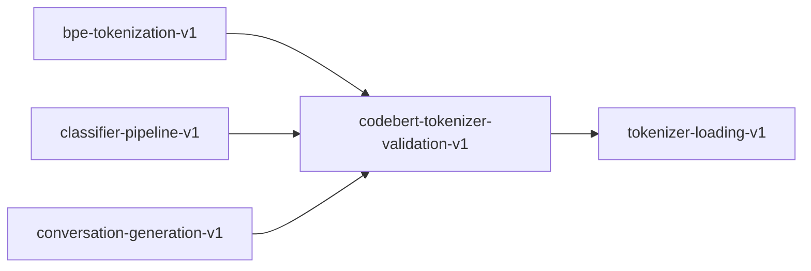

# codebert-tokenizer-validation-v1

**Version:** 1.0.0

Validates CodeBERT (RoBERTa) tokenizer quality on shell script constructs

## References

- shell-safety-inference.md v11.0.0 Section 5.2
- Feng et al. (2020) CodeBERT: A Pre-Trained Model for Programming and Natural Languages
- Liu et al. (2019) RoBERTa: A Robustly Optimized BERT Pretraining Approach

## Dependencies

- [tokenizer-loading-v1](tokenizer-loading-v1.md)

## Dependency Graph

## Equations

### tokenizer_adequacy

$$
acceptable_rate(T, corpus) = |{c \in constructs : tokens(T, c) is acceptable}| / |constructs| \geq 0.70
$$

**Domain:** $T = CodeBERT RoBERTa tokenizer (50265 BPE vocab), corpus = shell scripts$

**Codomain:** $acceptable_rate \in [0, 1]$

**Invariants:**

- $Vocab size = 50265$
- $Every non-empty input produces at least 1 token$
- $No construct produces > 20 tokens$
- $Tokenization is deterministic$

## Proof Obligations

| # | Type | Property | Formal |
|---|------|----------|--------|
| 1 | invariant | Vocab size = 50265 | $Vocab size = 50265$ |
| 2 | invariant | Every non-empty input produces at least 1 token | $Every non-empty input produces at least 1 token$ |

## Falsification Tests

| ID | Rule | Prediction | If Fails |
|----|------|------------|----------|
| FALSIFY-CTOK-001 | F-CTOK-001 (Vocab size) | CodeBERT vocab has exactly 50265 entries | Vocab file corrupted or wrong model downloaded |
| FALSIFY-CTOK-002 | F-CTOK-002 (Non-empty) | 100 corpus scripts all produce non-empty token sequences | Tokenizer silently dropping all content |
| FALSIFY-CTOK-003 | F-CTOK-003 (Construct preservation) | >= 70% of constructs tokenize acceptably | RoBERTa tokenizer too fragmented for shell — use fallback options |
| FALSIFY-CTOK-004 | F-CTOK-004 (Token explosion) | No construct produces > 20 tokens | Pathological tokenization — may need custom pre-tokenizer |
| FALSIFY-CTOK-005 | F-CTOK-005 (Determinism) | Repeated tokenization of same input is bit-identical | HashMap ordering leak in BPE merge — critical bug |

## Kani Harnesses

| ID | Obligation | Bound | Strategy |
|----|------------|-------|----------|
| KANI-CODEBE-001 | Vocab size = 50265 | 8 | exhaustive |
| KANI-CODEBE-002 | Every non-empty input produces at least 1 token | 8 | exhaustive |

## QA Gate

**Tokenizer Validation Gate** (C-TOK-001-GATE)

Pre-training quality gate for CodeBERT tokenizer on shell

**Checks:** vocab_size_50265, non_empty_tokenization, construct_preservation_70pct, no_token_explosion, deterministic_encoding

**Pass criteria:** All 5 checks pass

