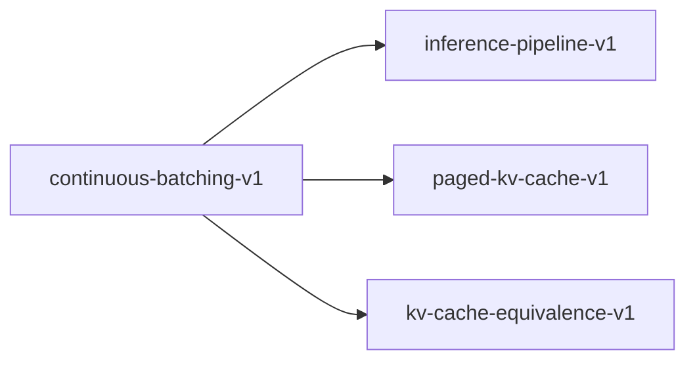

# continuous-batching-v1

**Version:** 1.0.0

Continuous batching scheduler — unified prefill/decode with token budget

## References

- Yu et al. (2022). Orca: A Distributed Serving System for Transformer-Based Generative Models.
- Kwon et al. (2023). Efficient Memory Management for Large Language Model Serving with PagedAttention. SOSP.
- vLLM v1 source: v1/core/sched/scheduler.py, v1/engine/core.py

## Dependencies

- [inference-pipeline-v1](inference-pipeline-v1.md)
- [paged-kv-cache-v1](paged-kv-cache-v1.md)
- [kv-cache-equivalence-v1](kv-cache-equivalence-v1.md)

## Dependency Graph



## Equations

### chunked_prefill

$$
chunk_size(r) = min(prompt_len(r) - computed(r), max_chunk, remaining_budget)
$$

**Domain:** $Long prompt split across multiple steps$

**Invariants:**

- $Each chunk processes at least 1 token$
- $Total chunks cover entire prompt: sum(chunks) = prompt_len$
- $Chunked prefill produces same KV cache as full prefill$

### correctness_under_batching

$$
|output_batched(r, c) - output_single(r, 1)| < epsilon
$$

**Domain:** $Same request r processed at concurrency c vs alone$

**Invariants:**

- $Numerical output within tolerance (epsilon <= 1e-3)$
- $No garbage or empty outputs$
- $Token count matches (same max_tokens)$

### decode_degradation

```
per_req_decode(c) / per_req_decode(1) >= min_ratio
```

**Domain:** $c concurrent decode requests, min_ratio \in (0, 1]$

**Invariants:**

- $Per-request decode does not collapse under load$
- $vLLM target: min_ratio >= 0.90 for c <= 8$
- $Bounded degradation: GEMV reads weights once for M requests$

### request_state

```
num_new_tokens(r) = total_tokens(r) - num_computed_tokens(r)
```

**Domain:** $r is an active request with computed KV cache$

**Invariants:**

- `Decode request: num_new_tokens = 1 (single token generation)`
- `Prefill request: num_new_tokens = min(remaining_prompt, budget)`
- `num_computed_tokens monotonically increases per request`

### scheduling_fairness

```
max_wait_time(r) <= max_wait_bound for all active requests r
```

**Domain:** $Continuous batching with FCFS scheduling$

**Invariants:**

- $No request starved indefinitely$
- $Running requests always scheduled before waiting$
- $Preemption only when KV cache pressure exceeds threshold$

### throughput_scaling

```
aggregate_tok_s(c) >= c * single_tok_s * efficiency(c)
```

**Domain:** $c = concurrency level, efficiency \in (0, 1]$

**Invariants:**

- $efficiency(1) = 1.0 (no overhead at c=1)$
- `efficiency(c) > 0 for c <= max_batch_size`
- $Monotonic degradation: efficiency(c+1) <= efficiency(c)$

### token_budget

```
sum_{r in scheduled} num_new_tokens(r) <= max_batch_tokens
```

**Domain:** `max_batch_tokens ∈ ℤ⁺ (typically 4096-16384)`

**Invariants:**

- $Total tokens per step bounded$
- $No single request exceeds budget$
- $Running requests prioritized over waiting$

## Proof Obligations

| # | Type | Property | Formal |
|---|------|----------|--------|
| 1 | bound | Token budget respected | `sum(num_new_tokens) <= max_batch_tokens per step` |
| 2 | monotonicity | Computed tokens monotonic | `num_computed_tokens(r, t) <= num_computed_tokens(r, t+1)` |
| 3 | equivalence | Chunked prefill equivalence | $\|chunked_kv - full_kv\| < 1e-5$ |
| 4 | bound | Decode degradation bounded | `per_req_decode(c) / per_req_decode(1) >= 0.50 for c <= 8` |
| 5 | invariant | No starvation | `∀ r in waiting: wait_time(r) < max_wait_bound` |
| 6 | equivalence | Correctness under batching | $\|batched_output - single_output\| < 1e-3$ |
| 7 | invariant | No empty outputs | $\forall r in completed: output_tokens(r) > 0$ |

## Falsification Tests

| ID | Rule | Prediction | If Fails |
|----|------|------------|----------|
| FALSIFY-CB-001 | Token budget | Scheduled tokens never exceed max_batch_tokens | Scheduler over-schedules tokens |
| FALSIFY-CB-002 | Computed tokens monotonic | num_computed_tokens never decreases for a request | KV cache corruption or scheduler regression |
| FALSIFY-CB-003 | Chunked prefill equivalence | Chunked and full prefill produce same KV cache | Cross-chunk boundary corrupts attention computation |
| FALSIFY-CB-004 | Decode degradation bounded | c=4 per-request decode >= 50% of c=1 | Architectural serialization or lock contention |
| FALSIFY-CB-005 | No starvation | All requests eventually scheduled within max_wait_bound | FCFS violated or preemption loop |
| FALSIFY-CB-006 | Correctness under batching | Same prompt at c=1 and c=4 produces equivalent output | Cross-request KV cache contamination or batch indexing error |
| FALSIFY-CB-007 | No empty outputs | Every completed request has at least 1 output token | Batch scheduler drops request or decode loop exits early |
| FALSIFY-CB-008 | No frozen slots | All M slots produce distinct tokens per decode step (not constant) | KV cache not populated for slot, or hidden state not indexed by slot |
| FALSIFY-CB-009 | KV cache populated for all slots after prefill | batched_kv_lengths[i] == prefill_len for all i in 0..M | prefill_attention_from_packed scatter or batched_kv_lengths update buggy |

## Kani Harnesses

| ID | Obligation | Bound | Strategy |
|----|------------|-------|----------|
| KANI-CB-001 | CB-INV-001 | 8 | bounded_int |
| KANI-CB-002 | CB-INV-002 | 32 | bounded_int |
| KANI-CB-003 | CB-INV-003 | 16 | bounded_int |
| KANI-CONTIN-004 | Token budget respected | 8 | exhaustive |
| KANI-CONTIN-005 | Computed tokens monotonic | 8 | exhaustive |
| KANI-CONTIN-006 | Chunked prefill equivalence | 8 | exhaustive |
| KANI-CONTIN-007 | Decode degradation bounded | 8 | stub_float |
| KANI-CONTIN-008 | No starvation | 8 | exhaustive |
| KANI-CONTIN-009 | Correctness under batching | 8 | exhaustive |
| KANI-CONTIN-010 | No empty outputs | 8 | exhaustive |

## QA Gate

**Continuous Batching Contract** (F-CB-001)

Unified scheduler correctness — throughput scaling and fairness

**Checks:** token_budget, computed_monotonic, chunked_equivalence, decode_degradation, no_starvation, correctness_under_batching, no_empty_outputs

**Pass criteria:** All 9 falsification tests pass + 3 Kani harnesses verify

