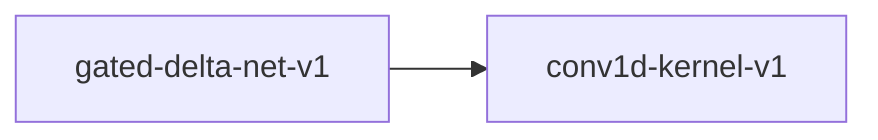

# conv1d-kernel-v1

**Version:** 1.0.0

Conv1d kernel — 1-dimensional convolution

## References

- LeCun et al. (1998) Gradient-Based Learning Applied to Document Recognition
- Radford et al. (2023) Robust Speech Recognition via Large-Scale Weak Supervision (Whisper)

## Dependency Graph

## Equations

### conv1d

$$
y[n] = sum_{k=0}^{K-1} w[k] * x[n*stride + k - pad] + bias
$$

**Domain:** $x in R^{C_in x L}, w in R^{C_out x C_in x K}, bias in R^{C_out}$

**Codomain:** $y in R^{C_out x L_out} where L_out = floor((L + 2*pad - K) / stride) + 1$

**Invariants:**

- $Output length follows standard convolution formula$
- $Convolution is linear: conv(a*x + b*z) = a*conv(x) + b*conv(z)$
- $Identity kernel [0,...,0,1,0,...,0] preserves input (when pad matches)$

## Proof Obligations

| # | Type | Property | Formal |
|---|------|----------|--------|
| 1 | invariant | Output shape correctness | $L_out = floor((L + 2*pad - K) / stride) + 1$ |
| 2 | linearity | Convolution linearity | $\|conv(a*x + b*z) - (a*conv(x) + b*conv(z))\| < eps$ |
| 3 | equivalence | Direct conv matches im2col+GEMM | $\|conv_direct(x) - conv_im2col(x)\| < eps$ |
| 4 | bound | Output bounded by input and kernel | $\|y[n]\| <= C_in * K * max(\|w\|) * max(\|x\|) + \|bias\|$ |
| 5 | equivalence | SIMD matches scalar within ULP |  |

## Kernel Phases

1. **im2col**: Reshape input patches into column matrix — *Column matrix has K*C_in rows and L_out columns*
2. **gemm**: Matrix multiply: weight @ im2col columns — *Output has C_out rows and L_out columns*
3. **add_bias**: Add bias per output channel — *Bias broadcast across spatial dimension*

## SIMD Dispatch

| Kernel | ISA | Target |
|--------|-----|--------|
| conv1d | avx2 | `conv1d_avx2` |
| conv1d | ptx | `conv1d_ptx` |
| conv1d | scalar | `conv1d_scalar` |

## Falsification Tests

| ID | Rule | Prediction | If Fails |
|----|------|------------|----------|
| FALSIFY-CV-001 | Output shape | Output length = floor((L + 2*pad - K) / stride) + 1 | Padding or stride calculation off by one |
| FALSIFY-CV-002 | Linearity | \|conv(a*x+b*z) - a*conv(x) - b*conv(z)\| < 1e-5 | Non-linear operation in convolution path |
| FALSIFY-CV-003 | im2col-GEMM equivalence | \|conv_direct(x) - conv_im2col(x)\| < 1e-6 | im2col indexing or GEMM accumulation differs |
| FALSIFY-CV-004 | SIMD equivalence | \|conv1d_avx2(x) - conv1d_scalar(x)\| < 8 ULP | SIMD accumulation order differs |
| FALSIFY-CV-005 | Boundary - kernel size 1 | conv1d with K=1 is equivalent to pointwise linear transform | Special case for K=1 not handled |
| FALSIFY-CV-006 | Identity kernel | Conv with delta kernel and appropriate padding preserves input | Padding or kernel indexing incorrect |

## Kani Harnesses

| ID | Obligation | Bound | Strategy |
|----|------------|-------|----------|
| KANI-CV-001 | CV-INV-001 | 8 | exhaustive |
| KANI-CV-002 | CV-LIN-001 | 4 | stub_float |

## QA Gate

**Conv1d Contract** (F-CV-001)

1-dimensional convolution quality gate

**Checks:** output_shape, linearity, im2col_equivalence, simd_equivalence

**Pass criteria:** All 6 falsification tests pass + Kani harnesses verify

