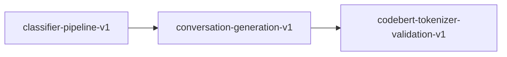

# conversation-generation-v1

**Version:** 1.0.0

Synthetic conversation generation for shell safety chat model training (SSC v11 S6)

## References

- SSC v11 Section 6: Synthetic Conversation Generation
- SSC v11 Section 6.5: Honesty Requirements

## Dependencies

- [codebert-tokenizer-validation-v1](codebert-tokenizer-validation-v1.md)

## Dependency Graph



## Equations

### chatml_format

$$
turns = [system_prompt, user_prompt, assistant_response]
$$

**Domain:** $Conversation$

**Codomain:** `Vec<Turn> with len == 3`

**Invariants:**

- $First turn is always system with honesty disclaimer$
- $Second turn is user with script in code block$
- $Third turn is assistant with analysis or confirmation$

### conversation_types

```
type(entry) = D if safe(entry) else C if !deterministic(entry) else B if SEC(entry) && even(seed) else A
```

**Domain:** $entry in CorpusEntry, seed in u64$

**Codomain:** ${ClassifyExplain, Fix, Debug, ConfirmSafe}$

**Invariants:**

- $Safe entries always produce Type D$
- $Non-deterministic unsafe entries always produce Type C$
- $Security findings alternate between Type A and Type B$

### quality_gate

```
pass = type_d_pct >= 30% AND empty_responses == 0 AND variant_balanced
```

**Domain:** `conversations in Vec<Conversation>`

**Codomain:** $bool$

**Invariants:**

- $At least 30\% of conversations are Type D (safe confirmations)$
- $No conversation has empty/trivial response content$
- $No single prompt variant exceeds 20\% of total$

## Proof Obligations

| # | Type | Property | Formal |
|---|------|----------|--------|
| 1 | invariant | ChatML structure | `conversation.turns.len() == 3 AND turns[0].role == 'system' AND turns[1].role == 'user' AND turns[2].role == 'assistant'` |
| 2 | invariant | Type D minimum | `type_d_count / total >= 0.30` |
| 3 | invariant | No empty responses | $for all conv: all turns have non-empty content$ |
| 4 | invariant | System prompt honesty | $SYSTEM_PROMPT contains 'not a replacement' AND 'pattern matching'$ |
| 5 | invariant | Deterministic generation | `generate(entries, seed) == generate(entries, seed) for same inputs` |

## Falsification Tests

| ID | Rule | Prediction | If Fails |
|----|------|------------|----------|
| FALSIFY-CONV-001 | ChatML 3-turn structure | Every conversation has exactly 3 turns (system, user, assistant) | Missing system prompt or broken turn generation |
| FALSIFY-CONV-002 | Type D minimum threshold | Safe corpus entries produce >= 30% Type D conversations | Classification logic incorrectly marks safe entries as unsafe |
| FALSIFY-CONV-003 | No empty responses | All generated responses have non-trivial content | Edge case in template rendering produces empty output |
| FALSIFY-CONV-004 | Variant diversity | 12+ prompt variants prevents any single variant > 20% | Seed modular arithmetic clusters on few variants |
| FALSIFY-CONV-005 | Honesty in system prompt | System prompt disclaims novel reasoning and audit replacement | S6.5 honesty requirements not embedded in training data |

## Kani Harnesses

| ID | Obligation | Bound | Strategy |
|----|------------|-------|----------|
| KANI-CONV-001 | ChatML structure | 8 | bounded_int |
| KANI-CONV-002 | Type D minimum | 16 | bounded_int |
| KANI-CONV-003 | No empty responses | 8 | bounded_int |
| KANI-CONV-004 | System prompt honesty | 4 | bounded_int |
| KANI-CONV-005 | Deterministic generation | 8 | bounded_int |

## QA Gate

**Conversation Generation Quality Gate** (C-CONV-001)

Conversation generation quality gate

**Checks:** generate_batch produces >= 30% Type D, No empty responses in full corpus generation, JSONL valid (each line parses as JSON), System prompt contains S6.5 honesty disclaimers, Dataset README includes YAML front matter and limitations section

