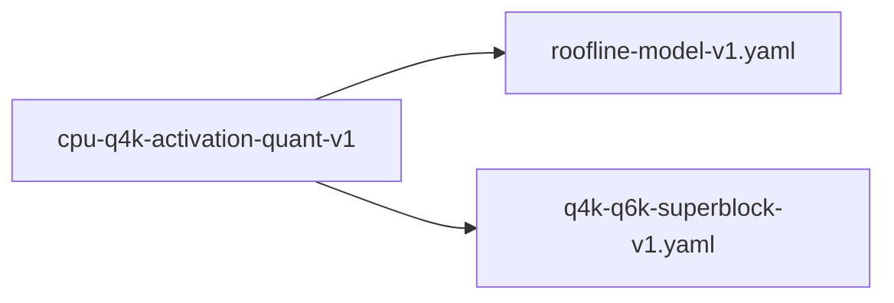

# cpu-q4k-activation-quant-v1

**Version:** 1.0.0

CPU Q4K kernel must pre-quantize activations to Q8_K for integer-only inner loop

## References

- llama.cpp ggml_vec_dot_q4_K_q8_K — maddubs_epi16 integer-only dot product
- realizar fused_k.rs:177 TODO — pre-quantize activations to Q8_0 format
- qwen-coder-deploy bench-results-v2: apr CPU 9.5 tok/s vs llama.cpp 74 tok/s
- Williams et al. (2009) Roofline: memory-bound inference requires bandwidth reduction

## Dependencies

- [roofline-model-v1.yaml](roofline-model-v1.yaml.md)
- [q4k-q6k-superblock-v1.yaml](q4k-q6k-superblock-v1.yaml.md)

## Dependency Graph



## Equations

### current_path

$$
Current (f32 activations):
  dot(row, acts) = \sum_b \sum_i dequant_q4k(row[b][i]) × acts[b*256+i]

Operations per super-block (256 values):
  - 256 nibble extractions (bit ops)
  - 256 f32 multiplications (dequant × activation)
  - 256 f32 FMA operations
  - Total: ~768 f32 ops per super-block

$$

**Domain:** $Q4_K super-blocks (144 bytes, 256 values each)$

### speedup_bound

$$
Theoretical speedup from activation quantization:
  bandwidth_reduction = sizeof(f32) / sizeof(int8) = 4×
  compute_reduction = fma_latency / maddubs_latency \approx 3-4×
  combined_speedup \approx 4-8× (memory-bound regime)

Target: apr CPU \geq 60 tok/s (within 15\% of llama.cpp's 74)

$$

**Domain:** $Memory-bound inference on DDR4/DDR5$

**Invariants:**

- $Q8_K quantization error < 0.1\% relative to f32$
- $Throughput improvement monotonic with activation vector length$

### target_path

```
Target (Q8_K activations, integer-only inner loop):
  Phase 1: quantize_row_q8_k(acts) → q8_acts  (once per matmul)
  Phase 2: dot(q4_row, q8_acts) = Σ_b vpdpbusd(q4[b], q8[b]) × scale[b]

Operations per super-block:
  - 4× _mm256_maddubs_epi16 (integer multiply-accumulate, 1 cycle throughput)
  - 4× _mm256_madd_epi16 (horizontal pair add, 1 cycle)
  - 1× horizontal sum + scale application
  - Total: ~12 integer ops per super-block

```

**Domain:** $Q4_K × Q8_K integer arithmetic$

## Proof Obligations

| # | Type | Property | Formal |
|---|------|----------|--------|
| 1 | equivalence | Q8_K quantization preserves dot product accuracy | `\|dot_q4k_f32(row, acts) - dot_q4k_q8k(row, quantize_q8k(acts))\| < ε` |
| 2 | bound | CPU throughput reaches llama.cpp parity | $tok/s(apr CPU) \geq 0.85 × tok/s(llama.cpp CPU) on same hardware$ |
| 3 | invariant | Phase 1 quantization is amortized | `quantize_row_q8_k called exactly once per matmul, not once per dot product` |
| 4 | equivalence | SIMD kernel equivalence | `avx2_q4k_q8k_dot(row, q8_acts) ≡ scalar_q4k_q8k_dot(row, q8_acts)` |

## Falsification Tests

| ID | Rule | Prediction | If Fails |
|----|------|------------|----------|
| FALSIFY-AQ-001 | Dot product parity | Q4K×Q8K dot matches Q4K×f32 dot within 0.1% for random vectors | Q8K quantization rounding error exceeds tolerance |
| FALSIFY-AQ-002 | Throughput target | apr CPU ≥ 60 tok/s on Qwen2.5-Coder-1.5B Q4K (RTX 4090 host, CPU-only) | Activation quantization not applied or parallelism overhead too high |
| FALSIFY-AQ-003 | Amortized quantization | quantize_row_q8_k called ≤ out_dim times per forward pass (once per matmul) | Quantization called per-dot instead of per-matmul |
| FALSIFY-AQ-004 | No regression in output quality | argmax(logits_q8k) == argmax(logits_f32) for greedy decoding | Quantization error flips argmax — increase Q8K precision |

## Kani Harnesses

| ID | Obligation | Bound | Strategy |
|----|------------|-------|----------|
| KANI-AQ-001 | AQ-EQV-001 | 8 | stub_float |
| KANI-CPU_Q4-002 | Q8_K quantization preserves dot product accuracy | 8 | exhaustive |
| KANI-CPU_Q4-003 | CPU throughput reaches llama.cpp parity | 8 | exhaustive |
| KANI-CPU_Q4-004 | Phase 1 quantization is amortized | 8 | exhaustive |
| KANI-CPU_Q4-005 | SIMD kernel equivalence | 8 | exhaustive |

## QA Gate

**CPU Q4K Activation Quantization Contract** (F-AQ-001)

Pre-quantize activations to Q8_K for integer-only CPU inference

**Checks:** dot_product_parity, throughput_target, amortized_quantization, output_quality

**Pass criteria:** All 4 falsification tests pass + throughput ≥ 60 tok/s

