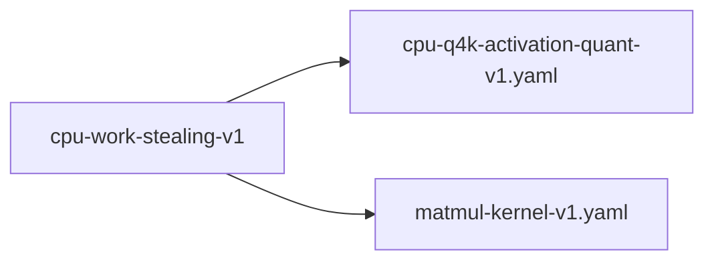

# cpu-work-stealing-v1

**Version:** 1.0.0

CPU matmul parallelism must use lightweight work-stealing with L1 tiling

## References

- llama.cpp ggml-cpu.c: atomic work-stealing with 16×16 L1 tiling
- realizar generic_matvec.rs: Rayon par_chunks_mut(64) — higher overhead
- qwen-coder-deploy bench-results-v2: apr CPU 9.5 vs llama.cpp 74 tok/s
- Goto & Van de Geijn (2008) Anatomy of high-performance matrix multiplication

## Dependencies

- [cpu-q4k-activation-quant-v1.yaml](cpu-q4k-activation-quant-v1.yaml.md)
- [matmul-kernel-v1.yaml](matmul-kernel-v1.yaml.md)

## Dependency Graph



## Equations

### l1_tiling

```
L1 cache tiling for quantized matmul:
  L1_size ≈ 32-48 KB (per core)
  Q4K super-block: 144 bytes (256 values)
  Tile size: 16 output rows × 1 input vector
  Tile footprint: 16 × ceil(in_dim/256) × 144 bytes
  For in_dim=1536: 16 × 6 × 144 = 13,824 bytes (fits in L1)

L2 cache tiling (Rayon current):
  Tile size: 64 output rows (MIDI_TILE_M)
  Tile footprint: 64 × 6 × 144 = 55,296 bytes (exceeds L1, fits L2)

```

**Domain:** $x86_64 with 32KB L1d, 256-512KB L2$

**Invariants:**

- $L1 tile footprint \leq L1_size$
- $Working set per thread fits in L1$

### rayon_overhead

```
Current Rayon dispatch cost per matmul:
  overhead = rayon_spawn_cost × ceil(out_dim / MIDI_TILE_M)
  rayon_spawn_cost ≈ 1-5 μs per task (crossbeam deque)
  For hidden_dim=1536: ceil(1536/64) = 24 tasks
  Per-matmul overhead: ~24-120 μs

Per-token overhead (7 matmuls × 28 layers):
  total_overhead = 196 × 24-120 μs = 4.7-23.5 ms

Lightweight atomic work-stealing:
  overhead = N_threads × atomic_fetch_add_cost
  atomic_fetch_add ≈ 10-50 ns (relaxed ordering)
  For 8 threads, 24 chunks: 24 × 10-50 ns ≈ 0.24-1.2 μs per matmul
  Per-token overhead: 196 × 0.24-1.2 μs = 47-235 μs

```

**Domain:** $Multi-core x86_64, 8+ threads$

**Invariants:**

- $Work-stealing overhead < 1\% of matmul compute time$
- $No thread contention on false-sharing boundaries$

## Proof Obligations

| # | Type | Property | Formal |
|---|------|----------|--------|
| 1 | bound | Dispatch overhead under budget | `work_stealing_overhead < 0.01 × matmul_compute_time` |
| 2 | invariant | No false sharing | $All atomic counters aligned to 64-byte cache lines$ |
| 3 | bound | L1 tile fits | `tile_footprint_bytes ≤ 32768 (32KB L1d)` |
| 4 | equivalence | Work-stealing output matches Rayon output | $matvec_worksteal(W, x) ≡ matvec_rayon(W, x)$ |

## Falsification Tests

| ID | Rule | Prediction | If Fails |
|----|------|------------|----------|
| FALSIFY-WS-001 | Dispatch overhead | Atomic work-stealing adds < 1ms per forward pass | Atomic contention or false sharing |
| FALSIFY-WS-002 | L1 tiling | L1 cache miss rate < 5% during inner loop (perf stat) | Tile size exceeds L1 — reduce tile dimension |
| FALSIFY-WS-003 | Output parity | Work-stealing matvec matches Rayon matvec within 1e-6 | Race condition or accumulation order difference |
| FALSIFY-WS-004 | Scaling efficiency | 4-thread throughput ≥ 3.5× single-thread (87.5% efficiency) | Lock contention or memory bandwidth saturation |

## Kani Harnesses

| ID | Obligation | Bound | Strategy |
|----|------------|-------|----------|
| KANI-WS-001 | Dispatch overhead under budget | 8 | bounded_int |
| KANI-WS-002 | No false sharing | 8 | bounded_int |
| KANI-WS-003 | L1 tile fits | 8 | bounded_int |
| KANI-WS-004 | Work-stealing output matches Rayon output | 4 | bounded_int |

## QA Gate

**CPU Work-Stealing Parallelism Contract** (F-WS-001)

Lightweight atomic work-stealing with L1-friendly tiling

**Checks:** dispatch_overhead, l1_tiling, output_parity, scaling_efficiency

**Pass criteria:** All 4 falsification tests pass

