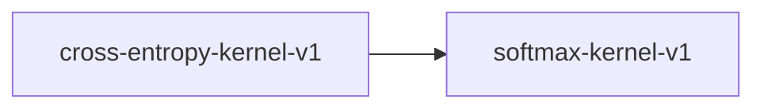

# cross-entropy-kernel-v1

**Version:** 1.0.0

Cross-entropy kernel — log-sum-exp stable cross-entropy loss

## References

- Shannon (1948) A Mathematical Theory of Communication
- Milakov & Gimelshein (2018) Online normalizer calculation for softmax

## Dependencies

- [softmax-kernel-v1](softmax-kernel-v1.md)

## Dependency Graph

## Equations

### cross_entropy

$$
CE(targets, logits) = -sum(targets_i * log_softmax(logits)_i)
$$

**Domain:** $targets in {0,1}^n with sum=1, logits in R^n, n >= 2$

**Codomain:** $CE in [0, +inf)$

**Invariants:**

- $CE >= 0 (non-negativity)$
- $CE(one_hot(k), logits) = -log_softmax(logits)_k$
- $CE(p, p_logits) = H(p) when p = softmax(p_logits)$

### log_softmax

$$
log_softmax(x)_i = x_i - max(x) - \log(sum(\exp(x_j - max(x))))
$$

**Domain:** $x in R^n, n >= 1$

**Codomain:** $log_softmax(x) in (-inf, 0]$

**Invariants:**

- $log_softmax(x)_i <= 0 for all i$
- $\exp(log_softmax(x)) = softmax(x)$
- $log_sum_exp trick preserves numerical stability$

## Proof Obligations

| # | Type | Property | Formal |
|---|------|----------|--------|
| 1 | invariant | Non-negativity | $CE(targets, logits) >= 0$ |
| 2 | bound | Log-softmax bounded above by zero | $log_softmax(x)_i <= 0 for all i$ |
| 3 | equivalence | LogSoftmax + NLL equals CrossEntropy | $\|CE(t, x) - (-sum(t_i * log_softmax(x)_i))\| < eps$ |
| 4 | bound | Finite output for finite inputs | $CE is finite when logits and targets are finite$ |
| 5 | equivalence | SIMD matches scalar within ULP |  |

## Kernel Phases

1. **find_max**: Compute max(logits) for numerical stability — *max >= logits_i for all i*
2. **log_sum_exp**: Compute log(sum(exp(logits_i - max))) — *result is finite for finite inputs*
3. **log_softmax**: Compute logits_i - max - log_sum_exp — *log_softmax_i <= 0*
4. **nll**: Compute -sum(targets_i * log_softmax_i) — *result >= 0*

## SIMD Dispatch

| Kernel | ISA | Target |
|--------|-----|--------|
| cross_entropy | avx2 | `cross_entropy_avx2` |
| cross_entropy | ptx | `cross_entropy_ptx` |
| cross_entropy | scalar | `cross_entropy_scalar` |

## Falsification Tests

| ID | Rule | Prediction | If Fails |
|----|------|------------|----------|
| FALSIFY-CE-001 | Non-negativity | CE(targets, logits) >= 0 for valid probability targets | Sign error in NLL computation |
| FALSIFY-CE-002 | Log-softmax upper bound | log_softmax(x)_i <= 0 for all i | Missing max subtraction in log-sum-exp |
| FALSIFY-CE-003 | Numerical stability | No NaN/Inf in output for finite logits | Log-sum-exp trick not applied or overflow in exp |
| FALSIFY-CE-004 | Decomposition equivalence | \|CE(t,x) - NLL(t, log_softmax(x))\| < 1e-6 | Fused computation introduces different rounding |
| FALSIFY-CE-005 | SIMD equivalence | \|cross_entropy_avx2(t,x) - cross_entropy_scalar(t,x)\| < 8 ULP | SIMD log/exp approximation differs |
| FALSIFY-CE-006 | Boundary - perfect prediction | CE(one_hot(k), logits) approaches 0 as logits_k >> logits_j | Loss not approaching zero for confident predictions |

## Kani Harnesses

| ID | Obligation | Bound | Strategy |
|----|------------|-------|----------|
| KANI-CE-001 | CE-INV-001 | 4 | stub_float |
| KANI-CE-002 | CE-BND-001 | 8 | stub_float |
| KANI-CE-003 | CE-BND-002 | 4 | stub_float |

## QA Gate

**Cross-Entropy Contract** (F-CE-001)

Numerically stable cross-entropy loss quality gate

**Checks:** non_negativity, log_softmax_bound, numerical_stability, simd_equivalence

**Pass criteria:** All 6 falsification tests pass + Kani harnesses verify

