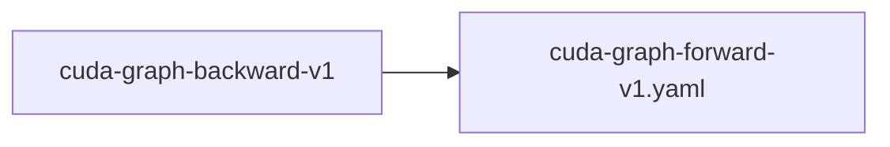

# cuda-graph-backward-v1

**Version:** 1.0.0

CUDA graph capture for NF4 training backward pass — move gradient clipping D2H sync outside graph boundary, enabling capture of the 28-layer backward loop. Forward graph exists (entrenar@0138b409). Backward is blocked by per-layer gradient clipping calling stream.synchronize() inside the loop (not capturable by CUDA graph).


## References

- CUDA Programming Guide: Graph capture cannot include host-device synchronization
- entrenar instruct_pipeline.rs:2340-2344 — gradient clipping call inside backward loop
- entrenar cuda_block.rs:3458-3497 — clip_gradients() with squared_sum_cuda() sync

## Dependencies

- [cuda-graph-forward-v1.yaml](cuda-graph-forward-v1.yaml.md)

## Dependency Graph



## Equations

### current_backward_loop

```
Current (NOT capturable — D2H sync inside loop):
  for layer in 27..=0:
    grad_output = backward(layer, grad_input)      # GPU: capturable
    norm = squared_sum_cuda(grad_output)            # GPU→CPU SYNC: NOT capturable
    if norm > clip_threshold:                       # CPU conditional: NOT capturable
      scale = clip_threshold / norm
      gradient_clip_cuda(grad_output, scale)        # GPU: capturable
    optimizer_step(layer)                           # GPU: capturable

```

**Domain:** $28 transformer layers, NF4 quantized$

**Invariants:**

- `squared_sum_cuda() calls stream.synchronize() (cuda_optim.rs:398)`
- $Host conditional (if norm > threshold) breaks graph capture$
- $6 D2H syncs per layer × 28 layers = 168 sync points per backward pass$

### fixed_backward_loop

```
Fixed (capturable — sync moved outside graph):
  # Phase 1: Backward pass (CUDA graph captured)
  graph_begin_capture()
  for layer in 27..=0:
    grad_output = backward(layer, grad_input)      # GPU only
  graph_end_capture()
  graph_replay()

  # Phase 2: Gradient clipping (outside graph, single sync)
  for layer in 27..=0:
    squared_sum_launch_cuda(layer.grads, &partial_sums[layer])  # async launch
  stream.synchronize()                              # ONE sync for all layers
  total_norm = cpu_reduce(partial_sums)
  if total_norm > clip_threshold:
    for layer in 27..=0:
      gradient_clip_cuda(layer.grads, clip_threshold / total_norm)

  # Phase 3: Optimizer step (async, no sync needed)
  for layer in 27..=0:
    optimizer_step(layer)

```

**Domain:** $28 transformer layers, NF4 quantized$

**Invariants:**

- $Graph boundary contains ONLY GPU kernel launches (no D2H sync)$
- $Single sync point after all squared-sum reductions launched$
- `Optimizer step is already async (adamw_step_cuda launches kernel, no implicit sync)`

### throughput_model

```
Without graphs:
  backward_time = 28 * (kernel_time + 6 * sync_overhead)
  sync_overhead ~= 5-15μs per D2H transfer
  total_sync = 28 * 6 * 10μs = 1,680μs = 1.7ms per backward

With graphs:
  backward_time = graph_launch_time + 28 * kernel_time + 1 * sync_overhead
  graph_launch_time ~= 10-20μs
  1 * sync_overhead ~= 10μs
  total_sync_saved = 1,680 - 20 = 1,660μs per backward

Expected speedup: depends on kernel_time relative to sync overhead.
If kernel_time dominates (large batch): minimal speedup.
If sync_overhead dominates (small batch/decode): up to 2-3x speedup.

```

**Domain:** $time in microseconds$

## Proof Obligations

| # | Type | Property | Formal |
|---|------|----------|--------|
| 1 | equivalence | Graphed backward produces same gradients as non-graphed | $\|grad_graphed - grad_ungraphed\| < \varepsilon for all parameters$ |
| 2 | invariant | No D2H synchronization inside graph boundary | `sync_count_inside_graph == 0` |
| 3 | invariant | Gradient clipping still applied (just moved outside graph) | $clipped_norm <= clip_threshold for all layers$ |
| 4 | bound | Reduces sync points from 168 to 1 per backward pass | `sync_count(fixed) == 1 AND sync_count(current) == 168` |

## Falsification Tests

| ID | Rule | Prediction | If Fails |
|----|------|------------|----------|
| F-GRAPH-BWD-001 | Graphed backward produces same gradients as non-graphed | Graphed backward loss trajectory matches ungraphed within 0.1 tolerance | Gradient clipping order matters — per-layer vs global norm produces different trajectories |
| F-GRAPH-BWD-002 | No D2H synchronization inside graph boundary | Backward graph capture succeeds without CUDA_ERROR | Remaining D2H sync inside graph — grep for synchronize() in backward path |
| F-GRAPH-BWD-003 | Reduces sync points from 168 to 1 per backward pass | Throughput improvement >= 10% at batch=4 | Sync overhead is not the backward bottleneck — profile with nsys |
| F-GRAPH-BWD-004 | Gradient clipping still applied (just moved outside graph) | Global gradient clipping produces equivalent results to per-layer clipping | Per-layer clipping prevents gradient explosion in early layers that global clipping misses |

## Kani Harnesses

| ID | Obligation | Bound | Strategy |
|----|------------|-------|----------|
| KANI-CGBW-001 | Graph boundary contains only GPU kernel launches | 8 | stub_float |
| KANI-CGBW-002 | Gradient equivalence across graphed and ungraphed paths | 4 | stub_float |

## QA Gate

**cuda-graph-backward-v1 Contract** (F-CGBW-001)

Quality gate for CUDA graph backward pass capture

**Checks:** validation, falsification

