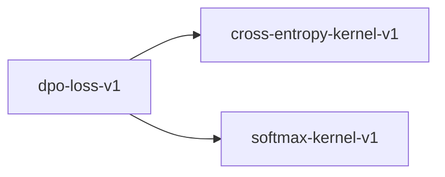

# dpo-loss-v1

**Version:** 1.0.0

Direct Preference Optimization (DPO) loss function — aligns language models to human preferences without explicit reward modeling

## References

- Rafailov et al. (2023) Direct Preference Optimization: Your Language Model is Secretly a Reward Model. NeurIPS. arXiv:2305.18290
- Azar et al. (2023) A General Theoretical Paradigm to Understand Learning from Human Feedback. arXiv:2310.12036
- Schulman et al. (2017) Proximal Policy Optimization Algorithms. arXiv:1707.06347

## Dependencies

- [cross-entropy-kernel-v1](cross-entropy-kernel-v1.md)
- [softmax-kernel-v1](softmax-kernel-v1.md)

## Dependency Graph



## Equations

### dpo_loss

```
DPO loss for a preference pair (x, y_w, y_l):
  L_DPO(pi_theta; pi_ref) = -log(sigma(beta * (log_ratio_w - log_ratio_l)))
where:
  log_ratio_w = log(pi_theta(y_w | x)) - log(pi_ref(y_w | x))
  log_ratio_l = log(pi_theta(y_l | x)) - log(pi_ref(y_l | x))
  sigma(z) = 1 / (1 + exp(-z))  (logistic sigmoid)
  beta > 0  (temperature / KL penalty coefficient)
  y_w = preferred (winning) response
  y_l = dispreferred (losing) response
Batch loss: L = (1/N) * sum_{i=1}^{N} L_DPO^{(i)}

```

**Domain:** $pi_theta, pi_ref: V* -> (0, 1] — policy distributions; beta > 0; x \in V* — prompt; y_w, y_l \in V* — responses$

**Codomain:** $L_DPO \in [0, +inf)$

**Invariants:**

- $L_DPO >= 0 (negative log of sigmoid is non-negative)$
- `L_DPO = log(2) when pi_theta == pi_ref (sigmoid(0) = 0.5)`
- $L_DPO -> 0 as pi_theta assigns higher probability to y_w vs y_l relative to pi_ref$

### implicit_reward

$$
DPO implicit reward function:
  r*(x, y) = beta * \log(pi_theta(y | x) / pi_ref(y | x)) + beta * log Z(x)
where Z(x) = sum_{y'} pi_ref(y' | x) * \exp(r*(x, y') / beta) is the partition function.
At the optimal policy pi*:
  pi*(y | x) = (1 / Z(x)) * pi_ref(y | x) * \exp(r*(x, y) / beta)
The DPO loss implicitly optimizes this reward without needing to compute Z(x).

$$

**Domain:** $x \in V* — prompt; y \in V* — response; beta > 0$

**Codomain:** $r* \in (-inf, +inf)$

**Invariants:**

- $Implicit reward is well-defined up to a constant (Z(x) cancels in preference comparisons)$
- $Higher implicit reward for preferred responses at convergence$
- $Recovers RLHF objective: maximizes E[r*(x,y)] - beta * KL(pi_theta || pi_ref)$

### log_ratio

```
Log-probability ratio between policy and reference:
  r(x, y) = log(pi_theta(y | x)) - log(pi_ref(y | x))
Computed as difference of per-token log-probabilities summed over sequence:
  r(x, y) = sum_{t=1}^{T} [log pi_theta(y_t | x, y_{<t}) - log pi_ref(y_t | x, y_{<t})]

```

**Domain:** $pi_theta, pi_ref policy distributions over sequences; x prompt; y response of length T$

**Codomain:** $r \in (-inf, +inf)$

**Invariants:**

- `r(x, y) = 0 when pi_theta == pi_ref`
- $r is finite when both policies assign non-zero probability to all tokens in y$
- $sum decomposition: sequence-level ratio = sum of token-level log-ratios$

## Proof Obligations

| # | Type | Property | Formal |
|---|------|----------|--------|
| 1 | bound | Log-ratio is finite | `\|r(x, y)\| < inf when pi_theta(y_t \| ...) > 0 and pi_ref(y_t \| ...) > 0 for all tokens t` |
| 2 | monotonicity | Loss decreases as preferred response probability increases | `dL_DPO/d(log_ratio_w) < 0 — increasing preferred log-ratio decreases loss` |
| 3 | invariant | Gradient is zero when pi_theta == pi_ref | $nabla_theta L_DPO = 0 when pi_theta = pi_ref (stationary at reference)$ |
| 4 | bound | DPO loss is non-negative | $L_DPO >= 0 for all valid inputs (since -\log(sigmoid(z)) >= 0 for all z)$ |
| 5 | equivalence | DPO loss at reference policy equals log(2) | `L_DPO(pi_ref; pi_ref) = -log(sigma(0)) = log(2) ≈ 0.6931` |

## Kernel Phases

1. **compute_log_probs**: Forward pass through pi_theta and pi_ref to get per-token log-probabilities for y_w and y_l — *Log-probabilities are finite and <= 0 (valid log of probability)*
2. **compute_log_ratios**: Compute r_w = log(pi_theta(y_w|x)/pi_ref(y_w|x)) and r_l similarly — *Log-ratios are finite when both policies assign positive probability*
3. **apply_sigmoid**: Compute sigma(beta * (r_w - r_l)) using numerically stable log-sigmoid — *Output in (0, 1); use log1p_exp for stability*
4. **negative_log**: Compute -log(sigma(...)) as the final loss — *Loss is non-negative and finite*

## Falsification Tests

| ID | Rule | Prediction | If Fails |
|----|------|------------|----------|
| FALSIFY-DPO-001 | Non-negativity of DPO loss | L_DPO >= 0 for all valid log-ratio pairs and beta > 0 | Sign error in loss formula or numerically unstable log-sigmoid implementation |
| FALSIFY-DPO-002 | Loss at reference policy | L_DPO = log(2) when log_ratio_w == log_ratio_l == 0 for any beta | Incorrect sigmoid or log implementation; beta scaling applied incorrectly |
| FALSIFY-DPO-003 | Monotonicity in preferred log-ratio | Increasing log_ratio_w while holding log_ratio_l fixed decreases loss | Gradient sign inverted; optimizing in wrong direction |
| FALSIFY-DPO-004 | Numerical stability for extreme log-ratios | Loss is finite (no NaN/Inf) for log-ratios in [-100, 100] | Missing log-sum-exp trick in sigmoid computation; exp overflow for large arguments |
| FALSIFY-DPO-005 | Symmetry under preference swap | L_DPO(r_w, r_l, beta) + L_DPO(r_l, r_w, beta) = -log(sigma(z)) - log(sigma(-z)) = log(1+exp(z))+log(1+exp(-z)) for z = beta*(r_w-r_l) | Asymmetric implementation error in loss computation |

## Kani Harnesses

| ID | Obligation | Bound | Strategy |
|----|------------|-------|----------|
| KANI-DPO-001 | DPO loss non-negativity | 16 | stub_float |
| KANI-DPO-002 | Log-ratio finiteness | 8 | stub_float |
| KANI-DPO-003 | Sigmoid output bounds | 16 | stub_float |
| KANI-DPO_LO-004 | Log-ratio is finite | 8 | exhaustive |
| KANI-DPO_LO-005 | Loss decreases as preferred response probability increases | 8 | exhaustive |
| KANI-DPO_LO-006 | Gradient is zero when pi_theta == pi_ref | 8 | exhaustive |
| KANI-DPO_LO-007 | DPO loss is non-negative | 8 | exhaustive |
| KANI-DPO_LO-008 | DPO loss at reference policy equals log(2) | 8 | exhaustive |

## QA Gate

**DPO Loss Contract** (F-DPO-001)

Direct Preference Optimization loss correctness and numerical stability

**Checks:** non_negativity, reference_policy_value, monotonicity, numerical_stability, preference_symmetry

**Pass criteria:** All 5 falsification tests pass + 3 Kani harnesses verify

