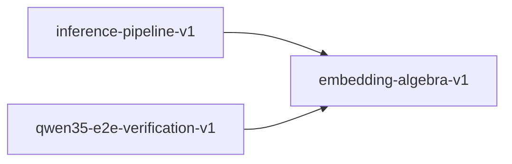

# embedding-algebra-v1

**Version:** 1.0.0

Token embedding and unembedding algebra — vocabulary projection invariants for Qwen3.5

## References

- Vaswani et al. (2017) Attention Is All You Need — shared embeddings
- Press & Wolf (2017) Using the Output Embedding to Improve Language Models
- Qwen3.5 Technical Report — tied embedding weights

## Dependency Graph

## Equations

### embedding_lookup

$$
embed(token_id) = W_e[token_id, :]
$$

**Domain:** $token_id \in [0, V), W_e \in R^{V × d_model}$

**Invariants:**

- $Output shape: [d_model]$
- $Deterministic: same token_id always gives same vector$

### embedding_norm

$$
||embed(t)||_2 for t \in [0, V)
$$

**Domain:** $L2 norm of each embedding vector$

**Invariants:**

- $All norms finite and positive$
- $No zero embeddings (non-degenerate)$

### logit_temperature

$$
logits_T = logits / T for temperature T > 0
$$

**Domain:** $Temperature scaling before softmax$

**Invariants:**

- $T = 1.0 is identity$
- $T \to 0 concentrates on argmax$
- $T \to ∞ approaches uniform$

### tied_weights

$$
W_u = W_e (weight tying)
$$

**Domain:** $Shared embedding matrix for input and output$

**Invariants:**

- $Single matrix shared: no independent parameters$
- $Parameter count: V * d_model (not 2 * V * d_model)$

### unembedding_projection

$$
logits = h @ W_u^T where W_u \in R^{V × d_model}
$$

**Domain:** $h = final hidden state, shape [seq_len, d_model]$

**Invariants:**

- $Output shape: [seq_len, V]$
- $Logits are real-valued (can be any finite float)$

### vocabulary_bounds

$$
0 <= token_id < V
$$

**Domain:** $V = vocabulary size (e.g., 151936 for Qwen)$

**Invariants:**

- $All token IDs in valid range$
- $No negative IDs$
- $No IDs >= V$

## Proof Obligations

| # | Type | Property | Formal |
|---|------|----------|--------|
| 1 | invariant | Embedding lookup shape | $\forall t \in [0,V): shape(embed(t)) = [d_model]$ |
| 2 | invariant | Unembedding output shape | $shape(h @ W_u^T) = [seq_len, V]$ |
| 3 | invariant | Tied weight identity | $W_u ≡ W_e (pointer equality or value equality)$ |
| 4 | bound | Token ID bounds | $\forall t in batch: 0 <= t < V$ |
| 5 | invariant | Embedding non-degeneracy | $\forall t \in [0,V): \|\|embed(t)\|\|_2 > 0$ |
| 6 | invariant | Temperature identity | $logits / 1.0 = logits$ |
| 7 | monotonicity | Temperature scaling effect | $T1 < T2 \to entropy(softmax(logits/T1)) < entropy(softmax(logits/T2))$ |

## Falsification Tests

| ID | Rule | Prediction | If Fails |
|----|------|------------|----------|
| FALSIFY-EMB-001 | Lookup determinism | Same ID always returns same vector | Non-deterministic embedding lookup |
| FALSIFY-EMB-002 | Shape preservation | Embedding output is d_model-dimensional | Shape mismatch in embedding table |
| FALSIFY-EMB-003 | Tied weight sharing | embed(t) @ W_u == logits row identity | Embedding weights not actually tied |
| FALSIFY-EMB-004 | Vocabulary bounds | Out-of-range IDs rejected | Missing bounds check on token ID |
| FALSIFY-EMB-005 | Non-zero embeddings | No all-zero embedding vectors | Dead embedding row in weight matrix |
| FALSIFY-EMB-006 | Temperature identity | logits / 1.0 == logits exactly | Floating-point division by 1.0 not exact |
| FALSIFY-EMB-007 | Temperature scaling monotonicity | Higher temperature => higher entropy of softmax(logits/T) | Temperature scaling inverted |

## Kani Harnesses

| ID | Obligation | Bound | Strategy |
|----|------------|-------|----------|
| KANI-EMB-001 | EMB-BND-001 | 8 | bounded_int |
| KANI-EMB-002 | EMB-INV-001 | 4 | stub_float |

## QA Gate

**Embedding Algebra Contract** (F-EMB-001)

Token embedding and unembedding quality gate

**Checks:** embedding_lookup, unembedding_projection, tied_weights, vocabulary_bounds, embedding_norm, logit_temperature

**Pass criteria:** All 7 falsification tests pass

