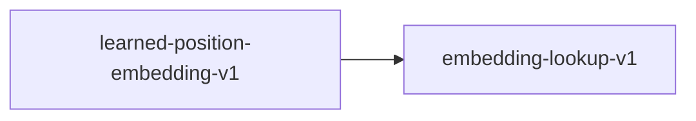

# embedding-lookup-v1

**Version:** 1.0.0

Embedding lookup — table lookup mapping token IDs to dense vectors

## References

- Mikolov et al. (2013) Efficient Estimation of Word Representations in Vector Space
- Vaswani et al. (2017) Attention Is All You Need

## Dependency Graph

## Equations

### embedding_lookup

$$
output[i] = W[token_ids[i]]  for i in 0..seq_len
$$

**Domain:** $token_ids[i] in {0, 1, ..., vocab_size - 1}, W in R^{vocab_size x d_model}$

**Codomain:** $output in R^{seq_len x d_model}$

**Invariants:**

- $output.shape = (seq_len, d_model) for any valid input sequence$
- $token_ids[i] >= 0 and token_ids[i] < vocab_size (no out-of-bounds)$
- $Deterministic: same token_ids and W always produce the same output$
- $All output elements are finite (no NaN, no Inf)$

## Proof Obligations

| # | Type | Property | Formal |
|---|------|----------|--------|
| 1 | bound | Output shape correctness | $output.shape = (seq_len, d_model) for token_ids.len() = seq_len$ |
| 2 | bound | Out-of-bounds panic freedom | $token_ids[i] < vocab_size for all i implies no panic$ |
| 3 | invariant | Deterministic output | $lookup(W, ids) = lookup(W, ids) for identical W and ids$ |
| 4 | bound | Finite output | $W[j][k] is finite implies output[i][k] is finite for all i, k$ |

## Kernel Phases

1. **validate_indices**: Assert all token_ids are within [0, vocab_size) — *token_ids[i] < vocab_size for all i*
2. **gather_rows**: Gather embedding rows W[token_ids[i]] into output buffer — *output[i] = W[token_ids[i]]*

## SIMD Dispatch

| Kernel | ISA | Target |
|--------|-----|--------|
| embedding_lookup | avx2 | `embedding_lookup_avx2` |
| embedding_lookup | ptx | `embedding_lookup_ptx` |
| embedding_lookup | scalar | `embedding_lookup_scalar` |

## Falsification Tests

| ID | Rule | Prediction | If Fails |
|----|------|------------|----------|
| FALSIFY-EM-001 | Output shape correctness | output.shape = (seq_len, d_model) for any valid seq_len | Allocation or reshape does not match expected dimensions |
| FALSIFY-EM-002 | Out-of-bounds panic freedom | No panic when all token_ids < vocab_size; controlled error otherwise | Missing bounds check on token index |
| FALSIFY-EM-003 | Deterministic output | Two calls with identical W and token_ids produce bit-identical output | Non-determinism from uninitialized memory or concurrency |
| FALSIFY-EM-004 | Finite output | All output elements are finite when all W elements are finite | Copying introduces NaN or Inf through uninitialized buffer |

## Kani Harnesses

| ID | Obligation | Bound | Strategy |
|----|------------|-------|----------|
| KANI-EM-001 | EM-SHP-001 | 4 | stub_float |
| KANI-EM-002 | EM-SAF-001 | 4 | stub_float |
| KANI-EMBEDD-003 | Output shape correctness | 8 | exhaustive |
| KANI-EMBEDD-004 | Out-of-bounds panic freedom | 8 | stub_float |
| KANI-EMBEDD-005 | Deterministic output | 8 | exhaustive |
| KANI-EMBEDD-006 | Finite output | 8 | exhaustive |

## QA Gate

**Embedding Lookup Contract** (F-EM-001)

Token-to-vector embedding table lookup quality gate

**Checks:** output_shape, oob_safety, determinism, finite_output

**Pass criteria:** All 4 falsification tests pass + Kani harnesses verify

