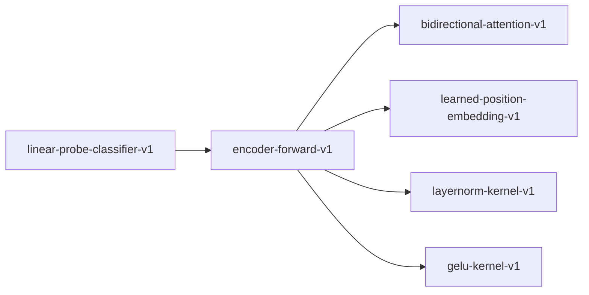

# encoder-forward-v1

**Version:** 1.0.0

Encoder forward pass -- full pipeline from tokens to [CLS] embedding

## References

- Devlin et al. (2019) BERT: Pre-training of Deep Bidirectional Transformers
- Liu et al. (2019) RoBERTa: A Robustly Optimized BERT Pretraining Approach

## Dependencies

- [bidirectional-attention-v1](bidirectional-attention-v1.md)
- [learned-position-embedding-v1](learned-position-embedding-v1.md)
- [layernorm-kernel-v1](layernorm-kernel-v1.md)
- [gelu-kernel-v1](gelu-kernel-v1.md)

## Dependency Graph

## Equations

### cls_pooling

$$
embedding = encoder_output[0] (first token)
$$

**Domain:** $encoder_output in R^{n x d_model}, n >= 1$

**Codomain:** $R^{d_model}$

**Invariants:**

- $Output is exactly the first row of encoder output$

### encoder_layer

$$
h = LayerNorm(x + BiAttn(x)) ; out = LayerNorm(h + FFN(h))
$$

**Domain:** $x in R^{n x d_model}$

**Codomain:** $R^{n x d_model}$

**Invariants:**

- $Output shape equals input shape (residual connection preserves dimensions)$
- $No NaN or Inf in output for finite input$

## Proof Obligations

| # | Type | Property | Formal |
|---|------|----------|--------|
| 1 | invariant | Shape preservation | `output.shape == input.shape for each encoder layer` |
| 2 | bound | No NaN/Inf | $is_finite(output[i][j]) for all i, j$ |
| 3 | equivalence | Reference parity | $\|entrenar_output - reference_output\| < tolerance$ |
| 4 | invariant | CLS pooling correctness | `cls_embedding == encoder_output[0]` |

## Falsification Tests

| ID | Rule | Prediction | If Fails |
|----|------|------------|----------|
| FALSIFY-ENC-001 | Shape preservation | 12 encoder layers preserve (n, 768) shape | Layer reshapes or drops dimensions |
| FALSIFY-ENC-002 | Finite output | No NaN or Inf for inputs in normal float range | Numerical instability in LayerNorm or attention |
| FALSIFY-ENC-003 | Reference parity | entrenar output matches saved HuggingFace reference within 1e-4 | Weight loading error or architectural mismatch |
| FALSIFY-ENC-004 | CLS pooling correctness | CLS embedding equals first row of encoder output | Pooling selects wrong token index or averages instead of selecting |

## Kani Harnesses

| ID | Obligation | Bound | Strategy |
|----|------------|-------|----------|
| KANI-ENC-001 | Shape preservation | 4 | stub_float |
| KANI-ENC-002 | No NaN/Inf | 4 | stub_float |
| KANI-ENC-003 | Reference parity | 4 | stub_float |
| KANI-ENC-004 | CLS pooling correctness | 4 | stub_float |

## QA Gate

**encoder-forward-v1 Contract** (F-EFV-001)

Quality gate for Encoder forward pass -- full pipeline from tokens to [CLS] e

**Checks:** validation, falsification

