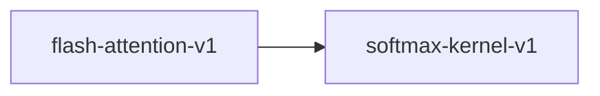

# flash-attention-v1

**Version:** 1.0.0

Flash Attention — IO-aware exact attention with tiling

## References

- Dao et al. (2022) FlashAttention: Fast and Memory-Efficient Exact Attention with IO-Awareness
- Dao (2023) FlashAttention-2: Faster Attention with Better Parallelism and Work Partitioning

## Dependencies

- [softmax-kernel-v1](softmax-kernel-v1.md)

## Dependency Graph

## Equations

### flash_attention

$$
FlashAttn(Q, K, V) = softmax(QK^T / √d_k) · V (computed in tiles)
$$

**Domain:** $Q \in \mathbb{R}^{N×d}, K \in \mathbb{R}^{N×d}, V \in \mathbb{R}^{N×d}$

**Codomain:** $\mathbb{R}^{N×d}$

**Invariants:**

- $Output = standard attention output (exact, not approximate)$
- $Memory usage O(N) not O(N²)$
- $Online softmax: running max and sum across tiles$

## Proof Obligations

| # | Type | Property | Formal |
|---|------|----------|--------|
| 1 | equivalence | Matches standard attention | $\|FlashAttn(Q,K,V) - StdAttn(Q,K,V)\| < \varepsilon$ |
| 2 | invariant | Online softmax correctness | $Tiled softmax = full softmax$ |
| 3 | invariant | Tile coverage | $All (i,j) pairs processed exactly once$ |
| 4 | conservation | Attention weight conservation | $Each output row is weighted mean of V rows$ |

## Kernel Phases

1. **outer_loop**: Iterate over query tiles (blocks of rows) — *All query rows covered*
2. **inner_loop**: Iterate over key/value tiles — *All KV pairs scored against current Q tile*
3. **online_softmax**: Update running max and sum for numerically stable softmax — *Running max >= all seen scores*
4. **accumulate**: Rescale and accumulate output tile — *Rescaling preserves running normalization*

## SIMD Dispatch

| Kernel | ISA | Target |
|--------|-----|--------|
| flash_attention | avx2 | `flash_attention_avx2` |
| flash_attention | ptx | `flash_attention_ptx` |
| flash_attention | scalar | `flash_attention_scalar` |

## Falsification Tests

| ID | Rule | Prediction | If Fails |
|----|------|------------|----------|
| FALSIFY-FA-001 | Equivalence to standard attention | \|flash_attn(Q,K,V) - std_attn(Q,K,V)\| < 1e-5 | Online softmax rescaling error |
| FALSIFY-FA-002 | Online softmax | Tiled softmax matches full softmax | Max tracking across tiles incorrect |
| FALSIFY-FA-003 | Weight normalization | Flash attention weight rows sum to 1.0 | Rescaling factor error in tile accumulation |
| FALSIFY-FA-004 | Single tile | When N ≤ tile_size, matches standard attention exactly | Edge case in tile loop bounds |

## Kani Harnesses

| ID | Obligation | Bound | Strategy |
|----|------------|-------|----------|
| KANI-FA-001 | FA-EQ-001 | 4 | stub_float |

## QA Gate

**Flash Attention Contract** (F-FA-001)

**Checks:** equivalence, online_softmax, weight_normalization

**Pass criteria:** All 4 falsification tests pass

