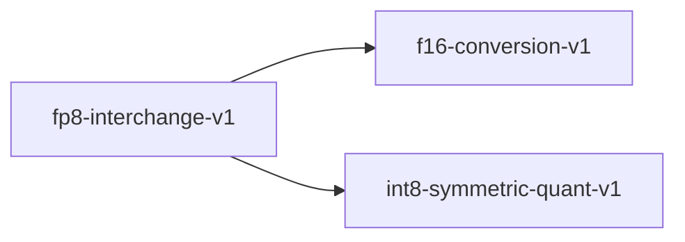

# fp8-interchange-v1

**Version:** 1.0.0

FP8 e4m3/e5m2 format interchange for mixed-precision training — encode/decode between float32 and 8-bit floating-point formats per OFP8 specification

## References

- Micikevicius et al. (2022) FP8 Formats for Deep Learning. arXiv:2209.05433
- Sun et al. (2019) Hybrid 8-bit Floating Point (HFP8) Training and Inference for Deep Neural Networks. NeurIPS.
- IEEE working group P3109 — Interim report on 8-bit binary floating-point

## Dependencies

- [f16-conversion-v1](f16-conversion-v1.md)
- [int8-symmetric-quant-v1](int8-symmetric-quant-v1.md)

## Dependency Graph



## Equations

### e4m3_encode

$$
Encode float32 x to E4M3 (4-bit exponent, 3-bit mantissa, 1 sign bit):
  sign = (x < 0) ? 1 : 0
  Clamp |x| to [0, 448] (E4M3 max normal value)
  exponent = clamp(floor(log2(|x|)) + bias, 0, 15)  where bias = 7
  mantissa = round((|x| / 2^(exponent - bias) - 1) * 8)  (3 mantissa bits)
  e4m3_bits = (sign << 7) | (exponent << 3) | mantissa
Special values: no infinity, no NaN (all 8 exponent+mantissa combos are numeric)
Max value: 448 = 1.875 * 2^8, Min subnormal: 2^-9 = 1/512

$$

**Domain:** $x \in \mathbb{R} (float32)$

**Codomain:** $e4m3_bits \in {0, 1, ..., 255} — 8-bit encoding$

**Invariants:**

- `Sign bit preserved: sign(encode(x)) == sign(x)`
- `Saturation: encode(x) == encode(448) for |x| > 448`
- $No NaN encoding: all 256 bit patterns represent numeric values$

### e5m2_encode

```
Encode float32 x to E5M2 (5-bit exponent, 2-bit mantissa, 1 sign bit):
  sign = (x < 0) ? 1 : 0
  Clamp |x| to [0, 57344] (E5M2 max normal value)
  exponent = clamp(floor(log2(|x|)) + bias, 0, 31)  where bias = 15
  mantissa = round((|x| / 2^(exponent - bias) - 1) * 4)  (2 mantissa bits)
  e5m2_bits = (sign << 7) | (exponent << 2) | mantissa
Special values: Inf at exponent=31 mantissa=0, NaN at exponent=31 mantissa!=0
Max value: 57344 = 1.75 * 2^15, Min subnormal: 2^-16

```

**Domain:** $x \in \mathbb{R} (float32)$

**Codomain:** $e5m2_bits \in {0, 1, ..., 255} — 8-bit encoding$

**Invariants:**

- `Sign bit preserved: sign(encode(x)) == sign(x)`
- $Saturation to Inf for |x| > 57344$
- $E5M2 has wider range but lower precision than E4M3$

### roundtrip

$$
Roundtrip property:
  decode(encode(x)) \approx x within format precision
For E4M3: |decode(encode(x)) - x| <= ULP_e4m3(x) / 2
For E5M2: |decode(encode(x)) - x| <= ULP_e5m2(x) / 2
Where ULP (unit in the last place) depends on the exponent:
  ULP_e4m3(x) = 2^(exponent - bias - 3)
  ULP_e5m2(x) = 2^(exponent - bias - 2)

$$

**Domain:** $x \in representable range of the target format$

**Codomain:** $error \in [0, ULP/2]$

**Invariants:**

- $Roundtrip error bounded by half ULP (round-to-nearest-even)$
- $Exact roundtrip for values exactly representable in the format$
- `Zero roundtrips exactly: decode(encode(0)) == 0`

## Proof Obligations

| # | Type | Property | Formal |
|---|------|----------|--------|
| 1 | roundtrip | E4M3 encode-decode preserves value within ULP | `\|decode_e4m3(encode_e4m3(x)) - x\| <= ULP_e4m3(x) / 2 for \|x\| <= 448` |
| 2 | roundtrip | E5M2 encode-decode preserves value within ULP | `\|decode_e5m2(encode_e5m2(x)) - x\| <= ULP_e5m2(x) / 2 for \|x\| <= 57344` |
| 3 | bound | E4M3 range [-448, 448] | $\|decode_e4m3(bits)\| <= 448 for all bits \in {0..255}$ |
| 4 | bound | E5M2 range [-57344, 57344] | $\|decode_e5m2(bits)\| <= 57344 for all non-special bits$ |
| 5 | invariant | Sign preservation | `sign(decode(encode(x))) == sign(x) for x != 0` |

## Kernel Phases

1. **classify_input**: Determine if input is zero, subnormal, normal, overflow, or NaN — *Classification is exhaustive and mutually exclusive*
2. **extract_fields**: Extract sign, exponent, and mantissa from float32 bit pattern — *Extracted fields reconstruct original float32 exactly*
3. **requantize**: Map float32 exponent+mantissa to target format with rounding — *Round-to-nearest-even applied; saturation on overflow*
4. **pack_bits**: Pack sign, exponent, mantissa into 8-bit result — *Bit layout matches OFP8 specification*

## Falsification Tests

| ID | Rule | Prediction | If Fails |
|----|------|------------|----------|
| FALSIFY-FP8-001 | E4M3 roundtrip within ULP | \|decode(encode(x)) - x\| <= ULP/2 for 10000 random values in [-448, 448] | Rounding mode incorrect (truncation instead of round-to-nearest-even) or exponent bias wrong |
| FALSIFY-FP8-002 | E5M2 roundtrip within ULP | \|decode(encode(x)) - x\| <= ULP/2 for 10000 random values in [-57344, 57344] | Mantissa bit count wrong (2 bits for e5m2) or exponent bias (15) incorrect |
| FALSIFY-FP8-003 | E4M3 range saturation | encode_e4m3(x) == encode_e4m3(448) for all x > 448 | Missing saturation clamp; overflow wraps instead of saturating |
| FALSIFY-FP8-004 | E5M2 range saturation | encode_e5m2(x) produces Inf encoding for \|x\| > 57344 | E5M2 overflow handling incorrect; should map to Inf not max-normal |
| FALSIFY-FP8-005 | Zero roundtrip | decode(encode(0.0)) == 0.0 and decode(encode(-0.0)) == -0.0 for both formats | Zero encoding corrupted; sign of zero not preserved |

## Kani Harnesses

| ID | Obligation | Bound | Strategy |
|----|------------|-------|----------|
| KANI-FP8-001 | E4M3 range bound | 256 | exhaustive |
| KANI-FP8-002 | E5M2 range bound | 256 | exhaustive |
| KANI-FP8-003 | Sign preservation | 256 | exhaustive |
| KANI-FP8_IN-004 | E4M3 encode-decode preserves value within ULP | 8 | exhaustive |
| KANI-FP8_IN-005 | E5M2 encode-decode preserves value within ULP | 8 | exhaustive |
| KANI-FP8_IN-006 | E4M3 range [-448, 448] | 8 | exhaustive |
| KANI-FP8_IN-007 | E5M2 range [-57344, 57344] | 8 | exhaustive |

## QA Gate

**FP8 Interchange Contract** (F-FP8-001)

FP8 e4m3/e5m2 encode-decode roundtrip and range correctness

**Checks:** e4m3_roundtrip, e5m2_roundtrip, range_saturation, sign_preservation, zero_roundtrip

**Pass criteria:** All 5 falsification tests pass + 3 Kani harnesses verify

