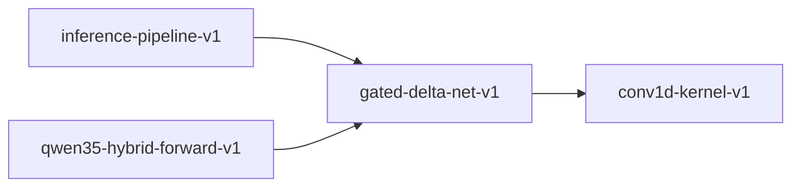

# gated-delta-net-v1

**Version:** 1.0.0

Gated Delta Net — Qwen3.5 linear attention with decay, delta rule, and causal conv1d

## References

- Yang et al. (2024) Gated Delta Networks: Improving Mamba2 with Delta Rule
- Qwen3.5 Technical Report — Qwen3_5GatedDeltaNet layer
- GH-278 implementation notes

## Dependencies

- [conv1d-kernel-v1](conv1d-kernel-v1.md)

## Dependency Graph

## Equations

### decay

$$
\alpha_t = sigmoid(A_log.\exp() × dt + dt_bias)
$$

**Domain:** $A_log \in \mathbb{R}, dt \in \mathbb{R}, dt_bias \in \mathbb{R}$

**Codomain:** $\alpha_t \in (0, 1)$

**Invariants:**

- $sigmoid output strictly in (0,1)$
- $Decay controls information retention$

### delta

$$
\delta_t = \beta_t × (v_t - r_t)
$$

**Domain:** $\beta_t \in \mathbb{R}, v_t \in \mathbb{R}^{v_dim}, r_t \in \mathbb{R}^{v_dim}$

**Codomain:** $\delta_t \in \mathbb{R}^{v_dim}$

**Invariants:**

- $Delta rule corrects toward target v_t$

### output

$$
o_t = state_t^T @ q_t × z_t
$$

**Domain:** $state_t \in \mathbb{R}^{k_dim × v_dim}, q_t \in \mathbb{R}^{k_dim}, z_t \in \mathbb{R}^{v_dim}$

**Codomain:** $o_t \in \mathbb{R}^{v_dim}$

**Invariants:**

- $Output gated by z_t element-wise$

### read

$$
r_t = state^T @ k_t
$$

**Domain:** $state \in \mathbb{R}^{k_dim × v_dim}, k_t \in \mathbb{R}^{k_dim}$

**Codomain:** $r_t \in \mathbb{R}^{v_dim}$

**Invariants:**

- $Read is linear projection from state$

### write

$$
state_{t+1} = \alpha_t × state_t + k_t \otimes \delta_t
$$

**Domain:** $state_t \in \mathbb{R}^{k_dim × v_dim}, k_t \in \mathbb{R}^{k_dim}, \delta_t \in \mathbb{R}^{v_dim}$

**Codomain:** $state_{t+1} \in \mathbb{R}^{k_dim × v_dim}$

**Invariants:**

- $State shape preserved across timesteps$
- $Outer product k_t \otimes \delta_t has shape [k_dim, v_dim]$

## Proof Obligations

| # | Type | Property | Formal |
|---|------|----------|--------|
| 1 | bound | Decay in unit interval | $\alpha_t \in (0, 1) since sigmoid maps \mathbb{R} \to (0, 1)$ |
| 2 | invariant | State shape preserved | $shape(state_{t+1}) == shape(state_t) == [k_dim, v_dim]$ |
| 3 | invariant | Causal conv1d | $conv1d output at t depends only on t..t-k+1$ |
| 4 | invariant | L2 norm preserves direction | $L2(q) / \|\|L2(q)\|\| \approx q / \|\|q\|\|$ |
| 5 | equivalence | SIMD matches scalar within ULP |  |

## SIMD Dispatch

| Kernel | ISA | Target |
|--------|-----|--------|
| gated_delta_net | avx2 | `gdn_recurrence_avx2` |
| gated_delta_net | ptx | `gated_delta_net_ptx` |
| gated_delta_net | scalar | `gdn_recurrence_scalar` |

## Falsification Tests

| ID | Rule | Prediction | If Fails |
|----|------|------------|----------|
| FALSIFY-GDN-001 | Decay bound | sigmoid(x) ∈ (0, 1) for all finite x | Sigmoid implementation not numerically stable |
| FALSIFY-GDN-002 | State shape | State [k_dim, v_dim] after any number of updates | Outer product dimension mismatch |
| FALSIFY-GDN-003 | Causal conv | Modifying future input does not change current output | Conv1d not properly causal |
| FALSIFY-GDN-004 | L2 direction | L2-normalized vector has same direction as input | L2 normalization changes direction |
| FALSIFY-GDN-005 | SIMD equivalence | SIMD and scalar give same result within ULP | SIMD reduction order differs |

## Kani Harnesses

| ID | Obligation | Bound | Strategy |
|----|------------|-------|----------|
| KANI-GDN-001 | GDN-BND-001 | 8 | stub_float |
| KANI-GDN-002 | GDN-INV-002 | 4 | bounded_int |

## QA Gate

**Gated Delta Net Contract** (F-GDN-001)

Qwen3.5 linear attention recurrence quality gate

**Checks:** decay_bound, state_shape, causal_conv, l2_direction

**Pass criteria:** All 5 falsification tests pass

