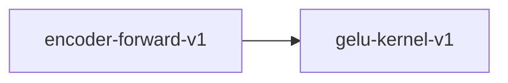

# gelu-kernel-v1

**Version:** 1.0.0

GELU kernel — Gaussian Error Linear Unit activation function

## References

- Hendrycks & Gimpel (2016) Gaussian Error Linear Units

## Dependency Graph

## Equations

### gelu

$$
GELU(x) = x * Phi(x) where Phi is the standard normal CDF
$$

**Domain:** $x in R$

**Codomain:** $GELU(x) in (-0.171, +inf)$

**Invariants:**

- $GELU(0) = 0 (zero preservation)$
- $GELU(x) >= 0 for x > 0 (non-negativity for positive inputs)$
- $GELU(x) ~ x for large positive x (asymptotic linearity)$
- $GELU is monotonically increasing for x > 0$
- $GELU(-x) + GELU(x) ~ 0 near origin (odd-function symmetry)$

### gelu_tanh_approx

$$
GELU_approx(x) = 0.5 * x * (1 + tanh(\sqrt{2/pi} * (x + 0.044715 * x^3)))
$$

**Domain:** $x in R$

**Codomain:** $GELU_approx(x) in (-0.171, +inf)$

**Invariants:**

- $|GELU(x) - GELU_approx(x)| < 0.005 for all x$
- $GELU_approx(0) = 0 (zero preservation)$

## Proof Obligations

| # | Type | Property | Formal |
|---|------|----------|--------|
| 1 | bound | Non-negativity for positive inputs | $x > 0 implies GELU(x) >= 0$ |
| 2 | monotonicity | Monotonically increasing for positive inputs | $x > y > 0 implies GELU(x) > GELU(y)$ |
| 3 | symmetry | Odd-function symmetry around origin | $GELU(-x) = -GELU(x) in the limit as the CDF approaches the step function$ |
| 4 | equivalence | SIMD matches scalar within ULP |  |
| 5 | bound | Tanh approximation accuracy | $\|GELU(x) - GELU_approx(x)\| < 0.005 for all x$ |

## Kernel Phases

1. **compute_cdf**: Compute Phi(x) via standard normal CDF or tanh approximation — *output in (0, 1)*
2. **multiply**: Compute x * Phi(x) — *result >= 0 for x > 0*

## SIMD Dispatch

| Kernel | ISA | Target |
|--------|-----|--------|
| gelu | avx2 | `gelu_avx2` |
| gelu | ptx | `gelu_ptx` |
| gelu | scalar | `gelu_scalar` |
| gelu_tanh_approx | avx2 | `gelu_tanh_approx_avx2` |
| gelu_tanh_approx | ptx | `gelu_tanh_approx_ptx` |
| gelu_tanh_approx | scalar | `gelu_tanh_approx_scalar` |

## Falsification Tests

| ID | Rule | Prediction | If Fails |
|----|------|------------|----------|
| FALSIFY-GE-001 | Non-negativity for positive inputs | GELU(x) >= 0 for all x > 0 | CDF computation underflow causing negative output |
| FALSIFY-GE-002 | Positive monotonicity | GELU(x) > GELU(y) when x > y > 0 | CDF saturation causing non-monotonicity |
| FALSIFY-GE-003 | Odd-function symmetry | \|GELU(-x) + GELU(x)\| < epsilon near origin | Asymmetric CDF approximation breaks odd-function property |
| FALSIFY-GE-004 | SIMD equivalence | \|gelu_avx2(x) - gelu_scalar(x)\| < 8 ULP | SIMD exp/tanh approximation differs from scalar |
| FALSIFY-GE-005 | Tanh approximation accuracy | \|GELU(x) - GELU_approx(x)\| < 0.005 for all x | Tanh approximation diverges from exact CDF-based GELU |
| FALSIFY-GE-006 | Boundary - large input stability | \|GELU(x) - x\| < 0.01 for x > 10 and \|GELU(x)\| < 0.01 for x < -10 | Numerical overflow in exp or tanh for extreme inputs |

## Kani Harnesses

| ID | Obligation | Bound | Strategy |
|----|------------|-------|----------|
| KANI-GE-001 | GE-BND-001 | 8 | stub_float |
| KANI-GE-002 | GE-APX-001 | 8 | stub_float |
| KANI-GELU_K-003 | Non-negativity for positive inputs | 8 | exhaustive |
| KANI-GELU_K-004 | Monotonically increasing for positive inputs | 8 | exhaustive |
| KANI-GELU_K-005 | Odd-function symmetry around origin | 8 | exhaustive |
| KANI-GELU_K-006 | SIMD matches scalar within ULP | 8 | exhaustive |
| KANI-GELU_K-007 | Tanh approximation accuracy | 8 | exhaustive |

## QA Gate

**GELU Contract** (F-GE-001)

Gaussian Error Linear Unit activation quality gate

**Checks:** non_negativity, monotonicity, odd_symmetry, simd_equivalence, approximation_accuracy

**Pass criteria:** All 6 falsification tests pass + Kani harnesses verify

