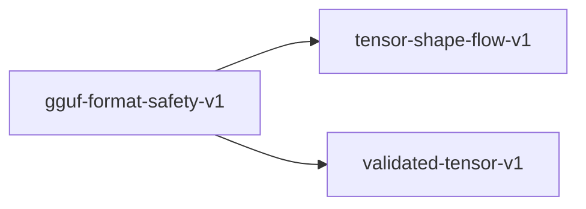

# gguf-format-safety-v1

**Version:** 1.0.0

GGUF binary format safety — magic number validation, version compatibility, tensor metadata integrity, alignment enforcement, and buffer overflow prevention. GGUF is the primary model format for local inference; parsing bugs here cause silent model corruption, segfaults, or arbitrary code execution.


## References

- GGUF Specification v3 (ggerganov/ggml, docs/gguf.md)
- CVE-2024-25664 — ggml GGUF heap buffer overflow in gguf_fread_str
- CVE-2024-25631 — ggml GGUF OOB read in GGUFReader
- aprender/src/gguf/ — GGUF parser implementation

## Dependencies

- [tensor-shape-flow-v1](tensor-shape-flow-v1.md)
- [validated-tensor-v1](validated-tensor-v1.md)

## Dependency Graph



## Equations

### alignment_enforcement

$$
check_alignment: (offset, alignment) -> Result<u64, AlignmentError>
  aligned_offset = (offset + alignment - 1) & !(alignment - 1)
  actual data starts at aligned_offset
  Default alignment = 32 bytes (GGUF v3)

$$

**Domain:** $Raw offset and alignment value from header$

**Codomain:** $Aligned offset$

**Invariants:**

- $Alignment is always a power of 2 (1, 2, 4, 8, 16, 32, ...)$
- $Aligned offset >= original offset (never moves backward)$
- $Data region [aligned_offset, aligned_offset + size) within file$
- $Padding bytes between metadata and data are not interpreted$

### magic_validation

```
magic: &[u8; 4] -> Result<(), FormatError>
  bytes[0..4] == [0x47, 0x47, 0x55, 0x46]  ("GGUF")
  Any other value -> FormatError::InvalidMagic

```

**Domain:** $First 4 bytes of any file claimed to be GGUF$

**Codomain:** $Result<(), FormatError>$

**Invariants:**

- $Non-GGUF files always rejected (no false positives)$
- $Magic check runs before ANY allocation or metadata parsing$
- $Rejection is O(1) — no file scanning$

### metadata_kv_safety

$$
parse_kv: &[u8] -> Result<HashMap<String, MetadataValue>, ParseError>
  For each of n_kv pairs:
    key = read_string(buf)     -- UTF-8, length < 64KB
    value_type = read_u32(buf) -- must be valid MetadataValueType
    value = read_typed(buf, value_type)
  No duplicate keys allowed.

$$

**Domain:** $Raw byte buffer after header$

**Codomain:** $Result<HashMap<String, MetadataValue>, ParseError>$

**Invariants:**

- $String values length-checked before allocation (CVE-2024-25664 mitigation)$
- $Array values count-checked before allocation (no 2^64 element arrays)$
- $Nested arrays not allowed (flat values only in GGUF v3)$
- $Total metadata size bounded by header.metadata_offset$

### tensor_metadata_integrity

```
parse_tensor_info: (Header, &[u8]) -> Result<Vec<TensorInfo>, ParseError>
  For each of n_tensors in header:
    name = read_string(buf)       -- length-prefixed, checked
    n_dims = read_u32(buf)        -- must be 1..=4
    shape[0..n_dims] = read_u64s  -- each > 0, product < MAX_TENSOR_SIZE
    dtype = read_u32(buf)         -- must be valid GGMLType
    offset = read_u64(buf)        -- must be within file bounds

```

**Domain:** $GGUF header + raw byte buffer$

**Codomain:** `Result<Vec<TensorInfo>, ParseError> with n_tensors entries`

**Invariants:**

- $n_dims in [1, 4] — no 0-dim or 5+-dim tensors$
- $shape product does not overflow u64$
- $shape product * dtype_size does not exceed file size$
- $offset + tensor_size <= file_size (no OOB read)$
- $tensor name is valid UTF-8 with length < 256$
- $dtype is a known GGMLType variant (0..=20)$

### version_compatibility

```
check_version: u32 -> Result<GGUFVersion, FormatError>
  version ∈ {2, 3} -> Ok(version)
  version == 1 -> Err(DeprecatedVersion)
  version == 0 or version > 3 -> Err(UnknownVersion)

```

**Domain:** $u32 read from header bytes 4..8$

**Codomain:** $Result<GGUFVersion, FormatError>$

**Invariants:**

- $Version 1 rejected with upgrade guidance$
- $Future versions (>3) rejected to prevent silent misparse$
- $Endianness detected from magic bytes, applied to version read$

## Proof Obligations

| # | Type | Property | Formal |
|---|------|----------|--------|
| 1 | precondition | Magic check before allocation | $No heap allocation occurs before magic bytes are validated$ |
| 2 | bound | Tensor shape product bounded | $forall t in tensors, product(t.shape) * dtype_size(t.dtype) <= file_size$ |
| 3 | invariant | No out-of-bounds tensor read | $forall t, t.offset + t.size <= file_size$ |
| 4 | precondition | String length checked before allocation | `string_length < MAX_STRING_LEN checked before alloc(string_length)` |
| 5 | invariant | Alignment is power of two | `alignment & (alignment - 1) == 0 for all alignment values` |
| 6 | roundtrip | Version roundtrip consistency | `write_version(parse_version(bytes)) == bytes for valid versions` |

## Falsification Tests

| ID | Rule | Prediction | If Fails |
|----|------|------------|----------|
| FALSIFY-GGUF-001 | Magic check before allocation | File starting with "GGML" (old format) is rejected immediately | Magic check missing or runs after allocation |
| FALSIFY-GGUF-002 | Tensor shape product bounded | Tensor with shape [2^32, 2^32, 1, 1] rejected (overflow) | Shape product overflow not checked — potential heap spray |
| FALSIFY-GGUF-003 | No out-of-bounds tensor read | Tensor with offset beyond file end returns error | OOB read — CVE-2024-25631 class vulnerability |
| FALSIFY-GGUF-004 | String length checked before allocation | Metadata string claiming 4GB length does not allocate 4GB | Heap buffer overflow — CVE-2024-25664 class vulnerability |
| FALSIFY-GGUF-005 | Alignment is power of two | Alignment value of 7 (not power of 2) returns AlignmentError | Non-power-of-2 alignment causes misaligned reads |
| FALSIFY-GGUF-006 | Version roundtrip consistency | Version 4 (future) is rejected with UnknownVersion | Future version silently misparsed |

## Kani Harnesses

| ID | Obligation | Bound | Strategy |
|----|------------|-------|----------|
| KANI-GGUF-001 | Magic check before allocation | 4 | exhaustive |
| KANI-GGUF-002 | Tensor shape product bounded | 16 | bounded_int |
| KANI-GGUF-003 | No out-of-bounds tensor read | 8 | exhaustive |
| KANI-GGUF-004 | String length checked before allocation | 8 | bounded_int |
| KANI-GGUF-005 | Alignment is power of two | 32 | exhaustive |
| KANI-GGUF-006 | Version roundtrip consistency | 4 | exhaustive |

## QA Gate

**GGUF Format Safety Contract** (F-GGUF-GATE)

Binary format parsing safety — prevents CVE-class vulnerabilities

**Checks:** magic_validation, tensor_metadata_integrity, alignment_enforcement, metadata_kv_safety

**Pass criteria:** All 6 falsification tests pass

