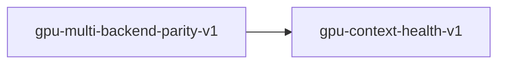

# gpu-context-health-v1

**Version:** 1.0.0

GPU context health contract — ensures FP8 warmup does not poison CUDA context on incompatible architectures (Blackwell sm_121+). Prevents CUDA_ERROR_ILLEGAL_ADDRESS from propagating.

## References

- GH-542: 32B batch inference crashes on Blackwell sm_121
- GH-480: Blackwell sm_121 PTX JIT backward branch patching
- realizar src/cuda/gpu_profile.rs — detect_fp8_prefill()
- realizar src/cuda/executor/layers/cublas_prefill/attention.rs — warmup_fp8_cache()

## Dependency Graph



## Equations

### context_health

```
healthy = (post_warmup_status == CUDA_SUCCESS)
```

**Domain:** `post_warmup_status = cuCtxGetApiVersion return code after FP8 warmup attempt`

**Invariants:**

- $If fp8_enabled = false, context_health is trivially true (no warmup attempted)$
- $If fp8_enabled = true and warmup fails, context MUST be destroyed and recreated$
- `A poisoned context (CUDA_ERROR_ILLEGAL_ADDRESS) MUST NOT be reused for inference`

### cuda_graph_guard

```
SKIP_CUDA_GRAPH=1 disables graph capture to prevent context poisoning
```

**Invariants:**

- `When SKIP_CUDA_GRAPH=1, cuStreamBeginCapture is never called`
- $Non-graphed path dispatches kernels individually (280 launches vs 1)$

### culink_skip

$$
cuLinkCreate never called — use legacy cuModuleLoadDataEx only
$$

**Invariants:**

- `compile_ptx_to_cubin() always returns Err (cuLinkCreate skipped)`
- $Legacy JIT (cuModuleLoadDataEx) used for all PTX modules$

### fp8_architecture_guard

$$
fp8_enabled = (cc >= 89)
$$

**Domain:** $cc = CUDA compute capability (integer)$

**Codomain:** $fp8_enabled in {true, false}$

**Invariants:**

- $cc < 89 implies fp8_enabled = false (pre-Ada)$
- $cc >= 89 implies fp8_enabled = true (Ada/Hopper/Blackwell)$
- $PMAT-410: FP8 GEMM works on sm_121 via lazy cache (no warmup needed)$
- `warmup_fp8_cache STILL guarded by cc < 100 (warmup crashes on Blackwell)`

## Proof Obligations

| # | Type | Property | Formal |
|---|------|----------|--------|
| 1 | invariant | FP8 is disabled on Blackwell (cc >= 100) | $For all cc >= 100: fp8_enabled = false$ |
| 2 | invariant | FP8 warmup cannot poison context on incompatible hardware | `warmup_fp8_cache() is a no-op when cc >= 100` |
| 3 | invariant | FP8 dispatch guard prevents runtime FP8 on Blackwell | `cublas_prefill_gemm() never dispatches FP8 path when cc >= 100` |

## Falsification Tests

| ID | Rule | Prediction | If Fails |
|----|------|------------|----------|
| FT-GPU-CTX-001 | FP8 architecture guard | detect_fp8_prefill(cc) == false for all cc >= 100 | FP8 enabled on incompatible Blackwell hardware, causes CUDA_ERROR_ILLEGAL_ADDRESS |
| FT-GPU-CTX-002 | Context health after warmup | warmup_fp8_cache() is a no-op when cc >= 100 | FP8 warmup poisons CUDA context on Blackwell, crashing inference |
| FT-GPU-CTX-003 | Ada/Hopper FP8 still enabled | detect_fp8_prefill(cc) == true for cc in [89, 90] | FP8 regression — disabled on hardware that supports it |

## Kani Harnesses

| ID | Obligation | Bound | Strategy |
|----|------------|-------|----------|
| KANI-GPU-CTX-001 | FP8 is disabled on Blackwell | 256 | exhaustive |
| KANI-GPU_CO-002 | FP8 is disabled on Blackwell (cc >= 100) | 8 | exhaustive |
| KANI-GPU_CO-003 | FP8 warmup cannot poison context on incompatible hardware | 8 | exhaustive |
| KANI-GPU_CO-004 | FP8 dispatch guard prevents runtime FP8 on Blackwell | 8 | exhaustive |

## QA Gate

**gpu-context-health-v1 Contract** (F-GCHV-001)

Quality gate for GPU context health contract — ensures FP8 warmup does not po

**Checks:** validation, falsification

