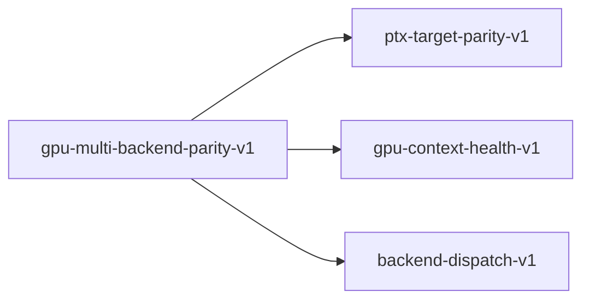

# gpu-multi-backend-parity-v1

**Version:** 1.0.0

Multi-backend GPU parity contract — ensures at least one GPU backend (wgpu, CUDA, NVRTC) produces cosine >= 0.98 vs CPU. Addresses GH-559 (sm_121 JIT bug) by validating at model load time.

## References

- GH-559: GPU parity FAILED cosine=-0.005 on Blackwell sm_121
- albor#82: PyTorch canary proves hardware correct (cosine=1.0)
- entrenar#309: training 21x slower than PyTorch (same root cause)
- §25 GPU Compute Architecture Specification
- Ivanov et al. (2021) Data Movement Is All You Need — MLSys 2021
- NVIDIA PTX ISA v8.5 — forward compatibility specification

## Dependencies

- [ptx-target-parity-v1](ptx-target-parity-v1.md)
- [gpu-context-health-v1](gpu-context-health-v1.md)
- [backend-dispatch-v1](backend-dispatch-v1.md)

## Dependency Graph

## Equations

### backend_priority

$$
select(backends) = first(b in [cuda, wgpu, cpu] where parity(b) >= 0.98)
$$

**Domain:** $backends sorted by expected performance: cuda > wgpu > cpu$

**Invariants:**

- $CUDA preferred when JIT works (pre-Blackwell, post-driver-fix)$
- $wgpu fallback when CUDA JIT broken (Blackwell sm_121)$
- $CPU always available as last resort$

### bandwidth_bound_theorem

$$
latency(backend) >= model_bytes / bandwidth(device)
$$

**Domain:** $All backends, all devices$

**Invariants:**

- $Q4K reads 0.5625 B/element (4.5 bits per weight)$
- $FP16 reads 2.0 B/element (16 bits per weight)$
- $Q4K backend is at most bandwidth(FP16)/bandwidth(Q4K) = 3.56x faster$
- $Memory bandwidth is the bottleneck for M=1 decode (Ivanov 2021)$

### jit_compilation_correctness

$$
cosine(jit_sass(ptx, device), reference_sass(ptx, device)) >= 0.9999
$$

**Domain:** $ptx = valid PTX with .target sm_90, device in {sm_89, sm_90, sm_121}$

**Codomain:** $cosine similarity of output logits$

**Invariants:**

- $JIT SASS must produce numerically equivalent results to offline-compiled SASS$
- $NVIDIA PTX ISA guarantees forward compatibility for .target <= device SM$
- $VIOLATION on sm_121: cosine = -0.005 (GH-559)$

### multi_backend_parity

$$
exists b in backends: cosine(forward(b, token), forward(cpu, token)) >= 0.98
$$

**Domain:** $backends = {wgpu, cuda_jit, cuda_nvrtc} intersect available_backends$

**Codomain:** $Boolean$

**Invariants:**

- $At least one GPU backend must produce cosine >= 0.98 vs CPU$
- $If no GPU backend passes, system uses CPU (never garbage GPU output)$
- $Backend selection is deterministic for a given (model, device) pair$
- $Parity gate runs at model load time, not per-token$

## Proof Obligations

| # | Type | Property | Formal |
|---|------|----------|--------|
| 1 | invariant | At least one backend passes parity | $for all models M, exists b: cosine(forward(b, M, bos), forward(cpu, M, bos)) >= 0.98$ |
| 2 | invariant | Failed backend never serves inference | $parity(b) < 0.98 implies b is not used for token generation$ |
| 3 | invariant | Backend selection is deterministic | `select(M, D, t1) == select(M, D, t2) for same model M and device D` |
| 4 | equivalence | wgpu matches CPU within tolerance | $cosine(forward(wgpu, M, token), forward(cpu, M, token)) >= 0.98$ |
| 5 | equivalence | NVRTC-compiled CUDA matches CPU within tolerance | $cosine(forward(nvrtc, M, token), forward(cpu, M, token)) >= 0.98$ |
| 6 | bound | Q4K bandwidth advantage | $latency(q4k_gemv) <= latency(fp16_gemm) for M=1 on same device$ |

## Kernel Phases

1. **parity_probe**: Run 1-token forward on candidate backend, compare with CPU — *cosine similarity >= 0.98 for backend to be accepted*
2. **backend_select**: Choose highest-priority passing backend — *Selection is deterministic and cached for session*
3. **inference_dispatch**: Route all subsequent tokens to selected backend — *No backend switching mid-session*

## Falsification Tests

| ID | Rule | Prediction | If Fails |
|----|------|------------|----------|
| FALSIFY-MBP-001 | wgpu parity on sm_121 | cosine(wgpu_forward, cpu_forward) >= 0.98 on GB10 Blackwell | Vulkan shader compiler also has sm_121 issues — need NVRTC or CPU-only |
| FALSIFY-MBP-002 | NVRTC parity on sm_121 | cosine(nvrtc_forward, cpu_forward) >= 0.98 on GB10 Blackwell | NVRTC compiler also produces wrong sm_121 SASS — driver bug, not JIT-specific |
| FALSIFY-MBP-003 | PyTorch canary (hardware validation) | cosine(pytorch_gpu, pytorch_cpu) >= 0.9999 on same device | Hardware defect — not a software issue |
| FALSIFY-MBP-004 | CUDA JIT parity on pre-Blackwell | cosine(cuda_jit, cpu) >= 0.98 on sm_89 (Ada) and sm_90 (Hopper) | JIT bug is not sm_121-specific — broader NVIDIA driver issue |
| FALSIFY-MBP-005 | Q4K bandwidth advantage over cuBLAS | Q4K GEMV tok/s >= 2x cuBLAS FP16 HGEMM tok/s for M=1 decode | Q4K kernel overhead negates bandwidth advantage — cuBLAS is better path |
| FALSIFY-MBP-006 | No silent fallback to garbage backend | If parity < 0.98, inference uses CPU (not failed GPU) | Toyota Way violation — system serves garbage instead of stopping the line |
| FALSIFY-MBP-007 | Driver update resolves JIT bug | Future NVIDIA driver (>590) produces cosine >= 0.98 on sm_121 via JIT | JIT bug persists across driver versions — permanent NVRTC/wgpu requirement |

## Kani Harnesses

| ID | Obligation | Bound | Strategy |
|----|------------|-------|----------|
| KANI-MBP-001 | Backend selection determinism | 8 | exhaustive |
| KANI-MBP-002 | Failed backend not used | 4 | bounded_int |
| KANI-GPU_MU-003 | At least one backend passes parity | 8 | exhaustive |
| KANI-GPU_MU-004 | Failed backend never serves inference | 8 | exhaustive |
| KANI-GPU_MU-005 | Backend selection is deterministic | 8 | exhaustive |
| KANI-GPU_MU-006 | wgpu matches CPU within tolerance | 8 | exhaustive |
| KANI-GPU_MU-007 | NVRTC-compiled CUDA matches CPU within tolerance | 8 | exhaustive |
| KANI-GPU_MU-008 | Q4K bandwidth advantage | 8 | exhaustive |

## QA Gate

**Multi-Backend GPU Parity** (F-MBP-001)

Ensures at least one GPU backend produces correct results, with automatic fallback

**Checks:** wgpu_parity, nvrtc_parity, pytorch_canary, no_silent_garbage, q4k_bandwidth_advantage

**Pass criteria:** PyTorch canary passes (hardware OK) AND at least one sovereign backend (wgpu or NVRTC) passes parity

