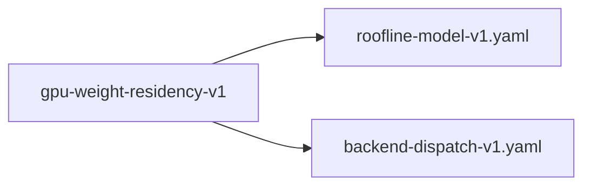

# gpu-weight-residency-v1

**Version:** 1.0.0

GPU inference must pre-upload all model weights to VRAM at startup

## References

- qwen-coder-deploy bench-results-v2: apr GPU 108 tok/s vs llama.cpp 225 tok/s
- realizar CUDA log: 'Pre-uploaded 0 MB weights to GPU' — no weights resident
- Gregg & Hazelwood (2011) 5× PCIe rule — data must be resident for GPU benefit
- roofline-model-v1.yaml — bandwidth ceiling analysis

## Dependencies

- [roofline-model-v1.yaml](roofline-model-v1.yaml.md)
- [backend-dispatch-v1.yaml](backend-dispatch-v1.yaml.md)

## Dependency Graph



## Equations

### pcie_overhead

```
Per-inference PCIe transfer cost:
  transfer_time = model_bytes / pcie_bandwidth
  Qwen2.5-1.5B Q4K: 1.1 GB / 32 GB/s (PCIe 4.0 x16) ≈ 34ms

Per-token overhead (28 layers, 7 matmuls/layer):
  matmul_transfers = 196 × weight_slab_bytes / pcie_bandwidth

With persistent VRAM residency:
  transfer_time = 0 (weights already in VRAM)
  Only activations + KV cache cross PCIe (negligible for batch=1)

```

**Domain:** $PCIe 4.0 x16, model_bytes > 0$

**Invariants:**

- $Persistent residency eliminates per-inference transfer$
- $VRAM usage = model_bytes (constant after startup)$

### throughput_target

$$
GPU memory bandwidth ceiling (RTX 4090):
  bw_ceiling = 1008 GB/s / 1.1 GB \approx 916 tok/s (theoretical)
  llama.cpp measured: 225 tok/s (24.5\% roofline utilization)
  apr measured: 108 tok/s (11.8\% roofline utilization)

Target: apr GPU \geq 180 tok/s (80\% of llama.cpp, 19.6\% roofline)

$$

**Domain:** $RTX 4090, Qwen2.5-1.5B Q4K$

**Invariants:**

- $Throughput bounded by min(bw_ceiling, compute_ceiling)$
- $Weight residency eliminates PCIe bottleneck$

## Proof Obligations

| # | Type | Property | Formal |
|---|------|----------|--------|
| 1 | invariant | All weights resident in VRAM after startup | `gpu_memory_used ≥ model_bytes after Benchmark::new()` |
| 2 | bound | GPU throughput reaches target | $tok/s(apr GPU) \geq 180 on RTX 4090 with Qwen2.5-1.5B Q4K$ |
| 3 | invariant | Zero PCIe transfers during inference | $cudaMemcpy count during forward() = 0 for weight tensors$ |
| 4 | equivalence | Output parity with CPU path | `argmax(logits_gpu) == argmax(logits_cpu) for greedy decoding` |
| 5 | invariant | PMAT-394: Grace Blackwell unified memory — cuMemAllocManaged eager, not lazy | $cuMemAllocManaged on CUDA 13.0/GB10 allocates physical pages immediately (Xid 31 on OOM)$ |

## Falsification Tests

| ID | Rule | Prediction | If Fails |
|----|------|------------|----------|
| FALSIFY-GWR-001 | Weight residency | nvidia-smi shows model_bytes MB allocated after server startup | Weights loaded on-demand, not at startup |
| FALSIFY-GWR-002 | Throughput target | apr GPU ≥ 180 tok/s on Qwen2.5-1.5B Q4K (RTX 4090) | PCIe overhead or kernel launch overhead exceeds budget |
| FALSIFY-GWR-003 | No per-inference transfers | nsys trace shows 0 cudaMemcpyHtoD during steady-state inference | Weights being re-uploaded per request |
| FALSIFY-GWR-004 | Output parity | GPU output matches CPU output within tolerance | VRAM layout corruption or precision drift |
| FALSIFY-GWR-005 | Grace Blackwell unified memory | cuMemAllocManaged uses eager allocation, not lazy | Lazy allocation causes page faults during inference |

## Kani Harnesses

| ID | Obligation | Bound | Strategy |
|----|------------|-------|----------|
| KANI-GWR-001 | All weights resident in VRAM after startup | 4 | bounded_int |
| KANI-GWR-002 | GPU throughput reaches target | 4 | bounded_int |
| KANI-GWR-003 | Zero PCIe transfers during inference | 8 | bounded_int |
| KANI-GWR-004 | Output parity with CPU path | 8 | stub_float |

## QA Gate

**GPU Weight Residency Contract** (F-GWR-001)

Persistent VRAM weight storage for inference throughput

**Checks:** weight_residency, throughput_target, no_pcie_transfers, output_parity

**Pass criteria:** All 5 falsification tests pass + throughput ≥ 180 tok/s

