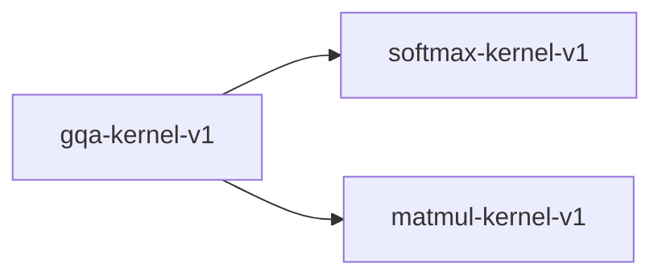

# gqa-kernel-v1

**Version:** 1.0.0

GQA kernel — grouped query attention with KV head broadcasting

## References

- Ainslie et al. (2023) GQA: Training Generalized MQT Models
- Vaswani et al. (2017) Attention Is All You Need

## Dependencies

- [softmax-kernel-v1](softmax-kernel-v1.md)
- [matmul-kernel-v1](matmul-kernel-v1.md)

## Dependency Graph

## Equations

### gqa

$$
GQA(Q, K, V) = softmax(Q_g * K_h^T / \sqrt{d_k}) * V_h
$$

**Domain:** $Q in R^{n x d}, K in R^{s x d}, V in R^{s x d_v}, num_heads > 0, num_kv_heads > 0$

**Codomain:** $GQA(Q, K, V) in R^{n x d}$

**Invariants:**

- $Attention weights sum to 1 per query position (normalization)$
- $Output is convex combination of V rows per head$
- $GQA(kv_heads=num_heads) = standard MHA$
- $num_heads must be divisible by num_kv_heads$

## Proof Obligations

| # | Type | Property | Formal |
|---|------|----------|--------|
| 1 | invariant | Attention weight normalization | $\|sum(attn_weights[i, :]) - 1.0\| < eps per query position i$ |
| 2 | equivalence | GQA degenerates to MHA | $GQA(kv_heads=num_heads) == MHA(Q, K, V) within tolerance$ |
| 3 | bound | Output is convex combination of V | $min(V) <= output_i <= max(V) per head$ |
| 4 | invariant | KV head broadcasting correctness | $Q heads [g*r..(g+1)*r] share K_g, V_g where r = num_heads/num_kv_heads$ |
| 5 | equivalence | SIMD matches scalar within ULP |  |

## Kernel Phases

1. **kv_broadcast**: Broadcast KV heads to match query head groups
   — *Each KV head serves exactly num_heads/num_kv_heads query heads*
2. **qk_matmul**: Compute Q * K^T / sqrt(d_k) per head — *Score matrix is n x s per head*
3. **attention_softmax**: Apply softmax to scores per query position — *Weights sum to 1 per row*
4. **weighted_sum**: Compute weighted sum of V rows — *Output is convex combination of V*

## SIMD Dispatch

| Kernel | ISA | Target |
|--------|-----|--------|
| gqa | avx2 | `gqa_avx2` |
| gqa | ptx | `gqa_ptx` |
| gqa | scalar | `gqa_scalar` |

## Falsification Tests

| ID | Rule | Prediction | If Fails |
|----|------|------------|----------|
| FALSIFY-GQ-001 | Weight normalization | sum(attn_weights[i, :]) = 1.0 for all query positions i | Softmax applied along wrong dimension or missing |
| FALSIFY-GQ-002 | MHA degeneration | \|GQA(kv=h) - MHA(Q,K,V)\| < 1e-6 when kv_heads=num_heads | KV broadcasting logic incorrect when groups=1 |
| FALSIFY-GQ-003 | Convex combination bound | min(V) <= output_i <= max(V) per head | Attention weights not properly normalized |
| FALSIFY-GQ-004 | Head divisibility | num_heads % num_kv_heads == 0 enforced at construction | Missing divisibility check |
| FALSIFY-GQ-005 | SIMD equivalence | \|gqa_avx2(Q,K,V) - gqa_scalar(Q,K,V)\| < 8 ULP | SIMD matmul accumulation order differs |
| FALSIFY-GQ-006 | Boundary - single KV head (MQA) | GQA(kv_heads=1) broadcasts single KV to all query heads | Multi-query degenerate case not handled |

## Kani Harnesses

| ID | Obligation | Bound | Strategy |
|----|------------|-------|----------|
| KANI-GQ-001 | GQ-INV-001 | 4 | stub_float |
| KANI-GQ-002 | GQ-EQV-001 | 4 | stub_float |
| KANI-GQ-003 | GQ-BND-001 | 4 | stub_float |

## QA Gate

**GQA Contract** (F-GQ-001)

Grouped query attention with KV broadcasting quality gate

**Checks:** weight_normalization, mha_equivalence, convex_bound, simd_equivalence

**Pass criteria:** All 6 falsification tests pass + Kani harnesses verify

