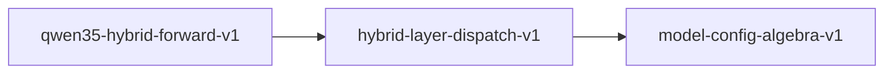

# hybrid-layer-dispatch-v1

**Version:** 1.0.0

Qwen3.5 hybrid attention layer dispatch and linear attention invariants

## References

- Qwen3.5 Fine-Tune Spec — hybrid architecture
- Yang et al. (2024) Gated Linear Attention

## Dependencies

- [model-config-algebra-v1](model-config-algebra-v1.md)

## Dependency Graph

## Equations

### conv1d_causal

$$
len(causal_conv1d(x, kernel_size=k)) == len(x)
$$

**Domain:** $x \in \mathbb{R}^T, padding = k - 1$

**Invariants:**

- $Output length equals input length (causal padding)$
- $Output at position t depends only on x[t-k+1..t]$

### head_grouping

$$
n_v \% n_k == 0
$$

**Domain:** $n_v >= n_k$

**Invariants:**

- $V heads are integer multiple of K heads$

### hybrid_dispatch

$$
dispatch(i) = layer_types[i] where layer_types \in {'attention', 'linear'}^L
$$

**Domain:** $i \in [0, L)$

**Invariants:**

- $len(layer_types) == num_hidden_layers$
- $Pure function of layer index$

### linear_associativity

$$
(V @ K^T) @ Q == V @ (K^T @ Q)
$$

**Domain:** $Conformable matrices$

**Invariants:**

- $Matrix multiplication is associative$

### linear_no_softmax

$$
linear_attn(Q, K, V) != softmax(Q @ K^T) @ V
$$

**Domain:** $Linear attention path$

**Invariants:**

- $Linear attention does NOT use softmax$

### linear_shapes

$$
K_dim = n_k * d_k, V_dim = n_v * d_v
$$

**Domain:** $n_k may != n_v, d_k may != d_v$

**Invariants:**

- $K and V head counts can differ$
- $Output still matches hidden_dim after O projection$

## Proof Obligations

| # | Type | Property | Formal |
|---|------|----------|--------|
| 1 | invariant | Exhaustive partition | $len(layer_types) == L, each entry in {attention, linear}$ |
| 2 | invariant | Matrix associativity | $(A @ B) @ C == A @ (B @ C) within numerical tolerance$ |
| 3 | invariant | Head grouping exact | $n_v \% n_k == 0 for valid configs$ |
| 4 | invariant | Residual shape preservation | $O_proj output dim == hidden_dim$ |
| 5 | invariant | Conv1d causal output length | $output_len == input_len with padding = kernel_size - 1$ |
| 6 | equivalence | SIMD linear attention equivalence |  |

## Falsification Tests

| ID | Rule | Prediction | If Fails |
|----|------|------------|----------|
| FALSIFY-HL-001 | Exhaustive partition | Every layer has exactly one type | Missing or duplicate layer assignment |
| FALSIFY-HL-002 | Matrix associativity | Two groupings yield same result within tolerance | Numerical instability in matmul |
| FALSIFY-HL-003 | Head grouping exact | n_v divisible by n_k for all valid configs | Head grouping constraint not enforced |
| FALSIFY-HL-004 | Residual shape preservation | O_proj output dim == hidden_dim | O projection output size != hidden_dim |
| FALSIFY-HL-005 | Conv1d causal | Padded conv1d preserves sequence length | Padding calculation error |
| FALSIFY-HL-006 | SIMD linear attention equivalence | SIMD linear attention matches scalar | SIMD path diverges from scalar reference |

## Kani Harnesses

| ID | Obligation | Bound | Strategy |
|----|------------|-------|----------|
| KANI-HL-001 | HL-INV-001 | 8 | bounded_int |
| KANI-HL-002 | HL-INV-005 | 16 | bounded_int |

## QA Gate

**Hybrid Layer Dispatch Contract** (F-HL-001)

Qwen3.5 hybrid architecture quality gate

**Checks:** exhaustive_partition, matrix_associativity, head_grouping, residual_preservation, conv1d_causal

**Pass criteria:** All 6 falsification tests pass

