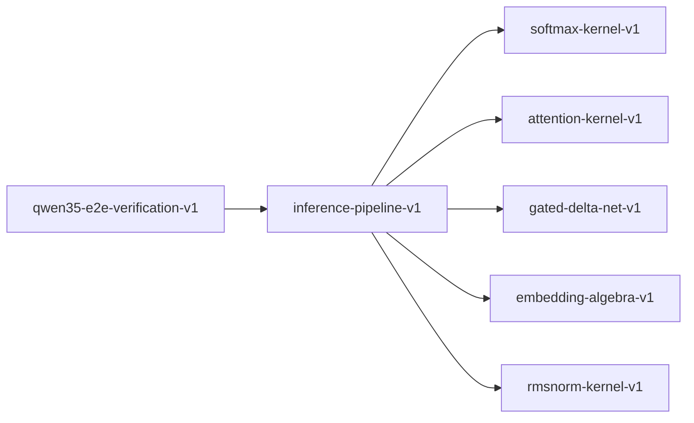

# inference-pipeline-v1

**Version:** 1.0.0

End-to-end inference pipeline — prefill/decode composition for Qwen3.5 hybrid architecture

## References

- Dao et al. (2022) FlashAttention — prefill/decode phases
- Kwon et al. (2023) Efficient Memory Management for Large Language Model Serving with PagedAttention
- Qwen3.5 Technical Report — hybrid inference with attention and linear layers

## Dependencies

- [softmax-kernel-v1](softmax-kernel-v1.md)
- [attention-kernel-v1](attention-kernel-v1.md)
- [gated-delta-net-v1](gated-delta-net-v1.md)
- [embedding-algebra-v1](embedding-algebra-v1.md)
- [rmsnorm-kernel-v1](rmsnorm-kernel-v1.md)

## Dependency Graph

## Equations

### decode_step

$$
h_t = layer_L(... layer_1(embed(token_t), kv_cache_{t-1}))
$$

**Domain:** $Single new token, reading from and appending to KV cache$

**Invariants:**

- $Output shape: [1, d_model]$
- $KV cache grows by 1 position per step$
- $All intermediate activations finite$

### hybrid_layer_schedule

$$
layer_type(l) = attention if l in A else linear_attention
$$

**Domain:** $A = set of attention layer indices, |A| + |L| = num_layers$

**Invariants:**

- $Partition covers all layers$
- $No layer is both attention and linear$
- $At least one attention layer (layer 0 is typically attention)$

### kv_cache_growth

$$
cache_size(t) = sum_{l in A} 2 * n_kv * d_k * t * bytes_per_element
$$

**Domain:** $Only attention layers contribute to KV cache$

**Invariants:**

- $Linear in t (sequence position)$
- $Zero for linear attention layers$
- $Monotonically increasing$

### layer_composition

$$
forward(x) = rmsnorm(attn(x) + x) \to rmsnorm(ffn(.) + .)
$$

**Domain:** $Single transformer layer: attention + FFN with pre-norm$

**Invariants:**

- $Two sub-layers per transformer layer$
- $Pre-norm applied before each sub-layer$
- $Residual added after each sub-layer$

### prefill_phase

$$
H_L = layer_L(... layer_1(embed(tokens)))
$$

**Domain:** $tokens \in [0,V)^{seq_len}, output H_L \in R^{seq_len × d_model}$

**Invariants:**

- $Output shape: [seq_len, d_model]$
- $All intermediate activations finite$
- $Final hidden states used for KV cache initialization$

### residual_stream

$$
h_{l+1} = h_l + sublayer(norm(h_l))
$$

**Domain:** $Pre-norm residual connection per layer$

**Invariants:**

- $Residual preserves dimension: shape(h_{l+1}) = shape(h_l)$
- $Skip connection is additive (no scaling)$

## Proof Obligations

| # | Type | Property | Formal |
|---|------|----------|--------|
| 1 | invariant | Prefill output shape | $shape(H_L) = [seq_len, d_model]$ |
| 2 | invariant | Decode step output shape | $shape(h_t) = [1, d_model]$ |
| 3 | invariant | Residual dimension preservation | $\forall l: shape(h_{l+1}) = shape(h_l)$ |
| 4 | conservation | Residual is pure addition | $h_{l+1} - h_l = sublayer(norm(h_l))$ |
| 5 | invariant | Layer schedule partition | $\|A\| + \|L\| = num_layers, A ∩ L = ∅$ |
| 6 | monotonicity | KV cache monotonically growing | $t1 < t2 \to cache_size(t1) < cache_size(t2)$ |
| 7 | bound | All activations finite | $\forall l,t: is_finite(h_l(t))$ |

## Falsification Tests

| ID | Rule | Prediction | If Fails |
|----|------|------------|----------|
| FALSIFY-INF-001 | Prefill shape | Output matches [seq_len, d_model] | Shape propagation error in layer stack |
| FALSIFY-INF-002 | Decode shape | Single-token output is [1, d_model] | KV cache append corrupts shape |
| FALSIFY-INF-003 | Residual stream | h_{l+1} = h_l + sublayer(norm(h_l)) | Missing or scaled residual connection |
| FALSIFY-INF-004 | Layer schedule exhaustiveness | Every layer has a type | Missing layer in schedule |
| FALSIFY-INF-005 | KV cache growth | Cache grows by fixed amount per token | Variable KV cache increment |
| FALSIFY-INF-006 | Residual dimension preservation | shape(h_{l+1}) = shape(h_l) for all layers | Layer l changes hidden dimension |
| FALSIFY-INF-007 | Activation finiteness | No NaN or Inf in hidden states | Numerical instability in layer composition |

## Kani Harnesses

| ID | Obligation | Bound | Strategy |
|----|------------|-------|----------|
| KANI-INF-001 | INF-INV-001 | 4 | bounded_int |
| KANI-INF-002 | INF-INV-002 | 48 | exhaustive |

## QA Gate

**Inference Pipeline Contract** (F-INF-001)

End-to-end prefill/decode quality gate

**Checks:** prefill_phase, decode_step, residual_stream, layer_composition, hybrid_layer_schedule, kv_cache_growth

**Pass criteria:** All 7 falsification tests pass

