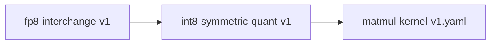

# int8-symmetric-quant-v1

**Version:** 1.0.0

INT8 symmetric per-row weight quantization for transformer inference — absmax scaling with integer accumulation

## References

- Dettmers et al. (2022) LLM.int8(): 8-bit Matrix Multiplication for Transformers at Scale
- Yao et al. (2022) ZeroQuant: Efficient and Affordable Post-Training Quantization for Large-Scale Transformers

## Dependencies

- [matmul-kernel-v1.yaml](matmul-kernel-v1.yaml.md)

## Dependency Graph

## Equations

### dequant_dot

$$
Dequantized matrix-vector product:
  output[r] = (Sigma dequant(W_q[r,i]) * x[i]) + bias[r]
  where dequant(w) = w * scale[r]
Equivalent integer-accumulate form:
  output[r] = scale[r] * (Sigma W_q[r,i] * x[i]) + bias[r]
The inner sum Sigma W_q[r,i] * x[i] can be computed with integer
or mixed-precision arithmetic, then scaled once per row.

$$

**Domain:** $W_q \in Z^{R x C}, x \in \mathbb{R}^C, scale \in \mathbb{R}^R, bias \in \mathbb{R}^R$

**Codomain:** $output \in \mathbb{R}^R$

**Invariants:**

- $Factored form is algebraically exact: scale[r] * Sigma(W_q[r,i] * x[i]) = Sigma(W_q[r,i] * scale[r] * x[i])$
- $output[r] = bias[r] when W[r,:] = 0 (zero-row passthrough)$

### per_row_scale

$$
scale[r] = max(|W[r,:]|) / 127
$$

**Domain:** $W \in \mathbb{R}^{R x C}, R rows, C columns$

**Codomain:** $scale \in \mathbb{R}^R, scale[r] >= 0$

**Invariants:**

- $scale[r] > 0 for all rows r where W[r,:] is not identically zero$
- $scale[r] = 0 if and only if W[r,:] = 0$

### quantize

$$
W_q[r,i] = clamp(round(W[r,i] / scale[r]), -127, 127)
$$

**Domain:** $W \in \mathbb{R}^{R x C}, scale \in \mathbb{R}^R$

**Codomain:** $W_q \in {-127, ..., 127}^{R x C}$

**Invariants:**

- $-127 <= W_q[r,i] <= 127 for all r,i$
- $W_q[r,i] = 0 for all i when scale[r] = 0 (zero-row preservation)$

## Proof Obligations

| # | Type | Property | Formal |
|---|------|----------|--------|
| 1 | equivalence | INT8 matvec approximates fp16 matvec | $\|int8_matvec(W, x) - fp16_matvec(W, x)\| < tolerance element-wise$ |
| 2 | invariant | Compression ratio: 1 byte per weight | $storage(W_q) = R * C bytes (vs 2 * R * C bytes for fp16)$ |
| 3 | invariant | Scale positivity for non-zero rows | `W[r,:] != 0 implies scale[r] > 0` |
| 4 | invariant | Quantized range | $-127 <= W_q[r,i] <= 127 for all r,i$ |
| 5 | invariant | Zero-row invariant | $W[r,:] = 0 implies scale[r] = 0 and output[r] = bias[r]$ |

## Kernel Phases

1. **compute_scales**: Per-row absmax: scan each row to find max absolute value, divide by 127 — *scale[r] = max(|W[r,:]|) / 127; scale[r] = 0 iff row is all-zero*
2. **quantize_weights**: Divide each weight by its row scale, round to nearest integer, clamp to [-127, 127] — *W_q[r,i] = clamp(round(W[r,i] / scale[r]), -127, 127); W_q stored as int8*
3. **int8_matvec**: Integer dot product per row, then scale and add bias — *output[r] = scale[r] * (Sigma_i W_q[r,i] * x[i]) + bias[r]*

## Falsification Tests

| ID | Rule | Prediction | If Fails |
|----|------|------------|----------|
| FALSIFY-I8Q-001 | Equivalence to fp16 for Whisper dimensions | \|int8_matvec(W, x) - fp16_matvec(W, x)\| < 0.05 element-wise | Quantization error exceeds tolerance — scale granularity insufficient or clamp distortion |
| FALSIFY-I8Q-002 | Round-trip accuracy (quantize then dequantize) | \|dequant(quant(W)) - W\| <= scale[r] / 2 element-wise (half-LSB bound) | Rounding mode or clamping introduces error beyond theoretical half-LSB bound |
| FALSIFY-I8Q-003 | Edge case: near-zero weights | Weights with \|W[r,i]\| < scale[r]/254 quantize to 0; scale remains valid | Subnormal or near-zero scale causes NaN or Inf in quantization |
| FALSIFY-I8Q-004 | Uniform distribution stress test | Equivalence holds for adversarial weight distributions (uniform, bimodal, heavy-tail) | Distribution shape causes systematic quantization bias exceeding tolerance |
| FALSIFY-I8Q-005 | Zero-row invariant | Property holds under boundary conditions | Edge case violation in Zero-row invariant |

## Kani Harnesses

| ID | Obligation | Bound | Strategy |
|----|------------|-------|----------|
| int8-symmetric-quant-v1-kani-001 | INT8 matvec approximates fp16 matvec | 8 | bounded_int |
| KANI-INT8_S-002 | Compression ratio: 1 byte per weight | 8 | exhaustive |
| KANI-INT8_S-003 | Scale positivity for non-zero rows | 8 | exhaustive |
| KANI-INT8_S-004 | Quantized range | 8 | exhaustive |
| KANI-INT8_S-005 | Zero-row invariant | 8 | exhaustive |

## QA Gate

**int8-symmetric-quant-v1 Contract** (F-ISQV-001)

Quality gate for INT8 symmetric per-row weight quantization for transformer i

**Checks:** validation, falsification

