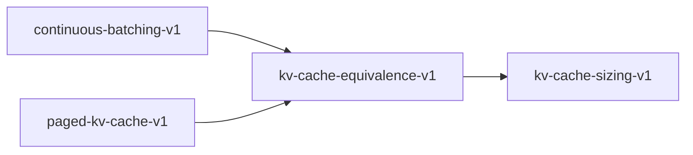

# kv-cache-equivalence-v1

**Version:** 1.0.0

KV cache equivalence, two-phase generation, and fused kernel correctness

## References

- Qwen2.5-Coder Showcase Spec §14
- Dao et al. (2022) FlashAttention

## Dependencies

- [kv-cache-sizing-v1](kv-cache-sizing-v1.md)

## Dependency Graph


```mermaid
graph LR
    kv_cache_equivalence_v1["kv-cache-equivalence-v1"] --> kv_cache_sizing_v1["kv-cache-sizing-v1"]
    continuous_batching_v1["continuous-batching-v1"] --> kv_cache_equivalence_v1["kv-cache-equivalence-v1"]
    paged_kv_cache_v1["paged-kv-cache-v1"] --> kv_cache_equivalence_v1["kv-cache-equivalence-v1"]
```

## Equations

### batched_serial_equivalence

$$
|batched_prefill(tokens) - serial_prefill(tokens)| < epsilon
$$

**Domain:** $Prefill phase$

**Invariants:**

- $Batched and serial prefill produce same result$

### fused_kernel

```
|fused_q4k_matvec(W, x) - matmul(dequant(W), x)| < epsilon
```

**Domain:** $Quantized weight W, float input x$

**Invariants:**

- $Fused equals decomposed within tolerance$
- $Epsilon depends on quantization (Q4K: 1e-3, F16: 1e-5)$

### page_shape

$$
page_elements = block_size * n_kv * d_k
$$

**Domain:** $PagedAttention configuration$

**Invariants:**

- $Page elements product of config values$

### prefill_incremental

```
|forward_with_cache(t_n) - forward_all([t_0..t_n])[n]| < epsilon
```

**Domain:** $Token sequence$

**Invariants:**

- $Cached forward equals full forward for last token$

## Proof Obligations

| # | Type | Property | Formal |
|---|------|----------|--------|
| 1 | frame | Cache append modifies only new entries; existing KV pairs unchanged | `modifies(cache[seq_len..seq_len+new_len]) ∧ preserves(cache[0..seq_len])` |
| 2 | old_state | Cache length increases by exactly the number of new tokens | `new(cache.len) = old(cache.len) + new_token_count` |
| 3 | equivalence | Prefill/incremental equivalence | $\|cached - full\| < 1e-5$ |
| 4 | invariant | Page shape formula | $page_elements = block_size * n_kv * d_k$ |
| 5 | equivalence | Batched/serial equivalence | $\|batched - serial\| < 1e-5$ |
| 6 | equivalence | Fused kernel equivalence | $\|fused - decomposed\| < 1e-3$ |

## Falsification Tests

| ID | Rule | Prediction | If Fails |
|----|------|------------|----------|
| FALSIFY-KCE-001 | Prefill/incremental | Cached matches full within tolerance | KV cache state corruption |
| FALSIFY-KCE-002 | Page shape | Formula matches actual page allocation | PagedAttention config error |
| FALSIFY-KCE-003 | Batched/serial | Both prefill modes agree | Batching introduces numerical drift |
| FALSIFY-KCE-004 | Fused kernel | Fused matches decomposed within quant tolerance | Fused kernel computation error |
| FALSIFY-KCE-005 | Frame condition — existing entries preserved | After cache append, all entries at positions < old_len are byte-identical | Cache append overwrites existing entries (off-by-one in slot index) |
| FALSIFY-KCE-006 | Old state — length growth | cache.len after append = cache.len before append + new_token_count | Cache append writes wrong number of entries |

## Kani Harnesses

| ID | Obligation | Bound | Strategy |
|----|------------|-------|----------|
| KANI-KCE-001 | KCE-INV-001 | 4 | bounded_int |
| KANI-KV_CAC-002 | Cache append modifies only new entries; existing KV pairs unchanged | 8 | exhaustive |
| KANI-KV_CAC-003 | Cache length increases by exactly the number of new tokens | 8 | exhaustive |
| KANI-KV_CAC-004 | Prefill/incremental equivalence | 8 | exhaustive |
| KANI-KV_CAC-005 | Page shape formula | 8 | exhaustive |
| KANI-KV_CAC-006 | Batched/serial equivalence | 8 | exhaustive |
| KANI-KV_CAC-007 | Fused kernel equivalence | 8 | exhaustive |

## QA Gate

**KV Cache Equivalence Contract** (F-KCE-001)

Cache and kernel equivalence quality gate

**Checks:** prefill_incremental, page_shape, batched_serial, fused_kernel

**Pass criteria:** All 6 falsification tests pass

