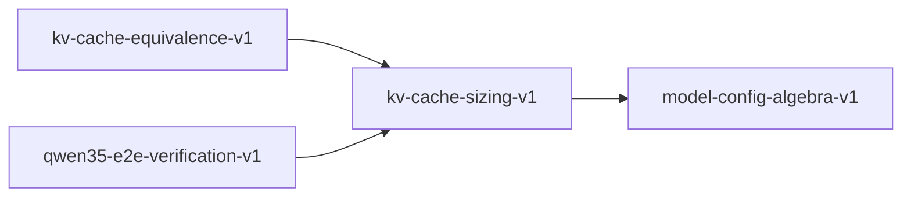

# kv-cache-sizing-v1

**Version:** 1.0.0

KV cache memory sizing and bias absence invariants

## References

- Qwen3 Performance Parity Spec — KV cache analysis
- Qwen3.5 Fine-Tune Spec — hybrid layer accounting

## Dependencies

- [model-config-algebra-v1](model-config-algebra-v1.md)

## Dependency Graph

## Equations

### bias_absence

$$
has_bias=false => count(bias_tensors) == 0
$$

**Domain:** $Model configuration$

**Invariants:**

- $No bias in projection when config says no bias$

### hybrid_accounting

$$
kv_layers = count(layer_type == 'attention')
$$

**Domain:** $Hybrid architecture with mixed layer types$

**Invariants:**

- $Only attention layers contribute to KV cache$
- $kv_layers <= total_layers$

### per_token_per_layer

$$
kv_bytes = 2 * n_kv * d_k * sizeof(dtype)
$$

**Domain:** $n_kv \in \mathbb{Z}^{+}, d_k \in \mathbb{Z}^{+}, sizeof(f16)=2, sizeof(f32)=4$

**Invariants:**

- $Factor of 2 for K and V$
- $Proportional to n_kv * d_k$

### total_kv_memory

$$
kv_total = L * S * 2 * n_kv * d_k * bytes_per_element
$$

**Domain:** $L=layers, S=sequence_length$

**Invariants:**

- $Linear in sequence length$
- $Linear in layer count$

### zero_input_identity

$$
W @ zeros = zeros when no bias
$$

**Domain:** $W \in \mathbb{R}^{m×n}, bias-free projection$

**Invariants:**

- $Matmul with zero input produces zero output$

## Proof Obligations

| # | Type | Property | Formal |
|---|------|----------|--------|
| 1 | invariant | Per-token KV bytes | $kv_bytes = 2 * n_kv * d_k * bpe$ |
| 2 | monotonicity | KV total monotonic in sequence length | $S1 < S2 => kv_total(S1) < kv_total(S2)$ |
| 3 | bound | Hybrid KV layers bounded | $kv_layers <= total_layers$ |
| 4 | invariant | Bias absence | $has_bias=false => 0 bias tensors$ |
| 5 | invariant | Zero input identity | $W @ 0 = 0 for bias-free projection$ |
| 6 | equivalence | SIMD KV equivalence |  |

## Falsification Tests

| ID | Rule | Prediction | If Fails |
|----|------|------------|----------|
| FALSIFY-KV-001 | Per-token KV bytes | Formula matches expected byte count | Missing factor of 2 (K+V) or wrong bpe |
| FALSIFY-KV-002 | KV total monotonic | Longer sequence => more KV cache | Non-linear component in formula |
| FALSIFY-KV-003 | Hybrid accounting | Only attention layers counted | Linear layers incorrectly counted |
| FALSIFY-KV-004 | Bias absence | has_bias=false => 0 bias tensors | Bias present despite config setting |
| FALSIFY-KV-005 | Zero input identity | W @ zeros = zeros for bias-free projection | Bias term leaking into zero-input result |
| FALSIFY-KV-006 | SIMD KV equivalence | SIMD KV sizing matches scalar | SIMD path uses different byte formula |

## Kani Harnesses

| ID | Obligation | Bound | Strategy |
|----|------------|-------|----------|
| KANI-KV-001 | KV-INV-001 | 4 | bounded_int |

## QA Gate

**KV Cache Sizing Contract** (F-KV-001)

KV cache memory quality gate

**Checks:** per_token_bytes, total_monotonic, hybrid_accounting, bias_absence, zero_input_identity

**Pass criteria:** All 6 falsification tests pass

