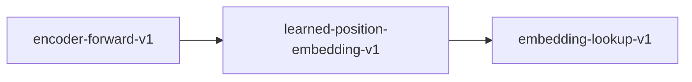

# learned-position-embedding-v1

**Version:** 1.0.0

Learned absolute position embeddings (RoBERTa-style)

## References

- Liu et al. (2019) RoBERTa: A Robustly Optimized BERT Pretraining Approach

## Dependencies

- [embedding-lookup-v1](embedding-lookup-v1.md)

## Dependency Graph

## Equations

### position_embedding

$$
PE(pos) = E[pos] where E in R^{max_positions x d_model}
$$

**Domain:** $pos in {0, 1, ..., max_positions - 1}$

**Codomain:** $R^{d_model}$

**Invariants:**

- $Lookup is O(1) (table index, not computation)$
- $pos < max_positions (bounds check)$
- $Output dimension equals d_model$

## Proof Obligations

| # | Type | Property | Formal |
|---|------|----------|--------|
| 1 | bound | Position in range | $0 <= pos < max_positions$ |
| 2 | equivalence | Deterministic lookup | $PE(pos) = PE(pos) for same weights (idempotent)$ |
| 3 | invariant | Output dimension | `PE(pos).len() == d_model for all valid pos` |

## Falsification Tests

| ID | Rule | Prediction | If Fails |
|----|------|------------|----------|
| FALSIFY-POS-001 | Out-of-bounds position | pos >= max_positions causes error, not silent truncation | Missing bounds check on position index |
| FALSIFY-POS-002 | Deterministic lookup | Same position always returns identical embedding | Non-determinism in embedding lookup |
| FALSIFY-POS-003 | Output dimension | PE(pos).len() == d_model for all valid positions | Embedding table has mismatched column dimension |

## Kani Harnesses

| ID | Obligation | Bound | Strategy |
|----|------------|-------|----------|
| KANI-POS-001 | Position in range | 16 | bounded_int |
| KANI-POS-002 | Deterministic lookup | 8 | stub_float |
| KANI-POS-003 | Output dimension | 16 | bounded_int |

## QA Gate

**learned-position-embedding-v1 Contract** (F-LPEV-001)

Quality gate for Learned absolute position embeddings (RoBERTa-style)

**Checks:** validation, falsification

