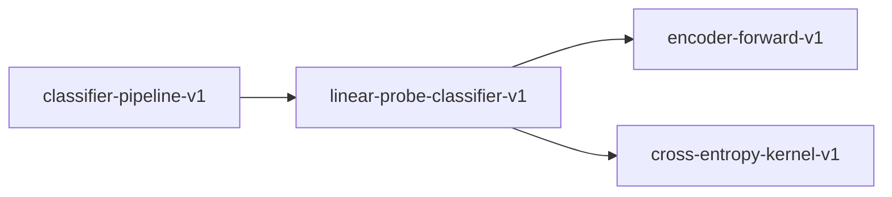

# linear-probe-classifier-v1

**Version:** 1.0.0

Linear probe classifier -- frozen encoder + trained linear head

## References

- Alain & Bengio (2016) Understanding intermediate layers using linear classifier probes

## Dependencies

- [encoder-forward-v1](encoder-forward-v1.md)
- [cross-entropy-kernel-v1](cross-entropy-kernel-v1.md)

## Dependency Graph

## Equations

### linear_probe

$$
logits = W @ embedding + b ; probs = softmax(logits)
$$

**Domain:** $embedding in R^{d_model}, W in R^{K x d_model}, b in R^K$

**Codomain:** $probs in R^K, sum(probs) = 1, probs_i > 0$

**Invariants:**

- $Frozen encoder weights do not receive gradients$
- $Only W and b are updated during training$
- $probs sum to 1.0$

## Proof Obligations

| # | Type | Property | Formal |
|---|------|----------|--------|
| 1 | invariant | Encoder frozen | `encoder_params_before == encoder_params_after for each training step` |
| 2 | invariant | Probability simplex | $\|sum(probs) - 1.0\| < eps AND probs_i > 0 for all i$ |
| 3 | invariant | Embedding determinism | `embed(x) == embed(x) for same x and weights (bit-identical)` |
| 4 | bound | Trainable parameter count | `trainable_params == K * d_model + K (only head weights)` |

## Falsification Tests

| ID | Rule | Prediction | If Fails |
|----|------|------------|----------|
| FALSIFY-PROBE-001 | Encoder truly frozen | Encoder weights unchanged after 100 training steps | Gradient leaking through frozen parameters |
| FALSIFY-PROBE-002 | Probability valid | Softmax output sums to 1.0 and all values > 0 | Numerical underflow in softmax or missing normalization |
| FALSIFY-PROBE-003 | Trainable parameter count | For K=2, d=768: exactly 1538 trainable params | Extra parameters added beyond linear head |
| FALSIFY-PROBE-004 | Embedding determinism | Same input produces bit-identical embeddings across calls | Non-determinism from dropout or random state leak in eval mode |

## Kani Harnesses

| ID | Obligation | Bound | Strategy |
|----|------------|-------|----------|
| KANI-PROBE-001 | Encoder frozen | 4 | bounded_int |
| KANI-PROBE-002 | Probability simplex | 8 | stub_float |
| KANI-PROBE-003 | Embedding determinism | 4 | stub_float |
| KANI-PROBE-004 | Trainable parameter count | 4 | bounded_int |

## QA Gate

**linear-probe-classifier-v1 Contract** (F-LPCV-001)

Quality gate for Linear probe classifier -- frozen encoder + trained linear h

**Checks:** validation, falsification

