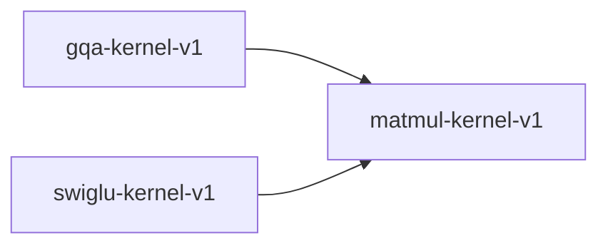

# matmul-kernel-v1

**Version:** 1.0.0

Matrix multiplication kernel — general and quantized variants

## References

- Goto & van de Geijn (2008) Anatomy of High-Performance Matrix Multiplication
- Dettmers et al. (2022) LLM.int8(): 8-bit Matrix Multiplication for Transformers

## Dependency Graph

## Equations

### matmul

$$
C_{ij} = \sum_k A_{ik} · B_{kj}
$$

**Domain:** $A \in \mathbb{R}^{m×p}, B \in \mathbb{R}^{p×n}$

**Codomain:** $C \in \mathbb{R}^{m×n}$

**Invariants:**

- $C has shape (m, n)$
- $Matmul is associative: (AB)C = A(BC)$
- $Matmul distributes over addition: A(B+C) = AB + AC$

### quantized_dot

$$
q_dot(a, b, s_a, s_b) = s_a · s_b · \sum_k a_k · b_k
$$

**Domain:** $a, b \in \mathbb{Z}^n (int8), s_a, s_b \in \mathbb{R} (scales)$

**Codomain:** $\mathbb{R}$

**Invariants:**

- $|q_dot - f32_dot| \leq quantization_error_bound$

## Proof Obligations

| # | Type | Property | Formal |
|---|------|----------|--------|
| 1 | invariant | Output shape correctness | $shape(A @ B) = (rows(A), cols(B))$ |
| 2 | associativity | Matmul associativity | $\|(AB)C - A(BC)\| < \varepsilon (within floating point)$ |
| 3 | linearity | Matmul distributes | $\|A(B+C) - AB - AC\| < \varepsilon$ |
| 4 | equivalence | SIMD matches scalar |  |
| 5 | bound | Quantized error bounded | $\|q_dot(a,b) - dot(dequant(a), dequant(b))\| \leq bound$ |

## Kernel Phases

1. **tile_partition**: Partition matrices into tiles for cache efficiency — *All elements covered exactly once*
2. **micro_kernel**: Compute C_tile += A_panel × B_panel — *Accumulation is exact (fused multiply-add)*
3. **store_result**: Write tile results to output matrix — *No overlap in output tiles*

## Falsification Tests

| ID | Rule | Prediction | If Fails |
|----|------|------------|----------|
| FALSIFY-MM-001 | Shape correctness | matmul(A[m,p], B[p,n]) has shape [m,n] | Dimension transposition error |
| FALSIFY-MM-002 | Numerical accuracy | \|matmul(A,B) - reference_matmul(A,B)\| < 1e-4 | Accumulation order or tiling error |
| FALSIFY-MM-003 | SIMD equivalence | \|matmul_avx2(A,B) - matmul_scalar(A,B)\| < 4 ULP | SIMD FMA ordering differs |
| FALSIFY-MM-004 | Quantized accuracy | \|q_dot(a,b) - float_dot(a,b)\| within quantization bound | Scale factor application error |
| FALSIFY-MM-005 | Identity matrix | matmul(A, I) = A and matmul(I, B) = B | Off-by-one in loop bounds |

## Kani Harnesses

| ID | Obligation | Bound | Strategy |
|----|------------|-------|----------|
| KANI-MM-001 | MM-INV-001 | 8 | exhaustive |

## QA Gate

**Matmul Contract** (F-MM-001)

**Checks:** shape_correctness, numerical_accuracy, simd_equivalence

**Pass criteria:** All 5 falsification tests pass

