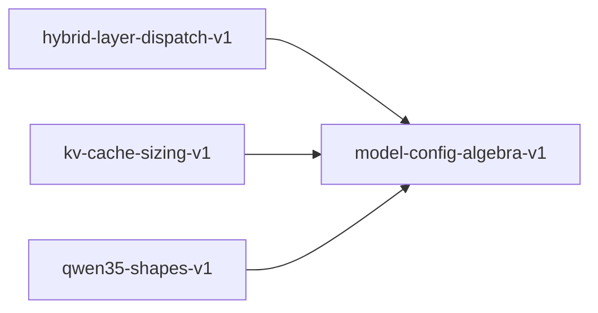

# model-config-algebra-v1

**Version:** 1.0.0

Model config algebra — 5-level proof hierarchy for transformer config constraints

## References

- Vaswani et al. (2017) Attention Is All You Need — head_dim = hidden_dim / num_heads
- Ainslie et al. (2023) GQA: Training Generalized Multi-Query — num_heads % num_kv_heads == 0
- Su et al. (2021) RoFormer — RoPE requires even head_dim
- Shazeer (2020) GLU Variants Improve Transformer — FFN expansion

## Dependency Graph

## Equations

### bounds

$$
head_dim >= hidden_dim / num_heads ∧ d_ff > hidden_dim
$$

**Domain:** $all config parameters \in \mathbb{Z}^{+}$

**Invariants:**

- $Head dimension at least hidden/num_heads$
- $FFN intermediate dimension strictly larger than hidden$

### cross_constraint

$$
rope_theta > 0 ∧ rope_theta.is_finite() ∧ rms_norm_eps > 0 ∧ rms_norm_eps < 0.1
$$

**Domain:** $rope_theta \in \mathbb{R}^{+}, rms_norm_eps \in (0, 0.1)$

**Invariants:**

- $RoPE base frequency finite and positive$
- $Normalization epsilon small but nonzero$

### divisibility

$$
hidden_dim \% num_heads == 0 ∧ num_heads \% num_kv_heads == 0 ∧ head_dim \% 2 == 0
$$

**Domain:** $hidden_dim, num_heads, num_kv_heads, head_dim \in \mathbb{Z}^{+}$

**Invariants:**

- $head_dim = hidden_dim / num_heads (exact integer division)$
- $GQA group size = num_heads / num_kv_heads (exact integer division)$
- $RoPE pairing requires head_dim divisible by 2$

### non_degeneracy

$$
hidden_dim > 0 ∧ num_layers > 0 ∧ num_heads > 0 ∧ vocab_size > 0
$$

**Domain:** $all config parameters \in \mathbb{Z}^{+}$

**Invariants:**

- $All structural parameters are strictly positive$

### ordering

$$
d_ff > hidden_dim ∧ num_kv_heads <= num_heads ∧ max_position > 0
$$

**Domain:** $all config parameters \in \mathbb{Z}^{+}$

**Invariants:**

- $FFN expansion ratio > 1$
- $KV heads cannot exceed query heads$

## Proof Obligations

| # | Type | Property | Formal |
|---|------|----------|--------|
| 1 | invariant | Divisibility constraints | $h \% n_h == 0 ∧ n_h \% n_kv == 0 ∧ d_k \% 2 == 0$ |
| 2 | bound | Dimension bounds | $d_k >= h/n_h, d_k <= 2*(h/n_h)$ |
| 3 | ordering | Parameter ordering | $d_ff > h, n_kv <= n_h, max_pos > 0$ |
| 4 | invariant | Non-degeneracy | $h>0, L>0, n_h>0, V>0, n_kv>0, d_k>0$ |
| 5 | invariant | Cross-parameter constraints | $rope_theta > 0 ∧ finite ∧ rms_norm_eps \in (0, 0.1)$ |
| 6 | equivalence | SIMD config equivalence |  |

## Falsification Tests

| ID | Rule | Prediction | If Fails |
|----|------|------------|----------|
| FALSIFY-MCA-001 | Divisibility | Random valid configs satisfy all divisibility constraints | Config validation allows invalid head grouping |
| FALSIFY-MCA-002 | Bounds | head_dim and FFN dimension satisfy expansion bounds | Config allows degenerate FFN or head dimensions |
| FALSIFY-MCA-003 | Ordering | d_ff > h, n_kv <= n_h for all valid configs | Config allows inverted dimension ordering |
| FALSIFY-MCA-004 | Non-degeneracy | All structural parameters strictly positive | Config allows zero-valued structural parameters |
| FALSIFY-MCA-005 | Cross-parameter | rope_theta finite positive, eps in (0, 0.1) | Config allows degenerate float parameters |
| FALSIFY-MCA-006 | SIMD config equivalence | SIMD config algebra matches scalar |  compare scalar vs SIMD config computation:SIMD config path diverges |

## Kani Harnesses

| ID | Obligation | Bound | Strategy |
|----|------------|-------|----------|
| KANI-MCA-001 | MCA-INV-001 | 4 | bounded_int |

## QA Gate

**Model Config Algebra Contract** (F-MCA-001)

Transformer configuration constraint quality gate

**Checks:** divisibility, bounds, ordering, non_degeneracy, cross_constraint

**Pass criteria:** All 6 falsification tests pass

