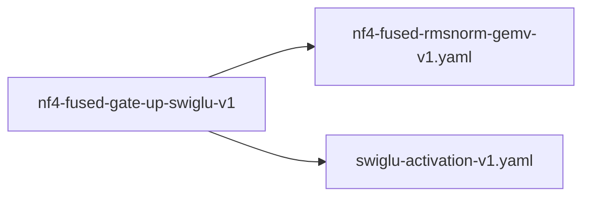

# nf4-fused-gate-up-swiglu-v1

**Version:** 1.0.0

Fused RMSNorm + Gate + Up + SwiGLU for NF4 quantized weights — 4-way kernel fusion that eliminates 3 kernel launches and 3 intermediate global memory roundtrips per FFN block. Replicates FusedRmsNormGateUpSwigluQ4KKernel (QWEN-009) for NF4 data type. FFN is 2/3 of transformer compute — this fusion has the highest throughput impact.


## References

- FusedRmsNormGateUpSwigluQ4KKernel (QWEN-009): proven Q4K 4-way fusion in trueno
- Shazeer (2020) GLU Variants Improve Transformer
- Dettmers et al. (2023) QLoRA: NF4 data type

## Dependencies

- [nf4-fused-rmsnorm-gemv-v1.yaml](nf4-fused-rmsnorm-gemv-v1.yaml.md)
- [swiglu-activation-v1.yaml](swiglu-activation-v1.yaml.md)

## Dependency Graph



## Equations

### bandwidth_savings

$$
separate_bw = hidden * 4 * 2     \# normed write+read (RMSNorm\to gate)
             + hidden * 4         \# normed re-read (gate\to up, if not cached)
             + intermediate * 4 * 2  \# gate write+read (gate\to SwiGLU)
             + intermediate * 4 * 2  \# up write+read (up\to SwiGLU)
             = hidden * 12 + intermediate * 16

fused_bw = hidden * 4             \# x read once
         + intermediate * 4       \# out write once
         = hidden * 4 + intermediate * 4

savings = separate_bw - fused_bw
        = hidden * 8 + intermediate * 12

For Qwen 1.5B (hidden=1536, intermediate=8960):
  savings = 1536*8 + 8960*12 = 12,288 + 107,520 = 119,808 bytes per FFN
  Per layer = 119 KB saved
  Per forward (28 layers) = 3.3 MB saved

$$

**Domain:** $bytes$

### fused_rmsnorm_gate_up_swiglu_nf4

```
Fused (1 kernel, zero intermediate roundtrips):
  # Phase 1: RMSNorm in registers
  rms = sqrt(reduce_sum(x^2) / hidden + epsilon)
  normed = x / rms * gamma                  # in registers

  # Phase 2: Dual NF4 GEMV (gate + up) with shared normed input
  for each output row j:
    gate_j = sum(nf4_dequant(W_gate[j]) * normed)
    up_j = sum(nf4_dequant(W_up[j]) * normed)

  # Phase 3: SwiGLU in registers (no write between gate and activation)
  out_j = silu(gate_j) * up_j               # SiLU = x * sigmoid(x)

```

**Domain:** $x \in \mathbb{R}^{hidden}, W_gate, W_up \in NF4^{intermediate × hidden}$

**Codomain:** $out \in \mathbb{R}^{intermediate}$

**Invariants:**

- $Input x loaded from DRAM exactly once (not 2x for gate and up)$
- $NF4 weights loaded from DRAM once each (gate and up are separate weight matrices)$
- $SiLU computed in FP32 registers (no precision loss from intermediate write)$
- $No intermediate global memory allocation for gate, up, or normed outputs$

### separate_ffn

```
Standard (4 kernels, 3 global memory roundtrips):
  normed = RMSNorm(x, gamma, epsilon)     # kernel 1
  gate = NF4_GEMV(W_gate, normed)          # kernel 2, reads normed from DRAM
  up = NF4_GEMV(W_up, normed)              # kernel 3, reads normed from DRAM AGAIN
  out = SiLU(gate) * up                    # kernel 4 (SwiGLU activation)

```

**Domain:** $x \in \mathbb{R}^{hidden}, W_gate, W_up \in NF4^{intermediate × hidden}$

**Codomain:** $out \in \mathbb{R}^{intermediate}$

## Proof Obligations

| # | Type | Property | Formal |
|---|------|----------|--------|
| 1 | equivalence | Fused FFN matches separate RMSNorm + Gate + Up + SwiGLU | $\|fused(x) - separate(x)\| < \varepsilon element-wise$ |
| 2 | bound | Reduces kernel launches from 4 to 1 per FFN block | `kernel_count(fused) == 1 AND kernel_count(separate) == 4` |
| 3 | bound | Memory bandwidth savings >= 100 KB per FFN at Qwen 1.5B dimensions | $bw_saved >= 100 * 1024 bytes$ |

## Falsification Tests

| ID | Rule | Prediction | If Fails |
|----|------|------------|----------|
| F-NF4-FFN-001 | Fused FFN matches separate RMSNorm + Gate + Up + SwiGLU | Fused FFN output matches separate kernels within 1e-4 tolerance | Check SiLU precision, NF4 scale order, warp reduction correctness |
| F-NF4-FFN-002 | Reduces kernel launches from 4 to 1 per FFN block | Fused FFN throughput improvement >= 15% | Memory bandwidth is not the FFN bottleneck — profile for compute saturation |
| F-NF4-FFN-003 | Fused FFN matches separate RMSNorm + Gate + Up + SwiGLU | SwiGLU numerical stability in FP32 registers for gate in [-100, 100] | Use stable SiLU implementation (x * sigmoid(x) with clamped exp) |
| F-NF4-FFN-004 | Memory bandwidth savings >= 100 KB per FFN at Qwen 1.5B dimensions | Training backward works with fused forward producing finite non-zero gradients | Fused kernel doesn't save intermediate activations needed for backward |

## Kani Harnesses

| ID | Obligation | Bound | Strategy |
|----|------------|-------|----------|
| KANI-NFGS-001 | Fused FFN equivalence to separate kernels | 8 | stub_float |
| KANI-NFGS-002 | SwiGLU numerical stability | 8 | stub_float |

## QA Gate

**nf4-fused-gate-up-swiglu-v1 Contract** (F-NFGS-001)

Quality gate for fused RMSNorm + NF4 Gate + Up + SwiGLU

**Checks:** validation, falsification

