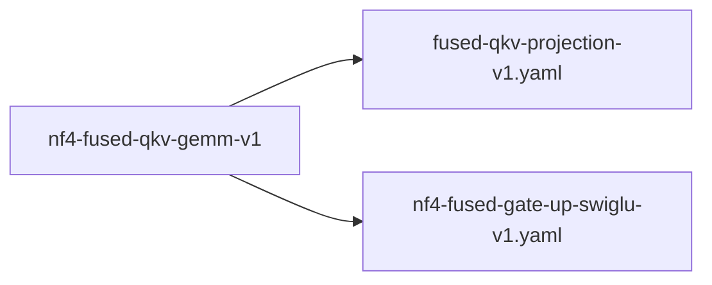

# nf4-fused-qkv-gemm-v1

**Version:** 1.0.0

Fused NF4 Q/K/V GEMM for GQA attention — computes all three projections with shared input activation load. Handles asymmetric output dimensions (Q: hidden→q_dim, K/V: hidden→kv_dim) in a single kernel.


## References

- Ainslie et al. (2023) GQA: Training Generalized Multi-Query Transformer Models
- FusedNf4GateUpGemmKernel: proven dual-output NF4 GEMM pattern

## Dependencies

- [fused-qkv-projection-v1.yaml](fused-qkv-projection-v1.yaml.md)
- [nf4-fused-gate-up-swiglu-v1.yaml](nf4-fused-gate-up-swiglu-v1.yaml.md)

## Dependency Graph



## Equations

### bandwidth_savings

$$
separate_bw = 3 × M × K × 4 bytes (3 input reads)
fused_bw = 2 × M × K × 4 bytes (Q + fused KV)
savings = M × K × 4 bytes

For Qwen 1.5B (K=1536, M=2048 at batch=4):
  savings = 2048 × 1536 × 4 = 12.6 MB per layer
  Per forward (28 layers) = 352 MB saved

$$

**Domain:** $bytes$

### fused_qkv

$$
Fused (1 kernel for Q, 1 for K+V — A loaded twice total, not 3×):
  q = A @ dequant(W_q)                          \# reads A from DRAM (once)
  k, v = FusedKVGemm(A, W_k, W_v)               \# reads A from DRAM (once)
Total: 2 reads instead of 3 (K+V share because same output dim)

$$

**Domain:** $same as separate$

**Codomain:** $same as separate$

**Invariants:**

- `K and V output dims are identical (GQA: both = num_kv_heads × head_dim)`
- $A loaded from DRAM at most twice (Q path + KV path)$

### separate_qkv

```
Standard (3 kernels, 3 input reads from DRAM):
  q = A[M,K] @ dequant(W_q_nf4[K, q_dim])     # reads A from DRAM
  k = A[M,K] @ dequant(W_k_nf4[K, kv_dim])    # reads A from DRAM AGAIN
  v = A[M,K] @ dequant(W_v_nf4[K, kv_dim])    # reads A from DRAM AGAIN

```

**Domain:** $A \in \mathbb{R}^{M × K}, M = seq_len, K = hidden_size$

**Codomain:** $q \in \mathbb{R}^{M × q_dim}, k,v \in \mathbb{R}^{M × kv_dim}$

## Proof Obligations

| # | Type | Property | Formal |
|---|------|----------|--------|
| 1 | equivalence | Fused K+V output matches separate K, V projections | $\|fused_kv(A, W_k, W_v) - [separate_k(A, W_k), separate_v(A, W_v)]\| < \varepsilon$ |
| 2 | bound | Reduces input reads from 3 to 2 per attention layer | `dram_reads(fused) == 2 AND dram_reads(separate) == 3` |
| 3 | invariant | K dim equals V dim for fused K+V path | `kv_dim_k == kv_dim_v` |

## Falsification Tests

| ID | Rule | Prediction | If Fails |
|----|------|------------|----------|
| F-NF4-QKV-001 | Fused K+V output matches separate K, V within 1e-4 | Fused K+V output matches separate projections within 1e-4 tolerance | Check NF4 dequant ordering or accumulation precision in fused path |
| F-NF4-QKV-002 | Reduces input reads from 3 to 2 per attention layer | Throughput improvement >= 10% for attention projections | Memory bandwidth is not the QKV bottleneck — profile for compute saturation |
| F-NF4-QKV-003 | K dim equals V dim for fused K+V path | Fused path rejects asymmetric K/V dims at initialization | Fused kernel silently computes wrong V output with mismatched dims |

## Kani Harnesses

| ID | Obligation | Bound | Strategy |
|----|------------|-------|----------|
| KANI-NFQKV-001 | Fused K+V equivalence to separate projections | 8 | stub_float |
| KANI-NFQKV-002 | Dimension precondition enforcement | 4 | exhaustive |

## QA Gate

**nf4-fused-qkv-gemm-v1 Contract** (F-NFQKV-001)

Quality gate for fused NF4 Q/K/V GEMM

**Checks:** validation, falsification

