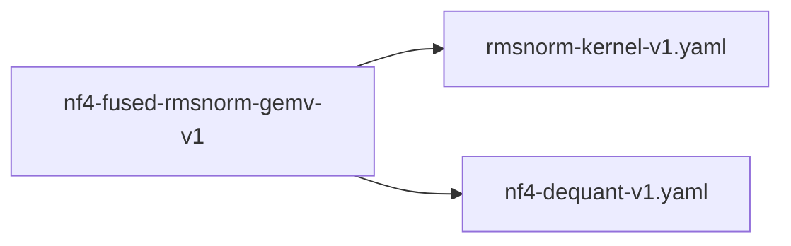

# nf4-fused-rmsnorm-gemv-v1

**Version:** 1.0.0

Fused RMSNorm + NF4 GEMV — normalize input and project through NF4-quantized weights in a single kernel launch. Eliminates global memory roundtrip between RMSNorm output and GEMV input. Replicates proven Q4K fusion pattern (FusedRmsNormQ4KGemvKernel) for NF4.


## References

- FusedRmsNormGateUpSwigluQ4KKernel (QWEN-009): proven Q4K 3-way fusion in trueno
- Zhang & Sennrich (2019) Root Mean Square Layer Normalization
- Dettmers et al. (2023) QLoRA: NF4 data type for memory-efficient fine-tuning

## Dependencies

- [rmsnorm-kernel-v1.yaml](rmsnorm-kernel-v1.yaml.md)
- [nf4-dequant-v1.yaml](nf4-dequant-v1.yaml.md)

## Dependency Graph



## Equations

### fused_rmsnorm_nf4_gemv

```
Fused (1 kernel, zero global memory roundtrip for normed):
  # Phase 1: RMSNorm in registers
  rms = sqrt(warp_reduce_sum(x_i^2) / hidden_size + epsilon)
  normed_i = x_i / rms * gamma_i                      # stays in registers

  # Phase 2: NF4 dequant + GEMV using normed_i from registers
  for each output row j:
    acc_j += nf4_lut[W_nf4_nibble] * scale * normed_i # fused accumulation
  y_j = acc_j

```

**Domain:** $x \in \mathbb{R}^{hidden_size}, gamma \in \mathbb{R}^{hidden_size}, W_nf4 \in NF4^{out_dim × hidden_size}$

**Codomain:** $y \in \mathbb{R}^{out_dim}$

**Invariants:**

- $NF4 dequant uses 16-value register LUT (same as standalone Nf4GemmKernel)$
- $RMSNorm epsilon matches unfused kernel$
- $No intermediate global memory write for normed output$

### separate_rmsnorm_gemv

```
Standard (2 kernels, 1 global memory roundtrip):
  normed = x / sqrt(mean(x^2) + epsilon) * gamma     # kernel 1: RMSNorm
  write(normed, global_memory)                         # BW: hidden_size * 4 bytes
  read(normed, global_memory)                          # BW: hidden_size * 4 bytes
  y = NF4_dequant(W_nf4) @ normed                     # kernel 2: dequant + GEMV

```

**Domain:** $x \in \mathbb{R}^{hidden_size}, gamma \in \mathbb{R}^{hidden_size}, W_nf4 \in NF4^{out_dim × hidden_size}$

**Codomain:** $y \in \mathbb{R}^{out_dim}$

## Proof Obligations

| # | Type | Property | Formal |
|---|------|----------|--------|
| 1 | equivalence | Fused matches separate RMSNorm + NF4 GEMV | `\|fused_rmsnorm_nf4_gemv(x, gamma, W) - separate_rmsnorm_gemv(x, gamma, W)\| < ε` |
| 2 | invariant | No global memory write for intermediate normed output | `global_memory_writes(fused) < global_memory_writes(separate)` |
| 3 | invariant | NF4 dequant numerically identical to standalone kernel | `nf4_dequant_fused(block) == nf4_dequant_standalone(block) for all blocks` |
| 4 | bound | Memory bandwidth reduction | $bw_saved >= hidden_size * 4 * 2 bytes per call (read + write of normed)$ |

## Kernel Phases

1. **rmsnorm_in_registers**: Load x, compute RMS via warp shuffle, normalize in registers — *normed values never touch global memory*
2. **nf4_dequant_gemv**: Load NF4 blocks, dequant via register LUT, accumulate with normed input — *NF4 LUT identical to standalone Nf4GemmKernel*

## Falsification Tests

| ID | Rule | Prediction | If Fails |
|----|------|------------|----------|
| F-NF4-RMS-001 | Fused matches separate RMSNorm + NF4 GEMV | Fused output matches separate RMSNorm + NF4 GEMV within 1e-4 tolerance | Check RMSNorm epsilon, warp shuffle reduction, NF4 scale application order |
| F-NF4-RMS-002 | No global memory write for intermediate normed output | Fused kernel eliminates intermediate global memory writes for normed output | Compiler spilled normed to global memory — check register pressure |
| F-NF4-RMS-003 | Memory bandwidth reduction | Throughput improvement >= 5% on training forward | Bottleneck is not RMSNorm→GEMV roundtrip — profile to find actual bottleneck |
| F-NF4-RMS-004 | NF4 dequant numerically identical to standalone kernel | Works for GQA dimensions where kv_dim != hidden_size | Kernel tile size assumes square — add rectangular support |

## Kani Harnesses

| ID | Obligation | Bound | Strategy |
|----|------------|-------|----------|
| KANI-NFRG-001 | Fused RMSNorm+GEMV equivalence | 8 | stub_float |
| KANI-NFRG-002 | NF4 dequant numerical identity | 8 | exhaustive |

## QA Gate

**nf4-fused-rmsnorm-gemv-v1 Contract** (F-NFRG-001)

Quality gate for fused RMSNorm + NF4 GEMV kernel

**Checks:** validation, falsification

