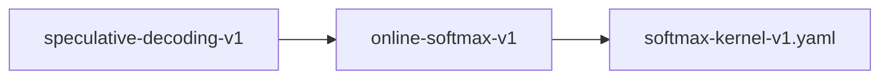

# online-softmax-v1

**Version:** 1.0.0

Online softmax — single-pass max+sum via running normalizer (Milakov & Gimelshein 2018)

## References

- Milakov & Gimelshein (2018) Online normalizer calculation for softmax
- Rabe & Staats (2022) Self-attention Does Not Need O(n²) Memory

## Dependencies

- [softmax-kernel-v1.yaml](softmax-kernel-v1.yaml.md)

## Dependency Graph

## Equations

### online_normalizer

$$
Online update rule (streaming max + sum_exp):
  Given running state (m_{i-1}, d_{i-1}) and new score x_i:
    m_i = max(m_{i-1}, x_i)
    d_i = d_{i-1} · \exp(m_{i-1} - m_i) + \exp(x_i - m_i)
Final: softmax(x)_j = \exp(x_j - m_n) / d_n

$$

**Domain:** $x \in \mathbb{R}^n, n \geq 1$

**Codomain:** $\sigma(x) \in (0,1)^n, \sum \sigma(x)_i = 1$

**Invariants:**

- $d_i > 0 for all i (sum of positive exponentials)$
- $m_i = max(x_1, ..., x_i)$
- $d_i = \sum_{j=1}^{i} \exp(x_j - m_i)$

### standard_softmax

$$
\sigma(x)_i = \exp(x_i - max(x)) / \sum_j \exp(x_j - max(x))
$$

**Domain:** $x \in \mathbb{R}^n$

**Codomain:** $(0,1)^n$

## Proof Obligations

| # | Type | Property | Formal |
|---|------|----------|--------|
| 1 | loop_invariant | Running max tracks true max of elements seen | $\forall k \leq i: m_i \geq x_k ∧ m_i = max(x_1, ..., x_i)$ |
| 2 | loop_invariant | Running sum_exp is correct partial sum | $d_i = \sum_{j=1}^{i} \exp(x_j - m_i)$ |
| 3 | loop_variant | Remaining elements decreases each iteration | $V(state) = n - i, V \geq 0, V strictly decreasing$ |
| 4 | old_state | Normalizer update preserves equivalence to full recomputation | $d_i = old(d_{i-1}) · \exp(old(m_{i-1}) - m_i) + \exp(x_i - m_i)$ |
| 5 | equivalence | Online matches standard softmax | $\|online_softmax(x) - standard_softmax(x)\| < \varepsilon element-wise$ |
| 6 | invariant | Output sums to 1 | $\|\sum \sigma(x)_i - 1.0\| < \varepsilon$ |
| 7 | invariant | All outputs strictly positive | $\sigma(x)_i > 0 for all i$ |
| 8 | monotonicity | Order preservation | $x_i > x_j ⟹ \sigma(x)_i > \sigma(x)_j$ |
| 9 | invariant | Shift invariance | $softmax(x + c) = softmax(x) for any scalar c$ |
| 10 | invariant | Two-pass (not three) | $Reads scores array exactly twice: once for online max+sum, once for normalize$ |

## Kernel Phases

1. **online_scan**: Single pass computing running (max, sum_exp) pair — *After processing x_1..x_i: m = max(x_1..x_i), d = Σ exp(x_j - m)*
2. **normalize**: Single pass computing weights[j] = exp(scores[j] - m) / d — *Each weight computed from final (m, d) state*

## Falsification Tests

| ID | Rule | Prediction | If Fails |
|----|------|------------|----------|
| FALSIFY-OSM-001 | Equivalence to standard softmax | \|online_softmax(x) - standard_softmax(x)\| < 1e-5 element-wise | Online normalizer update has numerical drift |
| FALSIFY-OSM-002 | Sum-to-one | \|Σ online_softmax(x)_i - 1.0\| < 1e-6 | Normalizer denominator computation error |
| FALSIFY-OSM-003 | Positivity | online_softmax(x)_i > 0 for all i | Underflow in exp() not handled |
| FALSIFY-OSM-004 | Shift invariance | \|online_softmax(x + c) - online_softmax(x)\| < 1e-6 | Max subtraction not properly applied |
| FALSIFY-OSM-005 | Decoder attention dimensions | Correct for kv_len in {1, 6, 64, 448, 1500} | Edge case at specific sequence lengths |
| FALSIFY-OSM-006 | Single-element softmax | online_softmax([x]) = [1.0] for any finite x | Base case handling |
| FALSIFY-OSM-007 | Loop invariant — running max | After processing x_1..x_i, m_i = max(x_1..x_i) | Running max not updated correctly when new element is smaller |
| FALSIFY-OSM-008 | Loop variant — termination | Loop counter advances by exactly 1 per iteration, terminates at n | Off-by-one in loop bounds or infinite loop |
| FALSIFY-OSM-009 | Old state — normalizer update | d_i computed from old d_{i-1} matches full recomputation Σ exp(x_j - m_i) | Normalizer rescaling factor exp(m_{i-1} - m_i) incorrect |
| FALSIFY-OSM-010 | Loop invariant — partial sum correctness | d_i = Σ_{j=1}^{i} exp(x_j - m_i) holds after processing each element | Running sum accumulation diverges from recomputed sum |

## Kani Harnesses

| ID | Obligation | Bound | Strategy |
|----|------------|-------|----------|
| online-softmax-v1-kani-001 | Online matches standard softmax | 8 | bounded_int |
| KANI-ONLINE-002 | Running max tracks true max of elements seen | 8 | exhaustive |
| KANI-ONLINE-003 | Running sum_exp is correct partial sum | 8 | stub_float |
| KANI-ONLINE-004 | Remaining elements decreases each iteration | 8 | exhaustive |
| KANI-ONLINE-005 | Normalizer update preserves equivalence to full recomputation | 8 | exhaustive |
| KANI-ONLINE-006 | Output sums to 1 | 8 | stub_float |
| KANI-ONLINE-007 | All outputs strictly positive | 8 | exhaustive |
| KANI-ONLINE-008 | Order preservation | 8 | exhaustive |
| KANI-ONLINE-009 | Shift invariance | 8 | exhaustive |
| KANI-ONLINE-010 | Two-pass (not three) | 8 | exhaustive |

## QA Gate

**online-softmax-v1 Contract** (F-OSV-001)

Quality gate for Online softmax — single-pass max+sum via running normalizer 

**Checks:** validation, falsification

