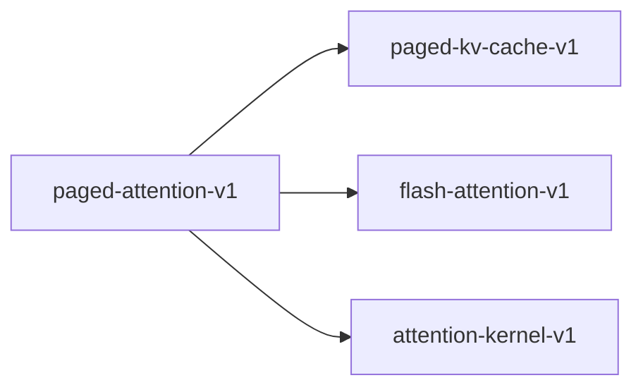

# paged-attention-v1

**Version:** 1.0.0

PagedAttention block table invariants — virtual memory-inspired KV cache management for efficient LLM serving with copy-on-write fork semantics

## References

- Kwon et al. (2023) Efficient Memory Management for Large Language Model Serving with PagedAttention. SOSP. arXiv:2309.06180
- vLLM project — https://github.com/vllm-project/vllm
- Dao et al. (2022) FlashAttention: Fast and Memory-Efficient Exact Attention with IO-Awareness

## Dependencies

- [paged-kv-cache-v1](paged-kv-cache-v1.md)
- [flash-attention-v1](flash-attention-v1.md)
- [attention-kernel-v1](attention-kernel-v1.md)

## Dependency Graph



## Equations

### block_allocation

```
Physical block allocation for logical KV cache pages:
  For a sequence of length S with block size B:
    num_logical_blocks = ceil(S / B)
    For each logical block l_i (i = 0..num_logical_blocks-1):
      physical_block[i] = allocate_from_free_pool()
    block_table[seq_id] = [physical_block[0], ..., physical_block[n-1]]
  KV data for position p stored at:
    physical_addr = block_table[seq_id][p / B] * B + (p mod B)

```

**Domain:** $S \in \mathbb{Z}+ — sequence length; B \in {16, 32, 64, 128} — block size; free_pool ⊂ [0, total_blocks)$

**Codomain:** `block_table[seq_id] ∈ [0, total_blocks)^{ceil(S/B)}`

**Invariants:**

- $Each allocated physical block is removed from free pool$
- $free_blocks + allocated_blocks = total_blocks (conservation)$
- $Block table grows incrementally as sequence length increases$

### block_table_lookup

```
Translate logical position to physical memory address:
  Given sequence seq_id and token position pos:
    logical_block_idx = pos / B  (integer division)
    block_offset = pos mod B
    physical_block_id = block_table[seq_id][logical_block_idx]
    physical_slot = physical_block_id * B + block_offset
  Read K[pos] from kv_cache[physical_slot].key
  Read V[pos] from kv_cache[physical_slot].value

```

**Domain:** `seq_id ∈ active_sequences; pos ∈ [0, seq_len(seq_id)); B = block_size`

**Codomain:** $physical_slot \in [0, total_blocks * B)$

**Invariants:**

- $Bijective for active sequences: distinct (seq_id, pos) maps to distinct physical_slot$
- $physical_slot < total_blocks * B (within allocated memory)$
- $Lookup is O(1) — single table index + arithmetic$

### copy_on_write

```
Fork sequence with copy-on-write (CoW) block sharing:
  fork(parent_seq, child_seq):
    child.block_table = copy(parent.block_table)  (shallow copy — same physical blocks)
    For each shared block b:
      ref_count[b] += 1
  On write to position p in child_seq:
    If ref_count[block_table[child][p/B]] > 1:
      new_block = allocate_from_free_pool()
      copy_block_data(old_block, new_block)
      block_table[child][p/B] = new_block
      ref_count[old_block] -= 1

```

**Domain:** $parent_seq, child_seq \in active_sequences; ref_count: block_id -> \mathbb{Z}+$

**Codomain:** $Updated block_table and ref_count$

**Invariants:**

- $After fork: parent and child share all blocks; ref_count incremented$
- `After CoW write: modified block is exclusive to writer (ref_count == 1)`
- $Unmodified blocks remain shared (memory efficient)$

## Proof Obligations

| # | Type | Property | Formal |
|---|------|----------|--------|
| 1 | invariant | No two active sequences share a mutable block | $If ref_count[b] > 1 then block b is read-only; writes trigger CoW$ |
| 2 | bound | Physical block index within bounds | $block_table[seq][i] < total_blocks for all active seq and valid i$ |
| 3 | equivalence | Paged attention output equals standard attention output | $\|PagedAttn(Q, KV_paged, block_table) - StdAttn(Q, KV_contiguous)\| < epsilon$ |
| 4 | invariant | Block pool conservation | `free_blocks + sum(allocated_per_seq) = total_blocks at all times` |
| 5 | invariant | Reference count consistency | `ref_count[b] == \|{seq : b in block_table[seq]}\| for all blocks b` |

## Kernel Phases

1. **block_table_setup**: Allocate physical blocks for each sequence's logical blocks — *Each sequence has ceil(seq_len/B) entries in its block table; all block IDs valid*
2. **gather_kv**: Use block table to gather K, V vectors from non-contiguous physical blocks — *All seq_len positions mapped to valid physical slots; no out-of-bounds access*
3. **compute_attention**: Compute scaled dot-product attention using gathered K, V — *Attention output identical to contiguous-memory attention given same K, V data*
4. **cow_on_write**: Copy-on-write when appending new tokens to a forked sequence's shared block — *After CoW: writer has exclusive block; other sequences unaffected; data preserved*

## Falsification Tests

| ID | Rule | Prediction | If Fails |
|----|------|------------|----------|
| FALSIFY-PA-001 | Paged attention equivalence to standard attention | \|paged_attn(Q, KV, block_table) - std_attn(Q, KV_contiguous)\| < 1e-5 | Block-boundary crossing corrupts KV gather; attention sees wrong K/V data at page boundaries |
| FALSIFY-PA-002 | No mutable block sharing | After fork + write to child, modified block has ref_count == 1 | CoW not triggered on write; parent data corrupted by child's append |
| FALSIFY-PA-003 | Physical block index bounds | block_table[seq][i] < total_blocks for all sequences and positions | Free-list corruption returns invalid block ID; off-by-one in pool management |
| FALSIFY-PA-004 | Block pool conservation | free + allocated = total after any sequence of alloc/free/fork/cow operations | Block leak on free (not returned to pool) or double-allocation |
| FALSIFY-PA-005 | CoW data integrity | After CoW, new block contains exact copy of old block data | Block copy omitted or partial; new block contains stale/zero data |

## Kani Harnesses

| ID | Obligation | Bound | Strategy |
|----|------------|-------|----------|
| KANI-PA-001 | Block index bounds | 16 | bounded_int |
| KANI-PA-002 | Block pool conservation | 16 | bounded_int |
| KANI-PA-003 | Reference count consistency | 8 | bounded_int |
| KANI-PAGED_-004 | No two active sequences share a mutable block | 8 | exhaustive |
| KANI-PAGED_-005 | Physical block index within bounds | 8 | stub_float |
| KANI-PAGED_-006 | Paged attention output equals standard attention output | 8 | exhaustive |

## QA Gate

**PagedAttention Contract** (F-PA-001)

Block-table paged attention with copy-on-write correctness

**Checks:** attention_equivalence, mutable_block_exclusivity, block_index_bounds, pool_conservation, cow_data_integrity

**Pass criteria:** All 5 falsification tests pass + 3 Kani harnesses verify

