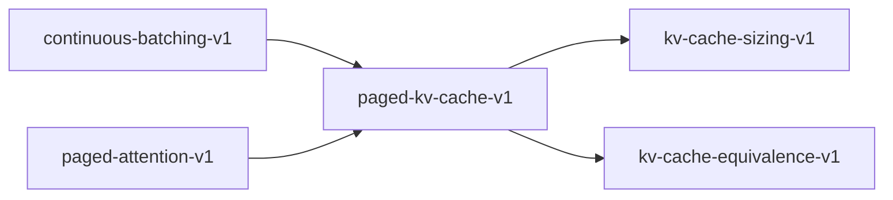

# paged-kv-cache-v1

**Version:** 1.0.0

Paged KV cache with block tables — correctness invariants for PagedAttention

## References

- Kwon et al. (2023). Efficient Memory Management for Large Language Model Serving with PagedAttention. SOSP.
- vLLM v1 source: v1/worker/gpu/block_table.py, v1/core/kv_cache_manager.py

## Dependencies

- [kv-cache-sizing-v1](kv-cache-sizing-v1.md)
- [kv-cache-equivalence-v1](kv-cache-equivalence-v1.md)

## Dependency Graph



## Equations

### block_allocation

$$
num_blocks(req) = ceil(seq_len(req) / B)
$$

**Domain:** $seq_len \in \mathbb{Z}^{+}, B \in {16, 32, 64}$

**Invariants:**

- $Monotonic in seq_len: longer sequence requires more blocks$
- $Tight: num_blocks * B - seq_len < B (at most B-1 waste)$
- $Total allocated <= pool_size$

### block_table_invariant

$$
block_table[req] = [b_0, b_1, ..., b_{n-1}] where each b_i is a unique block ID
$$

**Domain:** $Active request req with n = ceil(seq_len / B) blocks$

**Invariants:**

- $No duplicate block IDs within a request$
- $No block shared between requests (unless prefix caching enabled)$
- $All block IDs in [0, pool_size)$

### fragmentation_free

$$
utilization = sum(seq_len(req)) / (sum(num_blocks(req)) * B)
$$

**Domain:** $All active requests$

**Codomain:** $utilization \in (0, 1]$

**Invariants:**

- $Waste per request < B tokens (last block only)$
- $No internal fragmentation: freed blocks immediately reusable$
- $Pool utilization = allocated_blocks / pool_size$

### graph_compatibility

```
block_table is a fixed-shape tensor [max_reqs, max_blocks_per_req]
```

**Domain:** $CUDA graph capture requirements$

**Invariants:**

- $Shape does not change between graph capture and replay$
- $Only values (block IDs) change, not tensor dimensions$
- `Pad unused entries with INVALID_BLOCK_ID (-1)`

### paged_contiguous_equivalence

$$
|attention_paged(Q, KV_paged, block_table) - attention_contiguous(Q, KV_contiguous)| < epsilon
$$

**Domain:** $Same Q, K, V data arranged in paged vs contiguous layout$

**Invariants:**

- $Paged attention produces identical output to contiguous$
- $Epsilon bounded by floating-point accumulation (1e-5 for FP32, 1e-3 for FP16)$

### slot_mapping

$$
slot(req, pos) = block_table[req][pos / B] * B + pos mod B
$$

**Domain:** $req \in [0, max_reqs), pos \in [0, seq_len), B = block_size$

**Codomain:** $slot \in [0, num_blocks * B)$

**Invariants:**

- $Bijective: no two (req, pos) pairs map to the same slot$
- $Within-block contiguity: pos and pos+1 in same block map to adjacent slots$
- $Block boundary: pos = k*B maps to start of block_table[req][k]$

## Proof Obligations

| # | Type | Property | Formal |
|---|------|----------|--------|
| 1 | invariant | Slot mapping bijectivity | `(r1, p1) != (r2, p2) => slot(r1, p1) != slot(r2, p2)` |
| 2 | equivalence | Paged/contiguous attention equivalence | $\|paged - contiguous\| < 1e-5$ |
| 3 | monotonicity | Block allocation monotonic in seq_len | $s1 < s2 => num_blocks(s1) <= num_blocks(s2)$ |
| 4 | bound | Block waste bounded | $num_blocks * B - seq_len < B$ |
| 5 | invariant | No duplicate blocks within request | `∀ i != j: block_table[req][i] != block_table[req][j]` |
| 6 | invariant | Graph-compatible fixed shape | $shape(block_table) constant across graph replay$ |
| 7 | invariant | Block pool conservation | $allocated + free = pool_size$ |

## Falsification Tests

| ID | Rule | Prediction | If Fails |
|----|------|------------|----------|
| FALSIFY-PKV-001 | Slot bijectivity | No two (req, pos) pairs produce same slot | Block table contains duplicate block IDs or slot formula is wrong |
| FALSIFY-PKV-002 | Paged/contiguous equivalence | Paged attention matches contiguous within tolerance | Block boundary crossing corrupts attention computation |
| FALSIFY-PKV-003 | Block allocation monotonicity | Longer sequence needs more or equal blocks | ceil division error in allocation formula |
| FALSIFY-PKV-004 | Waste bounded by block_size | At most B-1 wasted slots per request | Over-allocation beyond one block |
| FALSIFY-PKV-005 | No duplicate blocks | Each block ID appears at most once per request | Allocator returns same block twice |
| FALSIFY-PKV-006 | Pool conservation | allocated + free = pool_size after any sequence of alloc/free | Block leak or double-free |
| FALSIFY-PKV-007 | Graph compatibility | Block table shape unchanged after request add/remove | Dynamic resizing breaks CUDA graph capture |

## Kani Harnesses

| ID | Obligation | Bound | Strategy |
|----|------------|-------|----------|
| KANI-PKV-001 | PKV-INV-001 | 8 | bounded_int |
| KANI-PKV-002 | PKV-INV-002 | 256 | bounded_int |
| KANI-PKV-003 | PKV-INV-003 | 16 | bounded_int |
| KANI-PAGED_-004 | Slot mapping bijectivity | 8 | exhaustive |
| KANI-PAGED_-005 | Paged/contiguous attention equivalence | 8 | exhaustive |
| KANI-PAGED_-006 | Block allocation monotonic in seq_len | 8 | exhaustive |
| KANI-PAGED_-007 | Block waste bounded | 8 | stub_float |
| KANI-PAGED_-008 | No duplicate blocks within request | 8 | exhaustive |
| KANI-PAGED_-009 | Graph-compatible fixed shape | 8 | exhaustive |
| KANI-PAGED_-010 | Block pool conservation | 8 | exhaustive |

## QA Gate

**Paged KV Cache Contract** (F-PKV-001)

Block-table KV cache correctness — prerequisite for CUDA graph capture at c>1

**Checks:** slot_bijectivity, paged_contiguous_equivalence, block_allocation, no_duplicate_blocks, pool_conservation, graph_compatibility

**Pass criteria:** All 7 falsification tests pass + 3 Kani harnesses verify

