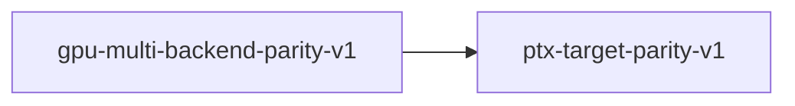

# ptx-target-parity-v1

**Version:** 1.0.0

PTX target must match device compute capability — no hardcoded SM targets in runtime kernel generation

## References

- PMAT-044: Batched decode state corruption from PTX JIT error 700
- trueno-gpu Kernel trait (src/kernels/mod.rs) — emit_ptx_for_target()
- realizar CudaKernels (src/cuda/kernel_generator.rs) — sm_target field
- realizar GpuProfile (src/cuda/gpu_profile.rs) — sm_target from compute_capability()
- CUDA PTX ISA — .target directive must be <= device SM version for JIT compilation

## Dependency Graph



## Equations

### jit_compilation_success

$$
cuModuleLoadDataEx(ptx, target=device_sm) returns CUDA_SUCCESS
$$

**Domain:** $All PTX modules loaded during model serving$

**Invariants:**

- `Error 700 (CUDA_ERROR_INVALID_SOURCE) must never occur at runtime`
- `Error 222 (CUDA_ERROR_INVALID_PTX) must never occur at runtime`
- $PTX JIT failure corrupts CUDA context — all subsequent requests fail silently$

### no_hardcoded_targets

```
count(emit_ptx() calls in executor/) == 0
```

**Domain:** $All .rs files in src/cuda/executor/$

**Invariants:**

- `All kernel PTX uses emit_ptx_for_target(sm_target) or generate_ptx(kernel_type)`
- $generate_ptx() reads sm_target from CudaKernels struct, never hardcodes$
- $Raw PTX string literals may use sm_70 only for basic instructions (no SM-specific features)$

### target_parity

```
ptx_target == device_compute_capability
```

**Domain:** $ptx_target in {sm_70, sm_75, sm_80, sm_86, sm_87, sm_89, sm_90, ...}, device_cc from cuDeviceGetAttribute$

**Codomain:** $Boolean$

**Invariants:**

- $Every PTX module loaded at runtime has .target matching the device$
- $CudaKernels.sm_target is set from GpuProfile.sm_target at executor init$
- $GpuProfile.sm_target is set from context.compute_capability() at executor init$
- $No runtime PTX generation path calls emit_ptx() (hardcoded sm_70)$

## Proof Obligations

| # | Type | Property | Formal |
|---|------|----------|--------|
| 1 | invariant | Target parity | `for all kernel K loaded at runtime: K.ptx_target == executor.gpu_profile.sm_target` |
| 2 | invariant | No hardcoded emit_ptx in executor | `grep -c 'emit_ptx()' src/cuda/executor/**/*.rs == 0` |
| 3 | invariant | CudaKernels constructed with device target | `CudaKernels::with_target(gpu_profile.sm_target) at executor init` |
| 4 | invariant | JIT success for all kernels | `for all K: compile_ptx(K.ptx) == Ok(_)` |

## Falsification Tests

| ID | Rule | Prediction | If Fails |
|----|------|------------|----------|
| FALSIFY-PTP-001 | No hardcoded emit_ptx in executor runtime path | Zero occurrences of .emit_ptx() in src/cuda/executor/ | Kernel PTX will use sm_70 instead of device target — JIT error 700 on some GPUs |
| FALSIFY-PTP-002 | CudaKernels uses device target | CudaKernels::with_target() called with gpu_profile.sm_target | CudaKernels defaults to sm_70 — all generated PTX targets wrong SM version |
| FALSIFY-PTP-003 | generate_ptx threads target | All generate_*_ptx helper functions accept target: &str parameter | Helper function generates PTX with hardcoded target — target param dropped in refactor |
| FALSIFY-PTP-004 | PTX JIT success on multi-GPU fleet | apr serve starts without PTX JIT errors on sm_87 (Jetson) and sm_89 (4060/4090) | PTX targets wrong SM — JIT error 700 corrupts CUDA context, all requests return 0 tokens |
| FALSIFY-PTP-005 | Batched→single transition preserves correctness | c=4 batch followed by c=1 request produces >0 output tokens | State corruption: stale CUDA graph, non-zero batched_kv_stride, or PTX JIT failure |

## Kani Harnesses

| ID | Obligation | Bound | Strategy |
|----|------------|-------|----------|
| KANI-PTP-001 | PTP-INV-001 | 8 | bounded_int |
| KANI-PTP-002 | PTP-INV-002 | 4 | exhaustive |
| KANI-PTX_TA-003 | Target parity | 8 | exhaustive |
| KANI-PTX_TA-004 | No hardcoded emit_ptx in executor | 8 | exhaustive |
| KANI-PTX_TA-005 | CudaKernels constructed with device target | 8 | exhaustive |
| KANI-PTX_TA-006 | JIT success for all kernels | 8 | exhaustive |

## QA Gate

**PTX Target Parity Contract** (F-PTP-001)

Ensures all runtime PTX matches device compute capability — no hardcoded SM targets

**Checks:** no_hardcoded_emit_ptx, cuda_kernels_with_target, generate_ptx_threads_target, ptx_jit_success_multi_gpu, batched_single_transition

**Pass criteria:** All 5 falsification tests pass (PTP-001 through PTP-005)

