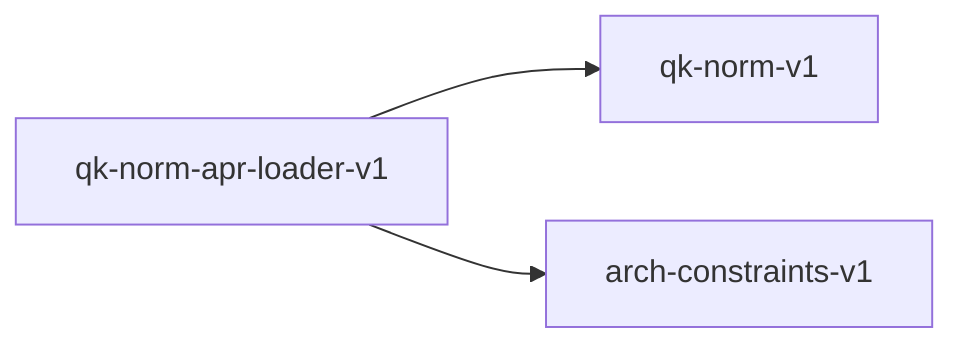

# qk-norm-apr-loader-v1

**Version:** 1.0.0

QK norm weight loading contract for APR format loaders (GH-479)

## References

- qk-norm-v1.yaml — normalization algorithm contract
- arch-constraints-v1.yaml — per-architecture feature flags

## Dependencies

- [qk-norm-v1](qk-norm-v1.md)
- [arch-constraints-v1](arch-constraints-v1.md)

## Dependency Graph



## Equations

### qk_norm_load

```
load(arch, layer_n) = try_f32(hf_name) ∨ try_f32(gguf_name)
```

**Domain:** $arch \in {qwen3, ...}, layer_n \in ℕ$

**Codomain:** `Option<Vec<f32>>`

**Invariants:**

- $Non-QK-norm architectures return None$
- $QK-norm architectures return Some(w) where len(w) = head_dim$

## Proof Obligations

| # | Type | Property | Formal |
|---|------|----------|--------|
| 1 | invariant | Non-regression for non-QK-norm models | $Qwen2, LLaMA, GPT-2 output unchanged (weights = None, no norm applied)$ |
| 2 | invariant | Weight shape matches head_dim | `len(q_norm_weight) == hidden_dim / num_heads` |
| 3 | equivalence | APR loader matches SafeTensors loader | `APR path loads same QK norm weights as safetensors_infer_convert.rs path` |

## Falsification Tests

| ID | Rule | Prediction | If Fails |
|----|------|------------|----------|
| FALSIFY-QKN-LOAD-001 | QK norm loaded from APR | Qwen3 APR file yields non-None attn_q_norm_weight | Tensor name mismatch or wrong loader function |
| FALSIFY-QKN-LOAD-002 | Non-regression | Qwen2 APR file yields None attn_q_norm_weight | Optional loading broke required tensor path |
| FALSIFY-QKN-LOAD-003 | Forward pass applies norm | With QK norm weights present, Q values differ from raw projection | Forward pass not checking for QK norm weights |

## Kani Harnesses

| ID | Obligation | Bound | Strategy |
|----|------------|-------|----------|
| qk-norm-apr-loader-v1-kani-001 | Weight shape matches head_dim | 8 | bounded_int |
| KANI-QK_NOR-002 | Non-regression for non-QK-norm models | 8 | exhaustive |
| KANI-QK_NOR-003 | APR loader matches SafeTensors loader | 8 | exhaustive |

## QA Gate

**QK Norm APR Loader Contract** (F-QKN-LOAD-001)

**Checks:** qk_norm_loaded, non_regression, forward_applied

**Pass criteria:** All 3 falsification tests pass

