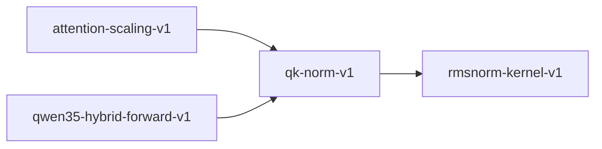

# qk-norm-v1

**Version:** 1.0.0

QK normalization — per-head RMSNorm applied to Q and K before attention

## References

- Henry et al. (2020) Query-Key Normalization for Transformers
- Qwen3 Technical Report — QK normalization for training stability
- Zhang & Sennrich (2019) Root Mean Square Layer Normalization

## Dependencies

- [rmsnorm-kernel-v1](rmsnorm-kernel-v1.md)

## Dependency Graph

## Equations

### qk_rmsnorm

$$
Q_norm = RMSNorm(Q) = Q / \sqrt{mean(Q²) + \varepsilon} * weight
$$

**Domain:** $Q \in \mathbb{R}^{head_dim}, weight \in \mathbb{R}^{head_dim}, \varepsilon > 0$

**Codomain:** $Q_norm \in \mathbb{R}^{head_dim}$

**Invariants:**

- $RMS(output / weight) \approx 1.0 when weight = 1$
- $|output_i| <= |weight_i| * \sqrt{d_k} / \sqrt{\varepsilon} (bounded amplitude)$
- $RMSNorm(0) = 0 (zero-stability)$

## Proof Obligations

| # | Type | Property | Formal |
|---|------|----------|--------|
| 1 | invariant | Unit RMS after normalization | $RMS(RMSNorm(x, 1)) \approx 1.0$ |
| 2 | bound | Output amplitude bounded | $\|output_i\| <= \|weight_i\| * \sqrt{d_k / \varepsilon}$ |
| 3 | invariant | Idempotent with unit weight | $RMSNorm(RMSNorm(x, 1), 1) \approx RMSNorm(x, 1)$ |
| 4 | invariant | Zero-input stability | $RMSNorm(0, w) = 0$ |
| 5 | equivalence | SIMD matches scalar within ULP |  |
| 6 | equivalence | GPU kernel matches CPU reference |  |
| 7 | invariant | Per-head independence | $RMSNorm([h1;h2;...]) = [RMSNorm(h1); RMSNorm(h2); ...]$ |

## Falsification Tests

| ID | Rule | Prediction | If Fails |
|----|------|------------|----------|
| FALSIFY-QKN-001 | Unit RMS | RMS of normalized output ≈ 1.0 with unit weight | Normalization denominator incorrect |
| FALSIFY-QKN-002 | Bounded amplitude | Output bounded by weight * sqrt(d_k/eps) | Missing eps guard in denominator |
| FALSIFY-QKN-003 | Idempotent | Double-applying RMSNorm ≈ single application | Normalization not convergent |
| FALSIFY-QKN-004 | Zero-stability | RMSNorm(0) = 0 | Division by zero not handled by eps |
| FALSIFY-QKN-005 | SIMD scalar equivalence | SIMD QK-norm matches scalar within 8 ULP | SIMD normalization diverges beyond ULP tolerance |
| FALSIFY-QKN-006 | Cross-backend equivalence | GPU per-head RMSNorm algorithm (rsqrt.approx) matches CPU RMSNorm::forward | GPU kernel diverges from CPU — check argument order, head count, or rsqrt precision |
| FALSIFY-QKN-007 | Per-head independence | Normalizing N heads produces same result as normalizing each head independently | Head slicing or offset computation incorrect in GPU kernel |

## Kani Harnesses

| ID | Obligation | Bound | Strategy |
|----|------------|-------|----------|
| KANI-QKN-001 | QKN-INV-001 | 8 | stub_float |
| KANI-QKN-002 | QKN-INV-004 | 8 | stub_float |

## QA Gate

**QK Normalization Contract** (F-QKN-001)

Per-head QK RMSNorm quality gate

**Checks:** unit_rms, bounded_amplitude, idempotent, zero_stability

**Pass criteria:** All 7 falsification tests pass

