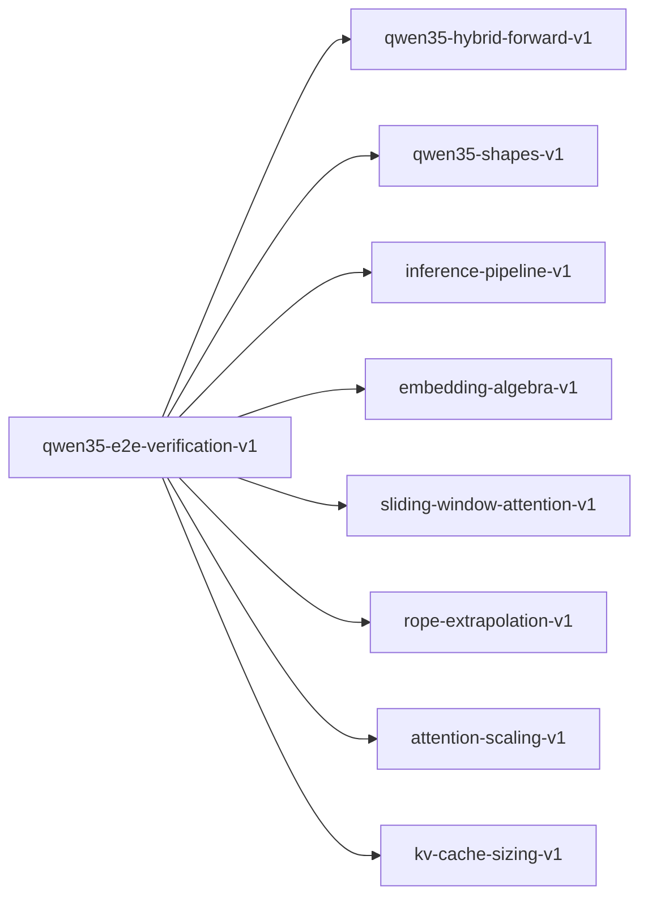

# qwen35-e2e-verification-v1

**Version:** 1.0.0

Qwen3.5 end-to-end verification — composing all kernel contracts into a complete model proof

## References

- Qwen3.5 Technical Report — full model architecture
- Vaswani et al. (2017) Attention Is All You Need
- Yang et al. (2024) Gated Delta Networks
- Su et al. (2021) RoFormer: Enhanced Transformer with Rotary Position Embedding

## Dependencies

- [qwen35-hybrid-forward-v1](qwen35-hybrid-forward-v1.md)
- [qwen35-shapes-v1](qwen35-shapes-v1.md)
- [inference-pipeline-v1](inference-pipeline-v1.md)
- [embedding-algebra-v1](embedding-algebra-v1.md)
- [sliding-window-attention-v1](sliding-window-attention-v1.md)
- [rope-extrapolation-v1](rope-extrapolation-v1.md)
- [attention-scaling-v1](attention-scaling-v1.md)
- [kv-cache-sizing-v1](kv-cache-sizing-v1.md)

## Dependency Graph

## Equations

### contract_composition

$$
model_contract = compose(embedding, L × block, final_norm, unembed)
$$

**Domain:** $Full model as composition of verified components$

**Invariants:**

- $Each component independently verified$
- $Composition preserves shape invariants$
- $Residual stream provides compositional proof structure$

### flops_per_token

$$
F \approx 2*P (forward pass) for dense compute
$$

**Domain:** $Approximate FLOPs per token for autoregressive generation$

**Invariants:**

- $Linear in P$
- $Attention FLOP component is O(seq_len * d)$
- $GDN FLOP component is O(d^2) per token (no quadratic)$

### memory_breakdown

$$
M = M_weights + M_kv + M_activations
$$

**Domain:** $Total GPU memory during inference$

**Invariants:**

- $M_weights depends on quantization (Q4K < Q6K < F16 < F32)$
- $M_kv grows linearly with sequence length$
- $M_activations bounded by batch_size * seq_len * d$

### model_parameter_count

$$
P = V*d + L*(d_attn + d_ffn + d_norm) + d_final
$$

**Domain:** $V=vocab, d=hidden, L=layers, d_attn/d_ffn/d_norm=per-layer params$

**Invariants:**

- $Total \approx 9.05B for Qwen3.5-9B$
- $Embedding dominates for large V$
- $Per-layer cost linear in d^2$

### throughput_model

$$
tok/s = min(bandwidth / bytes_per_token, compute / flops_per_token)
$$

**Domain:** $Roofline-limited throughput$

**Invariants:**

- $Memory-bound for small batch (typical inference)$
- $Compute-bound for large batch or long prefill$
- $GDN layers reduce attention bottleneck$

### verification_ladder

$$
coverage(contract_set) = verified_obligations / total_obligations
$$

**Domain:** $Fraction of proof obligations with passing tests or Kani proofs$

**Invariants:**

- $coverage \in [0, 1]$
- $coverage = 1 means all obligations verified$
- $Each layer adds: attention/GDN + FFN + 2*RMSNorm obligations$

## Proof Obligations

| # | Type | Property | Formal |
|---|------|----------|--------|
| 1 | invariant | Parameter count matches architecture | $P(Qwen3.5-9B) \in [9.0B, 9.2B]$ |
| 2 | bound | FLOPs bounded by 2P | $F <= 2 * P + O(seq_len * d * L)$ |
| 3 | ordering | Quantization memory ordering | $M(Q4K) < M(Q6K) < M(F16) < M(F32)$ |
| 4 | monotonicity | Throughput increases with bandwidth | $bw1 < bw2 \to tok_s(bw1) <= tok_s(bw2)$ |
| 5 | bound | Verification coverage at 100% | $coverage(qwen35_contracts) = 1.0$ |
| 6 | invariant | Compositional proof structure | $\forall l: shape(block_l(x)) = shape(x)$ |
| 7 | conservation | End-to-end shape: tokens in → logits out | $shape(model(tokens)) = [seq_len, V]$ |

## Falsification Tests

| ID | Rule | Prediction | If Fails |
|----|------|------------|----------|
| FALSIFY-QE2E-001 | Parameter count | Total params ≈ 9.05B | Architecture config mismatch |
| FALSIFY-QE2E-002 | FLOPs estimate | 2P FLOPs per forward token | Missing layer in FLOP count |
| FALSIFY-QE2E-003 | Memory ordering | Q4K < Q6K < F16 < F32 memory | Quantization byte formula wrong |
| FALSIFY-QE2E-004 | Throughput roofline | tok/s bounded by bandwidth and compute | Roofline formula error |
| FALSIFY-QE2E-005 | Coverage completeness | All obligations have test or proof | Missing obligation coverage |
| FALSIFY-QE2E-006 | Compositional proof structure | Each block preserves shape: shape(block_l(x)) = shape(x) | Block l breaks shape invariant |
| FALSIFY-QE2E-007 | End-to-end shape conservation | tokens → [seq_len, d] → ... → [seq_len, V] | Shape break in layer composition |

## Kani Harnesses

| ID | Obligation | Bound | Strategy |
|----|------------|-------|----------|
| KANI-QE2E-001 | QE2E-INV-001 | 1 | exhaustive |
| KANI-QE2E-002 | QE2E-ORD-001 | 4 | bounded_int |

## QA Gate

**Qwen3.5 End-to-End Verification** (F-QE2E-001)

Full model verification composition quality gate

**Checks:** model_parameter_count, flops_per_token, memory_breakdown,
throughput_model, verification_ladder, contract_composition

**Pass criteria:** All 7 falsification tests pass + 100% obligation coverage

