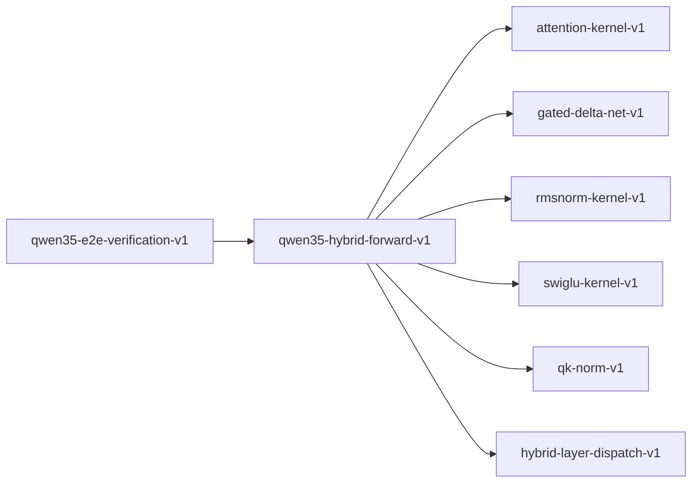

# qwen35-hybrid-forward-v1

**Version:** 1.0.0

Qwen3.5 hybrid forward pass — attention/GDN layer interleaving with numerical stability

## References

- Qwen3.5 Technical Report — hybrid architecture layer schedule
- Yang et al. (2024) Gated Delta Networks
- Zhang & Sennrich (2019) Root Mean Square Layer Normalization

## Dependencies

- [attention-kernel-v1](attention-kernel-v1.md)
- [gated-delta-net-v1](gated-delta-net-v1.md)
- [rmsnorm-kernel-v1](rmsnorm-kernel-v1.md)
- [swiglu-kernel-v1](swiglu-kernel-v1.md)
- [qk-norm-v1](qk-norm-v1.md)
- [hybrid-layer-dispatch-v1](hybrid-layer-dispatch-v1.md)

## Dependency Graph

## Equations

### activation_magnitude

$$
||h_l||_inf <= M * ||h_0||_inf for some bound M
$$

**Domain:** $Hidden state magnitude through L layers$

**Invariants:**

- $Magnitude bounded (no explosion)$
- $Magnitude non-zero (no vanishing)$
- $RMSNorm prevents unbounded growth per layer$

### attention_sublayer

$$
y = x + attn(qk_norm(q_proj(rmsnorm(x))), kv_proj(rmsnorm(x)))
$$

**Domain:** $x \in R^{seq_len × d_model}, attention layer with QK-norm$

**Invariants:**

- $shape(y) = shape(x)$
- $QK-norm applied before attention score computation$
- $Residual connection preserves gradient flow$

### ffn_sublayer

$$
y = x + swiglu(rmsnorm(x))
$$

**Domain:** $x \in R^{seq_len × d_model}, shared across both layer types$

**Invariants:**

- $shape(y) = shape(x)$
- $SwiGLU uses gate/up projections$
- $Down projection restores d_model dimension$

### gdn_sublayer

$$
y = x + gdn(conv1d(rmsnorm(x)))
$$

**Domain:** $x \in R^{seq_len × d_model}, linear attention layer$

**Invariants:**

- $shape(y) = shape(x)$
- $Causal conv1d before GDN recurrence$
- $Residual connection preserves gradient flow$

### gradient_flow

$$
∂L/∂h_0 = \sum_l (∂L/∂h_l * ∂h_l/∂h_0) with skip connections
$$

**Domain:** $Gradient through residual stream$

**Invariants:**

- $Direct gradient path through residual (identity Jacobian)$
- $Each sublayer adds gradient contribution$
- $QK-norm stabilizes attention gradient$

### hybrid_block

$$
block_l(x) = ffn_sublayer(attn_or_gdn_sublayer_l(x))
$$

**Domain:** $Complete transformer block at layer l$

**Invariants:**

- $Always attention_sublayer OR gdn_sublayer, never both$
- $FFN sublayer is identical regardless of attention type$
- $Output shape equals input shape$

## Proof Obligations

| # | Type | Property | Formal |
|---|------|----------|--------|
| 1 | invariant | Attention sublayer shape preservation | $\forall x: shape(attention_sublayer(x)) = shape(x)$ |
| 2 | invariant | GDN sublayer shape preservation | $\forall x: shape(gdn_sublayer(x)) = shape(x)$ |
| 3 | invariant | FFN sublayer shape preservation | $\forall x: shape(ffn_sublayer(x)) = shape(x)$ |
| 4 | invariant | Block outputs from exactly one attention type | $\forall l: is_attention(l) XOR is_gdn(l)$ |
| 5 | bound | Activation magnitude bounded | $\forall l: \|\|h_l\|\|_inf <= M for finite M$ |
| 6 | invariant | RMSNorm precedes each sublayer | $pre-norm architecture: norm before attention/GDN and before FFN$ |
| 7 | conservation | Residual identity component | $h_{l+1} - h_l = sublayer(norm(h_l))$ |

## Falsification Tests

| ID | Rule | Prediction | If Fails |
|----|------|------------|----------|
| FALSIFY-QHF-001 | Attention sublayer shape | Output shape equals input shape | Projection dimension mismatch in attention |
| FALSIFY-QHF-002 | GDN sublayer shape | Output shape equals input shape | GDN state dimension mismatch |
| FALSIFY-QHF-003 | FFN sublayer shape | Output shape equals input shape | Down projection wrong dimension |
| FALSIFY-QHF-004 | Exclusive layer type | Each layer is attention XOR GDN | Layer assigned both types |
| FALSIFY-QHF-005 | Activation stability | No NaN/Inf after 48 layers | Numerical instability in deep composition |
| FALSIFY-QHF-006 | RMSNorm pre-normalization | RMSNorm applied before attention/GDN and before FFN | Missing pre-norm before sublayer |
| FALSIFY-QHF-007 | Residual stream correctness | h_{l+1} - h_l = sublayer(norm(h_l)) | Residual not purely additive |

## Kani Harnesses

| ID | Obligation | Bound | Strategy |
|----|------------|-------|----------|
| KANI-QHF-001 | QHF-INV-001 | 4 | bounded_int |
| KANI-QHF-002 | QHF-INV-002 | 48 | exhaustive |

## QA Gate

**Qwen3.5 Hybrid Forward Contract** (F-QHF-001)

Hybrid attention/GDN forward pass quality gate

**Checks:** attention_sublayer, gdn_sublayer, ffn_sublayer, hybrid_block, activation_magnitude, gradient_flow

**Pass criteria:** All 7 falsification tests pass

